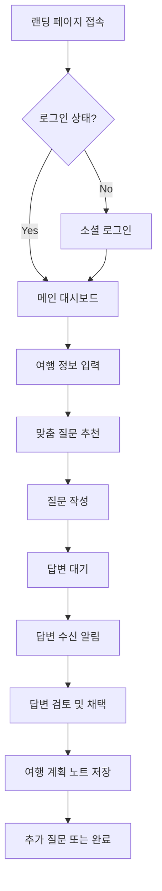
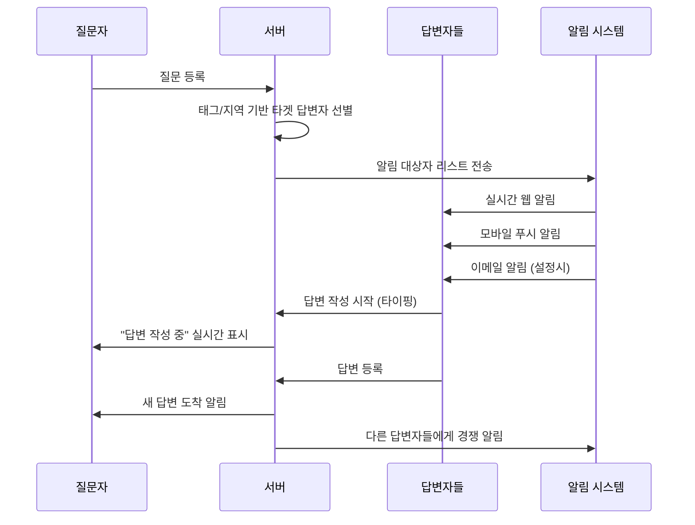

# "동네물어봐" UX 플로우 및 와이어프레임 설계서

## 📋 목차
1. [사용자 여정별 상세 플로우](#-사용자-여정별-상세-플로우)
2. [와이어프레임 설계](#-와이어프레임-설계)
3. [사용자 시나리오](#-사용자-시나리오)
4. [인터랙션 플로우](#-인터랙션-플로우)
5. [컴포넌트 구조 설계](#-컴포넌트-구조-설계)
6. [반응형 디자인 가이드](#-반응형-디자인-가이드)

---

## 🗺️ 사용자 여정별 상세 플로우

### 1단계: 여행 전 (Pre-Trip) - 웹 중심 계획 단계

#### 🎯 사용자 목표
- 신뢰할 수 있는 여행 정보 수집
- 상세한 여행 계획 수립
- 여러 옵션 비교 및 검토
- 질문 리스트 작성 및 관리

#### 📊 상세 플로우



#### 🖼️ 웹 랜딩 페이지 와이어프레임

```
┌─────────────────────────────────────────────────────────────────────────────┐
│  🏝️ 동네물어봐                        🔍 검색     📊 통계    👤 로그인      │
├─────────────────────────────────────────────────────────────────────────────┤
│                                                                             │
│  ┌─ 히어로 섹션 ──────────────────────────────────────────────────────────┐  │
│  │                     제주 현지인이 답하는 여행 Q&A                        │  │
│  │                   "궁금하면 동네 사람에게 물어봐!"                       │  │
│  │                                                                         │  │
│  │  ┌─────────────────────────────────────────────────────────────────┐   │  │
│  │  │ 🔍 "3박4일 가족여행, 아이와 함께 가기 좋은 곳 추천해주세요..."      │   │  │
│  │  └─────────────────────────────────────────────────────────────────┘   │  │
│  │                                                                         │  │
│  │  [✨ 무료로 질문하기]  [📖 답변 둘러보기]  [📊 실시간 통계]             │  │
│  └─────────────────────────────────────────────────────────────────────────┘  │
│                                                                             │
│  ┌─ 실시간 활동 피드 ────────────────┐  ┌─ 인기 카테고리 ─────────────────┐  │
│  │                                   │  │                                 │  │
│  │  🔥 지금 뜨는 질문                  │  │  📍 지역별                       │  │
│  │                                   │  │  ┌─ 제주시 ──── 124개 ──────┐    │  │
│  │  ┌─[🔴 2시간 전] ──────────────┐    │  │  ┌─ 서귀포 ──── 98개 ───────┐    │  │
│  │  │ "중문 맛집 현지인 추천!"      │    │  │  ┌─ 애월/한림 ── 67개 ──────┐    │  │
│  │  │ 💬 5  👍 12  ⏰ 답변중...     │    │  │                                 │  │
│  │  └─────────────────────────────┘    │  │  🍽️ 카테고리별                   │  │
│  │                                   │  │  ┌─ 맛집 ────── 189개 ──────┐    │  │
│  │  ┌─[🟡 4시간 전] ──────────────┐    │  │  ┌─ 카페 ────── 156개 ──────┐    │  │
│  │  │ "날씨 안 좋을 때 실내 명소?" │    │  │  ┌─ 해변/액티비티 ─ 134개 ──┐    │  │
│  │  │ 💬 8  👍 15  ✅ 답변완료      │    │  │                                 │  │
│  │  └─────────────────────────────┘    │  └─────────────────────────────────┘  │
│  │                                   │                                       │
│  │  [더 많은 질문 보기]               │                                       │
│  └───────────────────────────────────┘                                       │
│                                                                             │
│  ┌─ 신뢰성 지표 ────────────────────────────────────────────────────────────┐  │
│  │  📊 지난 주 통계                                                        │  │
│  │  • 질문 67개 → 답변 89개 (133% 답변률)                                   │  │
│  │  • 평균 첫 답변 시간: 8분 12초 (제주도 현지인 즉시 응답)                    │  │
│  │  • 답변 채택률: 78%                                                      │  │
│  │  • 🏠 제주도민 답변자: 23명 활동 중                                        │  │
│  └─────────────────────────────────────────────────────────────────────────┘  │
└─────────────────────────────────────────────────────────────────────────────┘
```

#### 🎯 질문 작성 페이지 (계획형)

```
┌─────────────────────────────────────────────────────────────────────────────┐
│  ← 뒤로    📝 새 질문 작성                                        💾 임시저장  │
├─────────────────────────────────────────────────────────────────────────────┤
│                                                                             │
│  ┌─ 1단계: 여행 기본 정보 ─────────────────────────────────────────────────┐  │
│  │                                                                         │  │
│  │  📅 여행 날짜                                                            │  │
│  │  ┌─────────────┐  ~  ┌─────────────┐                                   │  │
│  │  │ 2024-04-15  │     │ 2024-04-18  │  [📅]                            │  │
│  │  └─────────────┘     └─────────────┘                                   │  │
│  │                                                                         │  │
│  │  👥 동행자                                                              │  │
│  │  [ ] 혼자       [✓] 커플       [ ] 가족       [ ] 친구들                  │  │
│  │                                                                         │  │
│  │  💰 예산 (1인 기준)                                                      │  │
│  │  [ ] 5만원 이하  [✓] 5-10만원  [ ] 10-20만원  [ ] 20만원 이상           │  │
│  │                                                                         │  │
│  │  📍 관심 지역 (복수 선택 가능)                                            │  │
│  │  [✓] 제주시     [✓] 서귀포     [ ] 애월/한림   [ ] 성산/표선             │  │
│  └─────────────────────────────────────────────────────────────────────────┘  │
│                                                                             │
│  ┌─ 2단계: 질문 내용 작성 ─────────────────────────────────────────────────┐  │
│  │                                                                         │  │
│  │  🏷️ 자동 추천 태그                                                       │  │
│  │  #제주시 #서귀포 #커플 #5-10만원 #4월여행 [+ 태그 추가]                   │  │
│  │                                                                         │  │
│  │  ✍️ 질문 내용 (최대 500자)                                               │  │
│  │  ┌─────────────────────────────────────────────────────────────────┐   │  │
│  │  │ 4월 중순에 커플로 제주도 3박4일 여행 계획 중입니다.               │   │  │
│  │  │                                                                 │   │  │
│  │  │ 현지인이 진짜 추천하는 맛집과 예쁜 카페, 그리고 커플이           │   │  │
│  │  │ 가기 좋은 드라이브 코스를 알고 싶어요!                           │   │  │
│  │  │                                                                 │   │  │
│  │  │ 특히 인스타 감성 나는 장소와 현지에서만 맛볼 수 있는          │   │  │
│  │  │ 음식 추천 부탁드립니다 😊                                        │   │  │
│  │  │                                                                 │   │  │
│  │  │ [📷 사진 첨부] [🎤 음성 입력] [📍 위치 추가]                     │   │  │
│  │  └─────────────────────────────────────────────────────────────────┘   │  │
│  │                                                                         │  │
│  │  💡 비슷한 질문들 (참고용)                                               │  │
│  │  • "4월 제주도 커플 여행 코스 추천" - 8개 답변                           │  │
│  │  • "제주시 현지인 맛집 베스트" - 12개 답변                               │  │
│  │  • "제주도 인스타 명소 모음" - 6개 답변                                  │  │
│  │                                                                         │  │
│  └─────────────────────────────────────────────────────────────────────────┘  │
│                                                                             │
│  ┌─ 3단계: 질문 옵션 ─────────────────────────────────────────────────────┐  │
│  │                                                                         │  │
│  │  ⚡ 긴급도                                                               │  │
│  │  [ ] 🔴 긴급 (24시간 내 답변 필요)                                       │  │
│  │  [✓] 🟡 보통 (일주일 내 답변)                                            │  │
│  │  [ ] 🟢 여유 (언제든 답변 받으면 좋음)                                    │  │
│  │                                                                         │  │
│  │  🎯 선호 답변자                                                          │  │
│  │  [✓] 🏠 제주도민 우선     [ ] 🧳 최근 여행자     [ ] 👥 누구든          │  │
│  │                                                                         │  │
│  │  📢 알림 설정                                                           │  │
│  │  [✓] 이메일 알림    [✓] 웹 푸시 알림    [ ] 답변 즉시 카카오톡 알림      │  │
│  │                                                                         │  │
│  └─────────────────────────────────────────────────────────────────────────┘  │
│                                                                             │
│                           [💾 임시저장]  [🚀 질문 등록하기]                  │
└─────────────────────────────────────────────────────────────────────────────┘
```

### 2단계: 여행 중 (During Trip) - 모바일 중심 실시간 단계

#### 🎯 사용자 목표
- 즉시 필요한 정보 획득
- 긴급 상황 해결
- 위치 기반 실시간 추천
- 빠른 질문과 답변

#### 📱 모바일 메인 화면 (긴급 모드)

```
┌─────────────────────────────────┐
│ 📶 KT    🔋 89%    ⏰ 14:23     │
├─────────────────────────────────┤
│                                 │
│ 📍 현재위치: 제주시 연동         │
│ ┌─────────────────────────────┐ │
│ │ 🚨 지금 당장 도움이 필요해요! │ │
│ └─────────────────────────────┘ │
│                                 │
│ ⚡ 빠른 질문                     │
│ ┌─────┬─────┬─────┬─────────┐   │
│ │ 🍜  │ ☔  │ 🚗  │   🏥    │   │
│ │맛집 │비피 │교통 │ 응급상황  │   │
│ │     │할곳 │문제 │         │   │
│ └─────┴─────┴─────┴─────────┘   │
│                                 │
│ 🎤 [음성으로 빠른 질문하기]     │
│ 📸 [사진 찍어서 질문하기]       │
│                                 │
│ 📍 내 주변 1km 이내 질문 (실시간) │
│ ┌─────────────────────────────┐ │
│ │ 🔴 "연동 맛집 추천 급해요!"   │ │
│ │ 💬 3  ⏰ 5분 전  📍 700m    │ │
│ │ [🏠제주도민] 답변 작성 중...   │ │
│ └─────────────────────────────┘ │
│                                 │
│ ┌─────────────────────────────┐ │
│ │ 🟡 "비 그쳤나요? 바다 보고  │ │
│ │     싶어요"                 │ │
│ │ 💬 1  ⏰ 12분 전  📍 1.2km  │ │
│ └─────────────────────────────┘ │
│                                 │
│ [📋 전체 질문 보기]             │
│                                 │
│ ┌─ 바텀 네비게이션 ───────────┐ │
│ │[🏠홈] [🔍검색] [➕질문] [👤내] │ │
│ └─────────────────────────────┘ │
└─────────────────────────────────┘
```

#### 📱 음성 질문 작성 플로우

```
┌─────────────────────────────────┐
│ ← 뒤로      🎤 음성 질문        │
├─────────────────────────────────┤
│                                 │
│       🎙️ 음성 인식 중...        │
│                                 │
│ ┌─────────────────────────────┐ │
│ │  🔴 ●  REC  00:15           │ │
│ │                             │ │
│ │     [====|----]             │ │
│ │                             │ │
│ │  "지금 중문에 있는데 비가    │ │
│ │   갑자기 와서 실내에서       │ │
│ │   시간 보낼 곳 있을까요?"    │ │
│ └─────────────────────────────┘ │
│                                 │
│ ┌─ 자동 인식 결과 ─────────────┐ │
│ │ 📍 위치: 중문관광단지        │ │
│ │ 🏷️ 태그: #중문 #실내 #비    │ │
│ │ ⚡ 긴급도: 높음              │ │
│ └─────────────────────────────┘ │
│                                 │
│ ✏️ 수정하기                     │
│ ┌─────────────────────────────┐ │
│ │ 지금 중문에 있는데 비가 갑자 │ │
│ │ 와서 실내에서 시간 보낼 곳   │ │
│ │ 있을까요?                   │ │
│ │                             │ │
│ │ #중문 #실내 #비 ☔          │ │
│ └─────────────────────────────┘ │
│                                 │
│ 📸 사진 추가  📍 위치 수정       │
│                                 │
│ [🚀 긴급 질문하기]              │
└─────────────────────────────────┘
```

### 3단계: 여행 후 (Post-Trip) - 경험 공유 단계

#### 🎯 사용자 목표
- 받은 도움에 대한 후기 공유
- 답변자로 전환하여 기여
- 여행 경험 아카이빙
- 커뮤니티 참여 증대

#### 💬 여행 후기 및 답변 작성 플로우

```
┌─────────────────────────────────────────────────────────────────────────────┐
│  🏝️ 동네물어봐 > 내 여행 후기                             👤 프로필 설정  │
├─────────────────────────────────────────────────────────────────────────────┤
│                                                                             │
│  ┌─ 여행 완료 알림 ─────────────────────────────────────────────────────────┐  │
│  │  🎉 제주도 여행 다녀오셨네요!                                             │  │
│  │                                                                         │  │
│  │  받으셨던 답변들은 어떠셨나요? 후기를 남겨주시면                          │  │
│  │  다른 여행자들에게 큰 도움이 됩니다 😊                                    │  │
│  │                                                                         │  │
│  │  📊 내 여행 통계                                                         │  │
│  │  • 받은 답변: 8개                                                        │  │
│  │  • 채택한 답변: 6개 (75%)                                                │  │
│  │  • 도움받은 답변자: 5명                                                   │  │
│  │  • 여행 만족도: ⭐⭐⭐⭐⭐                                                 │  │
│  └─────────────────────────────────────────────────────────────────────────┘  │
│                                                                             │
│  📝 받은 답변들에 후기 남기기                                                │
│                                                                             │
│  ┌─────────────────────────────────────────────────────────────────────────┐  │
│  │  질문: "중문 근처 맛집 추천해주세요"                                       │  │
│  │                                                                         │  │
│  │  [🏠제주도민] 맛집지기님의 답변                                            │  │
│  │  "올레시장 안 미영이네 전복죽 추천드려요!"                                │  │
│  │                                                                         │  │
│  │  ⭐ 답변 평가: ⭐⭐⭐⭐⭐                                                  │  │
│  │                                                                         │  │
│  │  📝 실제 후기                                                            │  │
│  │  ┌─────────────────────────────────────────────────────────────────┐   │  │
│  │  │ 정말 맛있었어요! 제주도민분이 추천해주신 대로 전복죽 먹었는데       │   │  │
│  │  │ 진짜 현지 맛이었습니다. 가격도 합리적이고 사장님도 친절하셨어요.   │   │  │
│  │  │ 다음에 또 제주 오면 꼭 재방문할 예정입니다! 추천 감사해요 🙏        │   │  │
│  │  └─────────────────────────────────────────────────────────────────┘   │  │
│  │                                                                         │  │
│  │  📷 방문 인증샷 올리기                                                   │  │
│  │  [📷 사진 선택] [📱 카메라]                                              │  │
│  │                                                                         │  │
│  │  [💝 감사 인사 보내기] [⭐ 평가 저장하기]                                │  │
│  └─────────────────────────────────────────────────────────────────────────┘  │
│                                                                             │
│  🤝 이제 당신도 답변자가 되어보세요!                                         │
│                                                                             │
│  ┌─────────────────────────────────────────────────────────────────────────┐  │
│  │  🎯 추천 질문 (최근 제주 다녀온 경험 기반)                                │  │
│  │                                                                         │  │
│  │  ┌─ 질문 ─────────────────────────────────────────────────────────────┐  │  │
│  │  │ "4월 제주도 날씨 어떤가요? 어떤 옷 준비하면 될까요?"                 │  │  │
│  │  │ 📅 4시간 전 • 💬 2개 답변 • 👥 3명이 궁금해해요                     │  │  │
│  │  │                                                                   │  │  │
│  │  │ [✍️ 답변 작성하기] [📌 나중에 답변하기]                            │  │  │
│  │  └───────────────────────────────────────────────────────────────────┘  │  │
│  │                                                                         │  │
│  │  💡 답변하면 받는 혜택                                                   │  │
│  │  • 🎁 첫 답변 작성 시 500포인트                                          │  │
│  │  • 🏆 "최근 여행자" 배지 획득                                            │  │
│  │  • 📈 커뮤니티 신뢰도 상승                                               │  │
│  └─────────────────────────────────────────────────────────────────────────┘  │
└─────────────────────────────────────────────────────────────────────────────┘
```

---

## 💬 메시지 스타일 대화형 상세 페이지

### 질문 상세 페이지 (카카오톡 스타일)

```
┌─────────────────────────────────────────────────────────────────────────────┐
│ ← 뒤로    💬 제주도 맛집 추천                                   🔍 ⚙️ ⋮      │
├─────────────────────────────────────────────────────────────────────────────┤
│                                                                             │
│                    [여행러버] 📍 제주시 연동 • 3시간 전                      │
│                    ┌─────────────────────────────────────────────────────┐  │
│                    │ 안녕하세요! 내일 제주도 가는데 현지인이 추천하는     │  │
│                    │ 진짜 맛집 알고 싶어요 🍜                            │  │
│                    │                                                     │  │
│                    │ 특히 전복죽이나 갈치조림 맛집이 궁금해요.           │  │
│                    │ 관광지 말고 현지인들이 실제로 가는 곳 추천해주세요!  │  │
│                    │                                                     │  │
│                    │ #제주시 #맛집 #현지인추천 #갈치 #전복              │  │
│                    │                                                     │  │
│                    │ [📷][📷][📷] 숙소 근처 사진 3장                    │  │
│                    └─────────────────────────────────────────────────────┘  │
│                                                💬 12  👍 8  📍 제주시        │
│                                                                             │
│ [🏠제주도민] 맛집지기 • 2시간 전                                             │
│ ┌─────────────────────────────────────────────────────────────────────────┐   │
│ │ 아! 그 근처면 완전 맛집들이 많아요 😊                                     │   │
│ │                                                                         │   │
│ │ 📍 **올레시장 안 미영이네** ⭐⭐⭐⭐⭐                                    │   │
│ │ • 전복죽 진짜 맛있어요! (15,000원)                                       │   │
│ │ • 영업: 08:00-17:00 (일요일 휴무)                                       │   │
│ │ • 주차: 시장 공영주차장 이용                                             │   │
│ │                                                                         │   │
│ │ 📍 **동문시장 근처 갈치골목**                                            │   │
│ │ • 갈치조림 전문가게들이 쭉 있어요                                         │   │
│ │ • 추천: "제주식당" 갈치조림 (25,000원)                                   │   │
│ │                                                                         │   │
│ │ [📷][📷] 실제 방문 사진                                                  │   │
│ └─────────────────────────────────────────────────────────────────────────┘   │
│                                        👍 15  ✅ 채택됨  📍 위치보기  💾 저장   │
│                                                                             │
│ [🧳여행자] 부산촌놈 • 1시간 전                                               │
│ ┌─────────────────────────────────────────────────────────────────────────┐   │
│ │ 저도 작년에 미영이네 다녀왔는데 정말 맛있었어요!                          │   │
│ │ 전복죽에 전복이 진짜 많이 들어가 있고, 밑반찬도 깔끔해요 👍               │   │
│ │                                                                         │   │
│ │ 추가로 **제주향토음식점**도 추천드려요                                    │   │
│ │ 고등어조림이 예술입니다! 🐟                                               │   │
│ └─────────────────────────────────────────────────────────────────────────┘   │
│                                                    👍 8  📍 위치보기  💾 저장   │
│                                                                             │
│ ┌─ 답변 작성하기 ───────────────────────────────────────────────────────────┐ │
│ │ [😊] 💬 답변을 작성해보세요...                        📷 🎤 📍 ⚡         │ │
│ └─────────────────────────────────────────────────────────────────────────┘ │
│                                                                             │
│ ┌─ 관련 질문 추천 ───────────────────────────────────────────────────────────┐ │
│ │ 💡 비슷한 질문들                                                          │ │
│ │ • "제주시 현지인 맛집 BEST 5" - 23개 답변                                 │ │
│ │ • "전복 요리 맛집 총정리" - 18개 답변                                      │ │
│ │ • "동문시장 먹거리 추천" - 15개 답변                                       │ │
│ └─────────────────────────────────────────────────────────────────────────┘ │
└─────────────────────────────────────────────────────────────────────────────┘
```

---

## 🎭 핵심 사용자 시나리오

### 시나리오 1: 계획형 여행자 "민지" (32세, 회사원)

#### 상황
- 다음 달 제주도 3박4일 커플여행 계획
- 집에서 저녁에 노트북으로 정보 수집
- 꼼꼼한 성격으로 미리 모든 것을 계획하고 싶어함

#### 사용자 여정

**1주차 (여행 1개월 전)**
```
19:00 - 집에서 노트북으로 "동네물어봐" 접속
19:05 - 카카오 로그인 후 프로필 설정 (커플, 20대, 관심사: 카페/맛집)
19:10 - "제주도 3박4일 커플 코스 추천" 질문 작성
       - 여행 날짜: 4/15-4/18
       - 예산: 1인 10만원 내외
       - 관심사: #카페 #맛집 #드라이브 #인스타명소
19:30 - 답변 3개 수신, 북마크 및 여행 노트에 저장
```

**2주차 (여행 3주 전)**
```
20:00 - "제주도 4월 날씨 옷차림 추천" 추가 질문
20:15 - "렌터카 vs 대중교통 어떤게 좋을까요?" 질문
20:30 - 받은 답변들을 바탕으로 여행 일정표 작성
21:00 - 답변해준 현지인들에게 감사 메시지 전송
```

**여행 일주일 전**
```
여행 확정 준비 단계에서 실시간 정보 확인을 위해 모바일 앱 다운로드
푸시 알림 설정하여 여행 중 즉석 질문 준비
```

### 시나리오 2: 즉석 여행자 "수현" (28세, 신혼부부)

#### 상황
- 제주도 여행 중 갑작스러운 비로 계획 변경 필요
- 모바일로 즉시 도움 요청
- 실시간 해결책이 필요한 상황

#### 사용자 여정

**여행 둘째 날 오후 2시**
```
📱 중문관광단지 - 갑자기 폭우 시작
14:05 - "동네물어봐" 앱 실행
14:06 - 음성으로 긴급 질문: "중문에서 비 피할 실내 명소 급해요!"
14:07 - GPS 자동 인식으로 #중문 #실내 #긴급 태그 자동 생성
14:08 - 주변 1km 내 제주도민 3명에게 긴급 알림 전송
14:12 - 첫 번째 답변 수신: "테디베어뮤지엄 바로 옆에 있어요!"
14:13 - 답변 채택 후 바로 이동
14:20 - 도착 후 "정말 도움됐습니다!" 감사 메시지 전송
```

**저녁 8시**
```
20:00 - "제주시 밤에 갈만한 카페나 바 추천해주세요"
20:03 - 사진과 함께 질문 (현재 위치 첨부)
20:08 - 현지인 추천으로 "제주맥주 브루어리" 답변 받음
20:15 - 실제 방문 후 인스타 스토리 공유 및 앱에 후기 작성
```

### 시나리오 3: 답변자 "제주도민 카페지기" (35세, 카페 사장)

#### 상황
- 제주시에서 카페 운영 중
- 여행자들에게 도움 주는 것을 좋아함
- 포인트 적립으로 소소한 재미

#### 사용자 여정

**평일 오후 (카페 한가한 시간)**
```
15:00 - 카페에서 앱 확인, 새 질문 3개 알림 확인
15:05 - "애월 카페 추천해주세요" 질문에 답변 작성
       - 자신의 카페와 주변 카페 3곳 추천
       - 영업시간, 주차정보, 시그니처 메뉴 상세 안내
       - 실제 카페 사진 4장 첨부
15:15 - "카페지기님 덕분에 좋은 시간 보냈어요!" 댓글로 감사 인사 받음
15:20 - 포인트 150P 적립 확인 (답변 50P + 채택 100P)
```

**주말 저녁**
```
19:00 - 이번 주 활동 요약 확인
       - 답변 12개 작성
       - 채택률 83%
       - "카페 큐레이터" 배지 획득
19:05 - 주간 랭킹 3위 확인, 다음 주 1위 목표 설정
19:10 - 적립된 포인트로 동네 맛집 할인쿠폰 교환
```

---

## 🔄 인터랙션 플로우 상세 설계

### 실시간 알림 시스템

#### 새 질문 등록 시 알림 플로우



#### 타이핑 인디케이터 시스템

```javascript
// 실시간 타이핑 상태 관리
const TypingIndicator = {
  // 타이핑 시작
  startTyping: (questionId, userId, userName) => {
    socket.emit('typing_start', {
      questionId,
      userId,
      userName,
      timestamp: Date.now()
    });
  },

  // 타이핑 중지 (3초 후 자동)
  stopTyping: (questionId, userId) => {
    socket.emit('typing_stop', {
      questionId,
      userId,
      timestamp: Date.now()
    });
  },

  // 타이핑 상태 수신 및 표시
  onTypingUpdate: (data) => {
    const indicator = document.getElementById('typing-indicator');
    if (data.isTyping) {
      indicator.innerHTML = `${data.userName}님이 답변을 작성 중입니다...`;
      indicator.classList.add('visible');
    } else {
      indicator.classList.remove('visible');
    }
  }
};
```

### 해시태그 자동 파싱 시스템

#### 실시간 해시태그 인식 및 링크

```javascript
// 해시태그 자동 파싱 및 스타일링
const HashtagParser = {
  // 입력 중 실시간 파싱
  parseOnInput: (text) => {
    const hashtagRegex = /#[\w가-힣]+/g;
    const hashtags = text.match(hashtagRegex) || [];

    return {
      originalText: text,
      hashtags: hashtags.map(tag => ({
        text: tag,
        category: this.categorizeTag(tag),
        suggestions: this.getSuggestions(tag)
      })),
      styledText: this.applyStyles(text, hashtags)
    };
  },

  // 태그 카테고리 분류
  categorizeTag: (tag) => {
    const categories = {
      region: ['제주시', '서귀포', '애월', '한림', '성산', '중문'],
      food: ['맛집', '카페', '술집', '디저트', '현지음식'],
      activity: ['해변', '등산', '드라이브', '체험', '사진명소'],
      timing: ['지금당장', '내일', '이번주말', '평일', '저녁'],
      group: ['혼자', '커플', '가족', '친구', '아이동반']
    };

    for (const [category, keywords] of Object.entries(categories)) {
      if (keywords.some(keyword => tag.includes(keyword))) {
        return category;
      }
    }
    return 'other';
  },

  // 관련 태그 제안
  getSuggestions: (partialTag) => {
    const popularTags = [
      '#제주맛집', '#애월카페', '#한라산', '#성산일출봉',
      '#중문해변', '#서귀포시장', '#제주흑돼지', '#한라봉'
    ];

    return popularTags.filter(tag =>
      tag.toLowerCase().includes(partialTag.toLowerCase().replace('#', ''))
    );
  }
};
```

### 답변 채택 및 평가 시스템

#### 원탭 채택 시스템

```javascript
// 답변 채택 플로우
const AnswerAcceptance = {
  // 길게 누르기로 채택 메뉴 표시
  onLongPress: (answerId, element) => {
    const menu = this.createAcceptanceMenu(answerId);
    this.showMenu(menu, element);
  },

  // 채택 메뉴 생성
  createAcceptanceMenu: (answerId) => {
    return `
      <div class="acceptance-menu">
        <div class="menu-item" onclick="acceptAnswer('${answerId}')">
          ✅ 이 답변이 도움됐어요!
        </div>
        <div class="menu-item" onclick="saveAnswer('${answerId}')">
          💾 나중에 참고하기
        </div>
        <div class="menu-item" onclick="shareAnswer('${answerId}')">
          📤 공유하기
        </div>
      </div>
    `;
  },

  // 답변 채택 처리
  acceptAnswer: async (answerId) => {
    try {
      const response = await fetch(`/api/answers/${answerId}/accept`, {
        method: 'POST',
        headers: { 'Content-Type': 'application/json' },
        body: JSON.stringify({ accepted: true })
      });

      if (response.ok) {
        // UI 업데이트
        this.updateAcceptedUI(answerId);
        // 포인트 적립 알림
        this.showPointsEarned(150); // 채택시 150P
        // 감사 메시지 옵션 표시
        this.showThankYouOptions(answerId);
      }
    } catch (error) {
      console.error('채택 처리 중 오류:', error);
    }
  },

  // 감사 메시지 템플릿
  showThankYouOptions: (answerId) => {
    const templates = [
      "정말 도움됐어요! 감사합니다 🙏",
      "덕분에 좋은 시간 보냈어요! 고맙습니다 😊",
      "최고의 답변이었어요! 다음에도 부탁드려요 ✨"
    ];

    // 빠른 감사 메시지 버튼들 표시
    this.showQuickReplyButtons(answerId, templates);
  }
};
```

---

이 문서는 실제 개발 시 참고할 수 있는 상세한 UX 플로우와 와이어프레임을 제공합니다. 다음 단계로 각 컴포넌트별 상세 설계 문서를 작성하겠습니다.