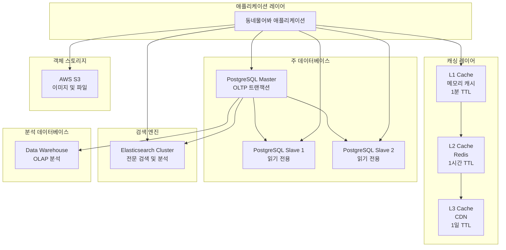
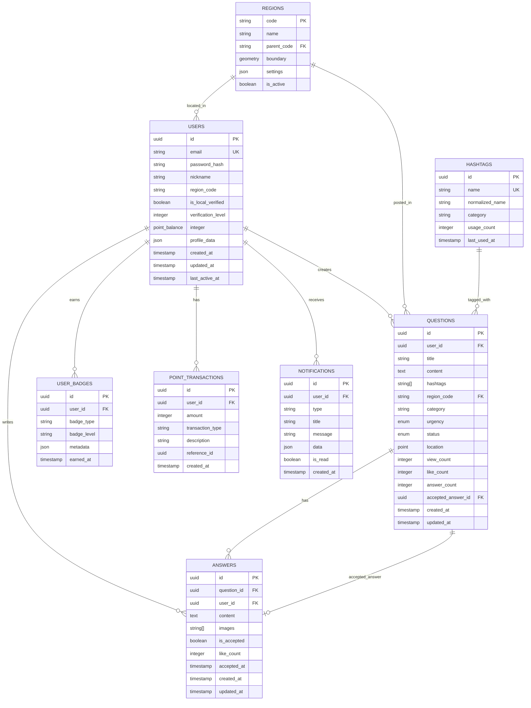

# "동네물어봐" 데이터베이스 아키텍처 설계서

## 📋 목차
1. [데이터베이스 아키텍처 개요](#-데이터베이스-아키텍처-개요)
2. [데이터 모델링](#-데이터-모델링)
3. [PostgreSQL 설계](#-postgresql-설계)
4. [Redis 캐싱 전략](#-redis-캐싱-전략)
5. [Elasticsearch 검색 설계](#-elasticsearch-검색-설계)
6. [멀티리전 확장 전략](#-멀티리전-확장-전략)
7. [성능 최적화](#-성능-최적화)
8. [백업 및 복구](#-백업-및-복구)
9. [모니터링 및 운영](#-모니터링-및-운영)
10. [데이터 거버넌스](#-데이터-거버넌스)

---

## 🏗️ 데이터베이스 아키텍처 개요

### 설계 원칙

#### 1. 계층별 데이터 저장 전략



#### 2. 데이터 특성별 저장 전략

| 데이터 유형 | 저장소 | 특성 | TTL/보관기간 |
|------------|-------|------|-------------|
| 사용자 세션 | Redis | 빠른 읽기/쓰기 | 24시간 |
| 질문/답변 | PostgreSQL | ACID 보장 필요 | 영구 보관 |
| 검색 인덱스 | Elasticsearch | 전문 검색 최적화 | 실시간 동기화 |
| 이미지/파일 | S3 | 확장 가능한 객체 스토리지 | 영구 보관 |
| 실시간 메트릭 | Redis + InfluxDB | 시계열 데이터 | 90일 |
| 로그 데이터 | CloudWatch Logs | 모니터링 및 디버깅 | 30일 |

### 데이터 일관성 모델

#### CAP 정리 적용

```typescript
// 서비스별 일관성 요구사항
interface ConsistencyRequirement {
  service: string;
  consistency: 'strong' | 'eventual' | 'weak';
  availability: 'high' | 'medium' | 'low';
  partitionTolerance: boolean;
  reasoning: string;
}

const consistencyModels: ConsistencyRequirement[] = [
  {
    service: "user-authentication",
    consistency: "strong",
    availability: "high",
    partitionTolerance: true,
    reasoning: "인증은 정확성이 최우선, 이중 로그인 방지 필요"
  },
  {
    service: "qa-content",
    consistency: "strong",
    availability: "high",
    partitionTolerance: true,
    reasoning: "질문/답변은 정확한 내용 보장 필요, 중복 방지"
  },
  {
    service: "search-results",
    consistency: "eventual",
    availability: "high",
    partitionTolerance: true,
    reasoning: "검색 결과는 약간의 지연 허용, 가용성 우선"
  },
  {
    service: "analytics-metrics",
    consistency: "eventual",
    availability: "medium",
    partitionTolerance: true,
    reasoning: "분석 데이터는 정확성보다 집계 속도 우선"
  },
  {
    service: "notification-delivery",
    consistency: "weak",
    availability: "high",
    partitionTolerance: true,
    reasoning: "알림은 속도가 최우선, 일부 누락 허용"
  }
];
```

---

## 📊 데이터 모델링

### 엔티티 관계도 (ERD)



### 도메인별 상세 스키마

#### 1. 사용자 도메인

```sql
-- 사용자 테이블
CREATE TABLE users (
    id UUID PRIMARY KEY DEFAULT gen_random_uuid(),
    email VARCHAR(255) UNIQUE NOT NULL,
    password_hash VARCHAR(255),
    nickname VARCHAR(50) NOT NULL,
    region_code VARCHAR(20) REFERENCES regions(code),

    -- 현지인 인증 시스템
    is_local_verified BOOLEAN DEFAULT FALSE,
    verification_level INTEGER DEFAULT 0, -- 0: 미인증, 1: 임시, 2: 검증됨, 3: 공식
    verification_metadata JSONB DEFAULT '{}',

    -- 프로필 정보
    profile_image_url TEXT,
    bio TEXT,
    interested_categories TEXT[],

    -- 포인트 시스템
    point_balance INTEGER DEFAULT 0,
    total_earned_points INTEGER DEFAULT 0,

    -- 활동 통계
    question_count INTEGER DEFAULT 0,
    answer_count INTEGER DEFAULT 0,
    accepted_answer_count INTEGER DEFAULT 0,

    -- 설정
    notification_settings JSONB DEFAULT '{}',
    privacy_settings JSONB DEFAULT '{}',

    -- 소셜 로그인 정보
    social_providers JSONB DEFAULT '{}',

    -- 타임스탬프
    created_at TIMESTAMP WITH TIME ZONE DEFAULT NOW(),
    updated_at TIMESTAMP WITH TIME ZONE DEFAULT NOW(),
    last_active_at TIMESTAMP WITH TIME ZONE DEFAULT NOW(),

    -- 소프트 삭제
    deleted_at TIMESTAMP WITH TIME ZONE,

    -- 제약 조건
    CONSTRAINT valid_verification_level CHECK (verification_level BETWEEN 0 AND 3),
    CONSTRAINT positive_point_balance CHECK (point_balance >= 0)
);

-- 인덱스 최적화
CREATE INDEX idx_users_email ON users(email) WHERE deleted_at IS NULL;
CREATE INDEX idx_users_region_verified ON users(region_code, is_local_verified, last_active_at);
CREATE INDEX idx_users_nickname_trgm ON users USING gin(nickname gin_trgm_ops);
CREATE INDEX idx_users_social_providers ON users USING gin(social_providers);

-- 트리거: 업데이트 시간 자동 갱신
CREATE TRIGGER update_users_updated_at
    BEFORE UPDATE ON users
    FOR EACH ROW
    EXECUTE FUNCTION update_updated_at_column();
```

#### 2. Q&A 도메인

```sql
-- 질문 테이블
CREATE TABLE questions (
    id UUID PRIMARY KEY DEFAULT gen_random_uuid(),
    user_id UUID NOT NULL REFERENCES users(id) ON DELETE CASCADE,

    -- 콘텐츠
    title VARCHAR(200) NOT NULL,
    content TEXT NOT NULL,
    hashtags TEXT[] DEFAULT '{}',

    -- 분류
    region_code VARCHAR(20) NOT NULL REFERENCES regions(code),
    category VARCHAR(50) NOT NULL,
    urgency question_urgency DEFAULT 'normal',
    status question_status DEFAULT 'open',

    -- 위치 정보
    location GEOMETRY(POINT, 4326),
    location_description TEXT,

    -- 상호작용 통계
    view_count INTEGER DEFAULT 0,
    like_count INTEGER DEFAULT 0,
    answer_count INTEGER DEFAULT 0,

    -- 채택 시스템
    accepted_answer_id UUID REFERENCES answers(id),
    accepted_at TIMESTAMP WITH TIME ZONE,

    -- 첨부 파일
    images TEXT[] DEFAULT '{}',

    -- 메타데이터
    metadata JSONB DEFAULT '{}',

    -- 타임스탬프
    created_at TIMESTAMP WITH TIME ZONE DEFAULT NOW(),
    updated_at TIMESTAMP WITH TIME ZONE DEFAULT NOW(),

    -- 소프트 삭제
    deleted_at TIMESTAMP WITH TIME ZONE,

    -- 제약 조건
    CONSTRAINT valid_title_length CHECK (LENGTH(title) BETWEEN 10 AND 200),
    CONSTRAINT valid_content_length CHECK (LENGTH(content) BETWEEN 20 AND 2000),
    CONSTRAINT valid_hashtag_count CHECK (array_length(hashtags, 1) <= 5)
);

-- 긴급도 enum
CREATE TYPE question_urgency AS ENUM ('normal', 'urgent', 'emergency');

-- 상태 enum
CREATE TYPE question_status AS ENUM ('open', 'answered', 'closed', 'hidden');

-- 답변 테이블
CREATE TABLE answers (
    id UUID PRIMARY KEY DEFAULT gen_random_uuid(),
    question_id UUID NOT NULL REFERENCES questions(id) ON DELETE CASCADE,
    user_id UUID NOT NULL REFERENCES users(id) ON DELETE CASCADE,

    -- 콘텐츠
    content TEXT NOT NULL,
    images TEXT[] DEFAULT '{}',

    -- 상호작용
    like_count INTEGER DEFAULT 0,
    is_accepted BOOLEAN DEFAULT FALSE,

    -- 품질 점수 (ML 기반)
    quality_score FLOAT DEFAULT 0.0,

    -- 메타데이터
    metadata JSONB DEFAULT '{}',

    -- 타임스탬프
    created_at TIMESTAMP WITH TIME ZONE DEFAULT NOW(),
    updated_at TIMESTAMP WITH TIME ZONE DEFAULT NOW(),
    accepted_at TIMESTAMP WITH TIME ZONE,

    -- 소프트 삭제
    deleted_at TIMESTAMP WITH TIME ZONE,

    -- 제약 조건
    CONSTRAINT valid_content_length CHECK (LENGTH(content) BETWEEN 10 AND 1000),
    CONSTRAINT valid_quality_score CHECK (quality_score BETWEEN 0.0 AND 1.0)
);

-- 복합 인덱스 최적화
CREATE INDEX idx_questions_region_category_created ON questions(region_code, category, created_at DESC);
CREATE INDEX idx_questions_user_status ON questions(user_id, status, created_at DESC);
CREATE INDEX idx_questions_location_gist ON questions USING GIST(location);
CREATE INDEX idx_questions_hashtags_gin ON questions USING GIN(hashtags);
CREATE INDEX idx_questions_search_vector ON questions USING GIN(to_tsvector('korean', title || ' ' || content));

CREATE INDEX idx_answers_question_created ON answers(question_id, created_at DESC);
CREATE INDEX idx_answers_user_accepted ON answers(user_id, is_accepted, created_at DESC);
CREATE INDEX idx_answers_quality_score ON answers(quality_score DESC) WHERE deleted_at IS NULL;
```

#### 3. 지역 및 위치 도메인

```sql
-- 지역 테이블 (계층 구조)
CREATE TABLE regions (
    code VARCHAR(20) PRIMARY KEY,
    name VARCHAR(100) NOT NULL,
    name_en VARCHAR(100),
    parent_code VARCHAR(20) REFERENCES regions(code),

    -- 지역 타입
    region_type region_type NOT NULL,

    -- 지리 정보
    boundary GEOMETRY(MULTIPOLYGON, 4326),
    center_point GEOMETRY(POINT, 4326),

    -- 설정
    settings JSONB DEFAULT '{}',
    is_active BOOLEAN DEFAULT TRUE,

    -- 통계
    user_count INTEGER DEFAULT 0,
    question_count INTEGER DEFAULT 0,

    -- 타임스탬프
    created_at TIMESTAMP WITH TIME ZONE DEFAULT NOW(),
    updated_at TIMESTAMP WITH TIME ZONE DEFAULT NOW()
);

-- 지역 타입
CREATE TYPE region_type AS ENUM ('country', 'province', 'city', 'district', 'neighborhood');

-- 제주도 지역 데이터 초기화
INSERT INTO regions (code, name, name_en, region_type, center_point) VALUES
('KR', '대한민국', 'South Korea', 'country', ST_Point(127.766922, 35.907757)),
('KR-49', '제주특별자치도', 'Jeju Special Self-Governing Province', 'province', ST_Point(126.531188, 33.499621)),
('KR-49-01', '제주시', 'Jeju City', 'city', ST_Point(126.521667, 33.513611)),
('KR-49-02', '서귀포시', 'Seogwipo City', 'city', ST_Point(126.555, 33.254167)),
('KR-49-01-01', '한림읍', 'Hallim-eup', 'district', ST_Point(126.266111, 33.414722)),
('KR-49-01-02', '애월읍', 'Aewol-eup', 'district', ST_Point(126.331944, 33.464722)),
('KR-49-01-03', '구좌읍', 'Gujwa-eup', 'district', ST_Point(126.768056, 33.564167)),
('KR-49-01-04', '조천읍', 'Jocheon-eup', 'district', ST_Point(126.654167, 33.551944)),
('KR-49-02-01', '대정읍', 'Daejeong-eup', 'district', ST_Point(126.244722, 33.229167)),
('KR-49-02-02', '안덕면', 'Andeok-myeon', 'district', ST_Point(126.392778, 33.306944)),
('KR-49-02-03', '표선면', 'Pyoseon-myeon', 'district', ST_Point(126.838889, 33.329167)),
('KR-49-02-04', '남원읍', 'Namwon-eup', 'district', ST_Point(126.713333, 33.289444)),
('KR-49-02-05', '성산읍', 'Seongsan-eup', 'district', ST_Point(126.921944, 33.419444));

-- 공간 인덱스
CREATE INDEX idx_regions_boundary ON regions USING GIST(boundary);
CREATE INDEX idx_regions_center_point ON regions USING GIST(center_point);
CREATE INDEX idx_regions_hierarchy ON regions(parent_code, region_type);
```

#### 4. 포인트 및 게임화 시스템

```sql
-- 포인트 거래 테이블
CREATE TABLE point_transactions (
    id UUID PRIMARY KEY DEFAULT gen_random_uuid(),
    user_id UUID NOT NULL REFERENCES users(id) ON DELETE CASCADE,

    -- 거래 정보
    amount INTEGER NOT NULL,
    transaction_type point_transaction_type NOT NULL,
    description TEXT,

    -- 참조 정보
    reference_type VARCHAR(50), -- 'question', 'answer', 'badge' 등
    reference_id UUID,

    -- 잔액 (스냅샷)
    balance_before INTEGER NOT NULL,
    balance_after INTEGER NOT NULL,

    -- 타임스탬프
    created_at TIMESTAMP WITH TIME ZONE DEFAULT NOW(),

    -- 제약 조건
    CONSTRAINT valid_amount CHECK (amount != 0),
    CONSTRAINT valid_balance_calculation CHECK (balance_after = balance_before + amount)
);

-- 포인트 거래 타입
CREATE TYPE point_transaction_type AS ENUM (
    'earn_answer',           -- 답변 작성
    'earn_accepted_answer',  -- 답변 채택
    'earn_daily_login',      -- 일일 로그인
    'earn_first_question',   -- 첫 질문 작성
    'earn_milestone',        -- 마일스톤 달성
    'spend_highlight',       -- 질문 강조
    'spend_premium',         -- 프리미엄 기능
    'admin_adjustment'       -- 관리자 조정
);

-- 배지 시스템
CREATE TABLE user_badges (
    id UUID PRIMARY KEY DEFAULT gen_random_uuid(),
    user_id UUID NOT NULL REFERENCES users(id) ON DELETE CASCADE,

    -- 배지 정보
    badge_type VARCHAR(50) NOT NULL,
    badge_level INTEGER DEFAULT 1,

    -- 배지 메타데이터
    metadata JSONB DEFAULT '{}',

    -- 타임스탬프
    earned_at TIMESTAMP WITH TIME ZONE DEFAULT NOW(),

    -- 유니크 제약 (사용자별 배지 타입 중복 방지)
    UNIQUE(user_id, badge_type)
);

-- 인덱스
CREATE INDEX idx_point_transactions_user_created ON point_transactions(user_id, created_at DESC);
CREATE INDEX idx_point_transactions_type ON point_transactions(transaction_type, created_at DESC);
CREATE INDEX idx_user_badges_type ON user_badges(badge_type, earned_at DESC);
```

---

## 🐘 PostgreSQL 설계

### 물리적 데이터베이스 설계

#### 1. 테이블스페이스 및 파티셔닝

```sql
-- 테이블스페이스 생성
CREATE TABLESPACE ts_questions LOCATION '/var/lib/postgresql/data/questions';
CREATE TABLESPACE ts_answers LOCATION '/var/lib/postgresql/data/answers';
CREATE TABLESPACE ts_logs LOCATION '/var/lib/postgresql/data/logs';
CREATE TABLESPACE ts_analytics LOCATION '/var/lib/postgresql/data/analytics';

-- 날짜 기반 파티셔닝 (질문 테이블)
CREATE TABLE questions_partitioned (
    LIKE questions INCLUDING ALL
) PARTITION BY RANGE (created_at);

-- 월별 파티션 생성 함수
CREATE OR REPLACE FUNCTION create_monthly_partitions(
    table_name TEXT,
    start_date DATE,
    end_date DATE
) RETURNS VOID AS $$
DECLARE
    current_date DATE := start_date;
    partition_name TEXT;
    partition_start DATE;
    partition_end DATE;
BEGIN
    WHILE current_date < end_date LOOP
        partition_start := DATE_TRUNC('month', current_date);
        partition_end := partition_start + INTERVAL '1 month';
        partition_name := table_name || '_' || TO_CHAR(partition_start, 'YYYY_MM');

        EXECUTE format('CREATE TABLE %I PARTITION OF %I
                       FOR VALUES FROM (%L) TO (%L)',
                      partition_name, table_name, partition_start, partition_end);

        current_date := partition_end;
    END LOOP;
END;
$$ LANGUAGE plpgsql;

-- 2024년 전체 파티션 생성
SELECT create_monthly_partitions('questions_partitioned', '2024-01-01', '2025-01-01');

-- 자동 파티션 생성 스크립트 (cron job)
CREATE OR REPLACE FUNCTION auto_create_partitions() RETURNS VOID AS $$
BEGIN
    -- 다음 3개월 파티션 미리 생성
    PERFORM create_monthly_partitions(
        'questions_partitioned',
        DATE_TRUNC('month', NOW()),
        DATE_TRUNC('month', NOW()) + INTERVAL '3 months'
    );
END;
$$ LANGUAGE plpgsql;
```

#### 2. 성능 최적화 설정

```sql
-- PostgreSQL 성능 최적화 설정
-- postgresql.conf 권장 설정

-- 메모리 설정 (16GB RAM 기준)
shared_buffers = 4GB                    -- RAM의 25%
effective_cache_size = 12GB             -- RAM의 75%
work_mem = 256MB                        -- 정렬/해시 작업용
maintenance_work_mem = 1GB              -- 인덱스 생성/VACUUM용

-- 체크포인트 설정
checkpoint_completion_target = 0.9      -- 체크포인트 분산
wal_buffers = 64MB                      -- WAL 버퍼 크기
max_wal_size = 4GB                      -- WAL 최대 크기

-- 연결 설정
max_connections = 200                   -- 최대 연결 수
idle_in_transaction_session_timeout = 60000  -- 유휴 트랜잭션 타임아웃

-- 쿼리 최적화
random_page_cost = 1.1                  -- SSD 환경 최적화
effective_io_concurrency = 200          -- SSD 동시 I/O

-- 로깅 설정
log_statement = 'mod'                   -- 수정 쿼리만 로깅
log_min_duration_statement = 1000       -- 1초 이상 쿼리 로깅
log_checkpoints = on                    -- 체크포인트 로깅
log_connections = on                    -- 연결 로깅
log_disconnections = on                 -- 연결 해제 로깅

-- 통계 설정
track_activity_query_size = 2048        -- 쿼리 추적 크기
track_io_timing = on                    -- I/O 타이밍 추적
```

#### 3. 고급 인덱스 전략

```sql
-- 복합 인덱스 전략
-- 1. 질문 검색 최적화
CREATE INDEX CONCURRENTLY idx_questions_search_optimized
ON questions (region_code, status, created_at DESC)
WHERE deleted_at IS NULL;

-- 2. 사용자 활동 조회 최적화
CREATE INDEX CONCURRENTLY idx_questions_user_activity
ON questions (user_id, status)
INCLUDE (title, created_at, answer_count);

-- 3. 위치 기반 검색 최적화
CREATE INDEX CONCURRENTLY idx_questions_location_search
ON questions USING GIST (location, region_code)
WHERE status = 'open' AND deleted_at IS NULL;

-- 4. 해시태그 검색 최적화 (GIN 인덱스)
CREATE INDEX CONCURRENTLY idx_questions_hashtags_search
ON questions USING GIN (hashtags)
WHERE status IN ('open', 'answered');

-- 5. 전문 검색 최적화 (한국어 지원)
CREATE INDEX CONCURRENTLY idx_questions_fulltext_search
ON questions USING GIN (to_tsvector('korean', title || ' ' || content))
WHERE deleted_at IS NULL;

-- 6. 부분 인덱스 활용 (활성 사용자만)
CREATE INDEX CONCURRENTLY idx_users_active_locals
ON users (region_code, verification_level, last_active_at DESC)
WHERE is_local_verified = true
  AND deleted_at IS NULL
  AND last_active_at > NOW() - INTERVAL '30 days';

-- 7. 함수 기반 인덱스
CREATE INDEX CONCURRENTLY idx_users_nickname_lower
ON users (LOWER(nickname))
WHERE deleted_at IS NULL;

-- 8. 조건부 고유 인덱스
CREATE UNIQUE INDEX CONCURRENTLY idx_users_email_unique_active
ON users (email)
WHERE deleted_at IS NULL;
```

#### 4. 저장 프로시저 및 함수

```sql
-- 질문 생성 시 자동 처리 함수
CREATE OR REPLACE FUNCTION process_new_question()
RETURNS TRIGGER AS $$
BEGIN
    -- 1. 해시태그 정규화 및 저장
    NEW.hashtags := array_agg(DISTINCT normalize_hashtag(hashtag))
    FROM unnest(NEW.hashtags) AS hashtag
    WHERE normalize_hashtag(hashtag) IS NOT NULL;

    -- 2. 지역 코드 자동 설정 (위치 기반)
    IF NEW.location IS NOT NULL AND NEW.region_code IS NULL THEN
        SELECT code INTO NEW.region_code
        FROM regions
        WHERE ST_Contains(boundary, NEW.location)
          AND region_type = 'district'
        ORDER BY ST_Area(boundary)
        LIMIT 1;
    END IF;

    -- 3. 카테고리 자동 분류 (ML 기반)
    IF NEW.category IS NULL THEN
        NEW.category := classify_question_category(NEW.title, NEW.content);
    END IF;

    RETURN NEW;
END;
$$ LANGUAGE plpgsql;

-- 트리거 등록
CREATE TRIGGER trigger_process_new_question
    BEFORE INSERT ON questions
    FOR EACH ROW
    EXECUTE FUNCTION process_new_question();

-- 답변 채택 시 포인트 지급 함수
CREATE OR REPLACE FUNCTION award_points_for_accepted_answer()
RETURNS TRIGGER AS $$
DECLARE
    answerer_id UUID;
    questioner_id UUID;
    points_to_award INTEGER := 150; -- 기본 150 포인트
BEGIN
    -- 답변이 채택되었을 때만 실행
    IF NEW.is_accepted = TRUE AND OLD.is_accepted = FALSE THEN
        -- 답변자와 질문자 ID 조회
        SELECT a.user_id, q.user_id
        INTO answerer_id, questioner_id
        FROM answers a
        JOIN questions q ON a.question_id = q.id
        WHERE a.id = NEW.id;

        -- 답변자에게 포인트 지급
        INSERT INTO point_transactions (
            user_id, amount, transaction_type, description,
            reference_type, reference_id, balance_before, balance_after
        ) VALUES (
            answerer_id, points_to_award, 'earn_accepted_answer',
            '답변 채택으로 인한 포인트 획득',
            'answer', NEW.id,
            (SELECT point_balance FROM users WHERE id = answerer_id),
            (SELECT point_balance FROM users WHERE id = answerer_id) + points_to_award
        );

        -- 사용자 포인트 잔액 업데이트
        UPDATE users
        SET point_balance = point_balance + points_to_award,
            total_earned_points = total_earned_points + points_to_award,
            accepted_answer_count = accepted_answer_count + 1
        WHERE id = answerer_id;

        -- 질문의 채택 답변 ID 업데이트
        UPDATE questions
        SET accepted_answer_id = NEW.id,
            accepted_at = NOW(),
            status = 'answered'
        WHERE id = NEW.question_id;

        -- 알림 발송 큐에 추가
        INSERT INTO notification_queue (
            user_id, type, title, message, data
        ) VALUES (
            answerer_id, 'answer_accepted',
            '답변이 채택되었습니다!',
            format('"%s" 질문에 대한 답변이 채택되어 %s 포인트를 획득했습니다.',
                   (SELECT title FROM questions WHERE id = NEW.question_id),
                   points_to_award),
            json_build_object('answer_id', NEW.id, 'points', points_to_award)
        );
    END IF;

    RETURN NEW;
END;
$$ LANGUAGE plpgsql;

-- 트리거 등록
CREATE TRIGGER trigger_award_points_accepted_answer
    AFTER UPDATE ON answers
    FOR EACH ROW
    EXECUTE FUNCTION award_points_for_accepted_answer();
```

---

## ⚡ Redis 캐싱 전략

### Redis 클러스터 설계

#### 1. 클러스터 구성

```yaml
# Redis Cluster 설정
version: '3.8'
services:
  redis-node-1:
    image: redis:7-alpine
    command: redis-server /etc/redis/redis.conf
    ports:
      - "7001:7001"
      - "17001:17001"
    volumes:
      - ./redis-cluster.conf:/etc/redis/redis.conf
      - redis-node-1-data:/data
    environment:
      - REDIS_PORT=7001

  redis-node-2:
    image: redis:7-alpine
    command: redis-server /etc/redis/redis.conf
    ports:
      - "7002:7002"
      - "17002:17002"
    volumes:
      - ./redis-cluster.conf:/etc/redis/redis.conf
      - redis-node-2-data:/data
    environment:
      - REDIS_PORT=7002

  redis-node-3:
    image: redis:7-alpine
    command: redis-server /etc/redis/redis.conf
    ports:
      - "7003:7003"
      - "17003:17003"
    volumes:
      - ./redis-cluster.conf:/etc/redis/redis.conf
      - redis-node-3-data:/data
    environment:
      - REDIS_PORT=7003

volumes:
  redis-node-1-data:
  redis-node-2-data:
  redis-node-3-data:
```

```conf
# redis-cluster.conf
# 클러스터 모드 활성화
cluster-enabled yes
cluster-config-file nodes.conf
cluster-node-timeout 15000
cluster-require-full-coverage no

# 네트워크 설정
bind 0.0.0.0
port 7001
cluster-announce-ip 127.0.0.1
cluster-announce-port 7001
cluster-announce-bus-port 17001

# 메모리 설정
maxmemory 1gb
maxmemory-policy allkeys-lru

# 영속성 설정
appendonly yes
appendfilename "appendonly.aof"
appendfsync everysec

# 보안 설정
requirepass your_redis_password
masterauth your_redis_password

# 성능 최적화
tcp-keepalive 60
timeout 300
```

#### 2. 캐싱 패턴 구현

```typescript
// Redis 캐싱 매니저
export class RedisCacheManager {
  private cluster: Cluster;
  private localCache: NodeCache;

  constructor() {
    this.cluster = new Redis.Cluster([
      { host: 'redis-node-1', port: 7001 },
      { host: 'redis-node-2', port: 7002 },
      { host: 'redis-node-3', port: 7003 }
    ], {
      redisOptions: {
        password: process.env.REDIS_PASSWORD,
        connectTimeout: 60000,
        maxRetriesPerRequest: 3
      },
      enableOfflineQueue: false,
      retryDelayOnFailover: 100,
      maxRetriesPerRequest: 3
    });

    // L1 캐시 (메모리)
    this.localCache = new NodeCache({
      stdTTL: 60,           // 1분 기본 TTL
      checkperiod: 120,     // 2분마다 만료 체크
      maxKeys: 1000         // 최대 1000개 키
    });
  }

  // 계층별 캐싱 전략
  async get<T>(key: string): Promise<T | null> {
    // L1 캐시 확인
    const localValue = this.localCache.get<T>(key);
    if (localValue !== undefined) {
      return localValue;
    }

    // L2 캐시 (Redis) 확인
    try {
      const redisValue = await this.cluster.get(key);
      if (redisValue) {
        const parsedValue = JSON.parse(redisValue) as T;

        // L1 캐시에 저장 (더 짧은 TTL)
        this.localCache.set(key, parsedValue, 30);

        return parsedValue;
      }
    } catch (error) {
      console.error('Redis get error:', error);
    }

    return null;
  }

  async set<T>(key: string, value: T, ttl: number = 3600): Promise<void> {
    try {
      // L2 캐시 (Redis)에 저장
      await this.cluster.setex(key, ttl, JSON.stringify(value));

      // L1 캐시에도 저장 (더 짧은 TTL)
      this.localCache.set(key, value, Math.min(ttl, 60));
    } catch (error) {
      console.error('Redis set error:', error);
    }
  }

  // Cache-Aside 패턴
  async getOrSet<T>(
    key: string,
    fetchFunction: () => Promise<T>,
    ttl: number = 3600
  ): Promise<T> {
    // 캐시에서 조회
    const cached = await this.get<T>(key);
    if (cached !== null) {
      return cached;
    }

    // 캐시 미스 시 DB에서 조회
    const value = await fetchFunction();

    // 캐시에 저장
    await this.set(key, value, ttl);

    return value;
  }

  // Write-Through 패턴
  async setWithWriteThrough<T>(
    key: string,
    value: T,
    dbWriteFunction: (value: T) => Promise<void>,
    ttl: number = 3600
  ): Promise<void> {
    // 1. DB에 먼저 저장
    await dbWriteFunction(value);

    // 2. 캐시에 저장
    await this.set(key, value, ttl);
  }

  // 패턴별 무효화
  async invalidatePattern(pattern: string): Promise<void> {
    try {
      // L1 캐시 전체 클리어 (패턴 매칭 어려움)
      this.localCache.flushAll();

      // L2 캐시 패턴 매칭 삭제
      const keys = await this.cluster.keys(pattern);
      if (keys.length > 0) {
        await this.cluster.del(...keys);
      }
    } catch (error) {
      console.error('Cache invalidation error:', error);
    }
  }
}

// 도메인별 캐싱 전략
export class DomainCacheStrategies {
  constructor(private cacheManager: RedisCacheManager) {}

  // 사용자 프로필 캐싱
  async getUserProfile(userId: string): Promise<UserProfile | null> {
    const key = `user:profile:${userId}`;

    return this.cacheManager.getOrSet(
      key,
      async () => {
        const user = await User.findById(userId);
        return user ? this.transformToProfile(user) : null;
      },
      3600 // 1시간 캐시
    );
  }

  // 질문 목록 캐싱 (페이지네이션)
  async getQuestionList(params: QuestionListParams): Promise<PaginatedQuestions> {
    const key = `questions:list:${this.hashParams(params)}`;

    return this.cacheManager.getOrSet(
      key,
      async () => await QuestionService.getQuestions(params),
      600 // 10분 캐시
    );
  }

  // 트렌딩 해시태그 캐싱
  async getTrendingHashtags(): Promise<TrendingTag[]> {
    const key = 'trending:hashtags:24h';

    return this.cacheManager.getOrSet(
      key,
      async () => await HashtagService.calculateTrending(),
      900 // 15분 캐시
    );
  }

  // 지역별 통계 캐싱
  async getRegionStats(regionCode: string): Promise<RegionStats> {
    const key = `region:stats:${regionCode}`;

    return this.cacheManager.getOrSet(
      key,
      async () => await RegionService.calculateStats(regionCode),
      1800 // 30분 캐시
    );
  }

  // 실시간 알림 카운트 캐싱
  async getNotificationCount(userId: string): Promise<number> {
    const key = `notifications:count:${userId}`;

    const cached = await this.cacheManager.get<number>(key);
    if (cached !== null) return cached;

    const count = await NotificationService.getUnreadCount(userId);
    await this.cacheManager.set(key, count, 300); // 5분 캐시

    return count;
  }

  // 캐시 워밍 (사전 로딩)
  async warmUpCache(): Promise<void> {
    const warmUpTasks = [
      // 인기 지역 데이터 사전 로딩
      this.getRegionStats('KR-49'), // 제주도
      this.getRegionStats('KR-49-01'), // 제주시
      this.getRegionStats('KR-49-02'), // 서귀포시

      // 트렌딩 데이터 사전 로딩
      this.getTrendingHashtags(),

      // 인기 질문 목록 사전 로딩
      this.getQuestionList({
        region: 'KR-49',
        sortBy: 'popularity',
        page: 1
      })
    ];

    await Promise.allSettled(warmUpTasks);
    console.log('Cache warm-up completed');
  }

  private hashParams(params: any): string {
    return crypto
      .createHash('md5')
      .update(JSON.stringify(params))
      .digest('hex');
  }

  private transformToProfile(user: User): UserProfile {
    return {
      id: user.id,
      nickname: user.nickname,
      regionCode: user.region_code,
      isLocalVerified: user.is_local_verified,
      verificationLevel: user.verification_level,
      pointBalance: user.point_balance,
      badges: user.badges?.slice(0, 5) || [], // 최대 5개만
      stats: {
        questionCount: user.question_count,
        answerCount: user.answer_count,
        acceptedAnswerCount: user.accepted_answer_count
      }
    };
  }
}
```

#### 3. 실시간 데이터 캐싱

```typescript
// 실시간 세션 관리
export class RealtimeSessionCache {
  private readonly SESSION_TTL = 86400; // 24시간
  private readonly ACTIVITY_TTL = 1800;  // 30분

  constructor(private redis: RedisCacheManager) {}

  // 사용자 온라인 상태 관리
  async setUserOnline(userId: string, socketId: string): Promise<void> {
    const pipeline = this.redis.cluster.pipeline();

    // 사용자 세션 저장
    pipeline.hset(`session:${userId}`, {
      socketId,
      status: 'online',
      connectedAt: Date.now(),
      lastActivity: Date.now()
    });
    pipeline.expire(`session:${userId}`, this.SESSION_TTL);

    // 온라인 사용자 목록에 추가
    pipeline.sadd('users:online', userId);
    pipeline.expire('users:online', this.ACTIVITY_TTL);

    // 지역별 온라인 사용자 추가
    const user = await this.getUserRegion(userId);
    if (user?.regionCode) {
      pipeline.sadd(`users:online:${user.regionCode}`, userId);
      pipeline.expire(`users:online:${user.regionCode}`, this.ACTIVITY_TTL);
    }

    await pipeline.exec();
  }

  async setUserOffline(userId: string): Promise<void> {
    const pipeline = this.redis.cluster.pipeline();

    // 세션 삭제
    pipeline.del(`session:${userId}`);

    // 온라인 목록에서 제거
    pipeline.srem('users:online', userId);

    // 지역별 온라인 목록에서도 제거
    const user = await this.getUserRegion(userId);
    if (user?.regionCode) {
      pipeline.srem(`users:online:${user.regionCode}`, userId);
    }

    await pipeline.exec();
  }

  // 활동 추적
  async updateUserActivity(userId: string): Promise<void> {
    await this.redis.cluster.hset(
      `session:${userId}`,
      'lastActivity',
      Date.now()
    );
  }

  // 지역별 온라인 사용자 조회
  async getOnlineUsersInRegion(regionCode: string): Promise<string[]> {
    return this.redis.cluster.smembers(`users:online:${regionCode}`);
  }

  // 타이핑 상태 관리
  async setUserTyping(questionId: string, userId: string): Promise<void> {
    const key = `typing:${questionId}`;

    await this.redis.cluster.hset(key, userId, Date.now());
    await this.redis.cluster.expire(key, 10); // 10초 후 자동 만료
  }

  async removeUserTyping(questionId: string, userId: string): Promise<void> {
    await this.redis.cluster.hdel(`typing:${questionId}`, userId);
  }

  async getTypingUsers(questionId: string): Promise<string[]> {
    const typingData = await this.redis.cluster.hgetall(`typing:${questionId}`);
    const now = Date.now();
    const activeUsers: string[] = [];

    for (const [userId, timestamp] of Object.entries(typingData)) {
      if (now - parseInt(timestamp) < 5000) { // 5초 이내 활동
        activeUsers.push(userId);
      }
    }

    return activeUsers;
  }

  // 실시간 통계 캐싱
  async incrementQuestionViews(questionId: string): Promise<number> {
    const key = `stats:question:${questionId}:views`;
    const count = await this.redis.cluster.incr(key);

    // 1시간마다 DB에 동기화
    if (count % 10 === 0) { // 10회마다 DB 업데이트
      await this.syncViewsToDB(questionId, count);
    }

    return count;
  }

  private async syncViewsToDB(questionId: string, views: number): Promise<void> {
    try {
      await Question.update(
        { id: questionId },
        { view_count: views }
      );
    } catch (error) {
      console.error('Failed to sync views to DB:', error);
    }
  }

  private async getUserRegion(userId: string): Promise<{ regionCode: string } | null> {
    // 캐시에서 사용자 지역 정보 조회
    const key = `user:region:${userId}`;
    let regionCode = await this.redis.get<string>(key);

    if (!regionCode) {
      const user = await User.findById(userId);
      regionCode = user?.region_code || null;

      if (regionCode) {
        await this.redis.set(key, regionCode, 3600); // 1시간 캐시
      }
    }

    return regionCode ? { regionCode } : null;
  }
}
```

---

## 🔍 Elasticsearch 검색 설계

### 인덱스 설계 및 매핑

#### 1. 질문 검색 인덱스

```json
{
  "settings": {
    "number_of_shards": 3,
    "number_of_replicas": 1,
    "analysis": {
      "analyzer": {
        "korean_analyzer": {
          "type": "custom",
          "tokenizer": "nori_tokenizer",
          "filter": [
            "nori_part_of_speech",
            "nori_readingform",
            "lowercase",
            "stop",
            "synonym_filter"
          ]
        },
        "hashtag_analyzer": {
          "type": "custom",
          "tokenizer": "keyword",
          "filter": ["lowercase", "trim"]
        },
        "ngram_analyzer": {
          "type": "custom",
          "tokenizer": "ngram_tokenizer",
          "filter": ["lowercase"]
        }
      },
      "tokenizer": {
        "nori_tokenizer": {
          "type": "nori_tokenizer",
          "decompound_mode": "mixed",
          "user_dictionary": "user_dict.txt"
        },
        "ngram_tokenizer": {
          "type": "ngram",
          "min_gram": 2,
          "max_gram": 3,
          "token_chars": ["letter", "digit"]
        }
      },
      "filter": {
        "nori_part_of_speech": {
          "type": "nori_part_of_speech",
          "stoptags": ["E", "IC", "J", "MAG", "MAJ", "MM", "SP", "SSC", "SSO", "SC", "SE", "XPN", "XSA", "XSN", "XSV", "UNA", "NA", "VSV"]
        },
        "synonym_filter": {
          "type": "synonym",
          "synonyms": [
            "맛집,맛있는집,식당,레스토랑",
            "카페,커피숍,다방",
            "숙소,펜션,호텔,리조트",
            "해변,바다,해수욕장",
            "산,오름,등산"
          ]
        }
      }
    }
  },
  "mappings": {
    "properties": {
      "id": {
        "type": "keyword"
      },
      "title": {
        "type": "text",
        "analyzer": "korean_analyzer",
        "fields": {
          "ngram": {
            "type": "text",
            "analyzer": "ngram_analyzer"
          },
          "keyword": {
            "type": "keyword"
          }
        }
      },
      "content": {
        "type": "text",
        "analyzer": "korean_analyzer"
      },
      "hashtags": {
        "type": "text",
        "analyzer": "hashtag_analyzer",
        "fields": {
          "keyword": {
            "type": "keyword"
          }
        }
      },
      "region_code": {
        "type": "keyword"
      },
      "category": {
        "type": "keyword"
      },
      "urgency": {
        "type": "keyword"
      },
      "status": {
        "type": "keyword"
      },
      "location": {
        "type": "geo_point"
      },
      "user": {
        "properties": {
          "id": { "type": "keyword" },
          "nickname": {
            "type": "text",
            "analyzer": "korean_analyzer"
          },
          "is_local_verified": { "type": "boolean" },
          "verification_level": { "type": "integer" }
        }
      },
      "stats": {
        "properties": {
          "view_count": { "type": "integer" },
          "like_count": { "type": "integer" },
          "answer_count": { "type": "integer" }
        }
      },
      "created_at": {
        "type": "date"
      },
      "updated_at": {
        "type": "date"
      },
      "popularity_score": {
        "type": "float"
      }
    }
  }
}
```

#### 2. 검색 서비스 구현

```typescript
// Elasticsearch 검색 서비스
export class ElasticsearchService {
  private client: Client;

  constructor() {
    this.client = new Client({
      node: process.env.ELASTICSEARCH_URL || 'http://localhost:9200',
      auth: {
        username: process.env.ES_USERNAME || 'elastic',
        password: process.env.ES_PASSWORD || 'password'
      },
      requestTimeout: 60000,
      maxRetries: 3
    });
  }

  // 통합 검색
  async searchQuestions(params: SearchParams): Promise<SearchResult> {
    const {
      query,
      filters = {},
      sort = 'relevance',
      page = 1,
      size = 20,
      location
    } = params;

    const searchBody: any = {
      query: this.buildSearchQuery(query, filters, location),
      sort: this.buildSortClause(sort),
      highlight: {
        fields: {
          title: { number_of_fragments: 0 },
          content: { fragment_size: 150, number_of_fragments: 3 }
        },
        pre_tags: ['<mark>'],
        post_tags: ['</mark>']
      },
      aggs: {
        categories: {
          terms: { field: 'category', size: 10 }
        },
        regions: {
          terms: { field: 'region_code', size: 20 }
        },
        hashtags: {
          terms: { field: 'hashtags.keyword', size: 30 }
        }
      },
      from: (page - 1) * size,
      size
    };

    try {
      const response = await this.client.search({
        index: 'questions',
        body: searchBody
      });

      return this.formatSearchResponse(response.body);
    } catch (error) {
      console.error('Elasticsearch search error:', error);
      throw new Error('Search service unavailable');
    }
  }

  private buildSearchQuery(query: string, filters: SearchFilters, location?: LocationFilter): any {
    const must: any[] = [];
    const filter: any[] = [];

    // 텍스트 검색
    if (query) {
      must.push({
        multi_match: {
          query,
          fields: [
            'title^3',           // 제목에 높은 가중치
            'title.ngram^2',     // 부분 일치
            'content^1',         // 내용
            'hashtags^2',        // 해시태그
            'user.nickname^1'    // 사용자명
          ],
          type: 'best_fields',
          fuzziness: 'AUTO',     // 자동 오타 보정
          operator: 'and'
        }
      });
    } else {
      must.push({ match_all: {} });
    }

    // 필터 조건
    filter.push({ term: { status: 'open' } }); // 활성 질문만

    if (filters.regionCode) {
      filter.push({ term: { region_code: filters.regionCode } });
    }

    if (filters.category) {
      filter.push({ term: { category: filters.category } });
    }

    if (filters.hashtags?.length > 0) {
      filter.push({
        terms: { 'hashtags.keyword': filters.hashtags }
      });
    }

    if (filters.urgency) {
      filter.push({ term: { urgency: filters.urgency } });
    }

    if (filters.hasAnswers !== undefined) {
      if (filters.hasAnswers) {
        filter.push({ range: { 'stats.answer_count': { gt: 0 } } });
      } else {
        filter.push({ term: { 'stats.answer_count': 0 } });
      }
    }

    if (filters.localOnly) {
      filter.push({ term: { 'user.is_local_verified': true } });
    }

    // 날짜 필터
    if (filters.dateRange) {
      filter.push({
        range: {
          created_at: {
            gte: filters.dateRange.from,
            lte: filters.dateRange.to
          }
        }
      });
    }

    // 위치 기반 검색
    if (location) {
      filter.push({
        geo_distance: {
          distance: `${location.radius}km`,
          location: {
            lat: location.lat,
            lon: location.lng
          }
        }
      });
    }

    return {
      bool: {
        must,
        filter
      }
    };
  }

  private buildSortClause(sort: string): any[] {
    switch (sort) {
      case 'newest':
        return [{ created_at: { order: 'desc' } }];

      case 'oldest':
        return [{ created_at: { order: 'asc' } }];

      case 'popularity':
        return [
          { popularity_score: { order: 'desc' } },
          { created_at: { order: 'desc' } }
        ];

      case 'most_answers':
        return [
          { 'stats.answer_count': { order: 'desc' } },
          { created_at: { order: 'desc' } }
        ];

      case 'most_views':
        return [
          { 'stats.view_count': { order: 'desc' } },
          { created_at: { order: 'desc' } }
        ];

      case 'urgent':
        return [
          {
            _script: {
              type: 'number',
              script: {
                source: "params.urgency_scores[doc['urgency'].value] ?: 0",
                params: {
                  urgency_scores: {
                    emergency: 3,
                    urgent: 2,
                    normal: 1
                  }
                }
              },
              order: 'desc'
            }
          },
          { created_at: { order: 'desc' } }
        ];

      case 'relevance':
      default:
        return ['_score', { created_at: { order: 'desc' } }];
    }
  }

  // 자동완성 기능
  async getAutoSuggestions(query: string, size: number = 5): Promise<string[]> {
    try {
      const response = await this.client.search({
        index: 'questions',
        body: {
          suggest: {
            title_suggest: {
              prefix: query,
              completion: {
                field: 'title.suggest',
                size,
                contexts: {
                  region: ['KR-49'] // 제주도 중심 제안
                }
              }
            }
          },
          _source: false
        }
      });

      return response.body.suggest.title_suggest[0].options
        .map((option: any) => option.text);
    } catch (error) {
      console.error('Auto-suggest error:', error);
      return [];
    }
  }

  // 트렌딩 키워드 분석
  async getTrendingKeywords(timeRange: string = '7d'): Promise<TrendingKeyword[]> {
    try {
      const response = await this.client.search({
        index: 'questions',
        body: {
          query: {
            range: {
              created_at: {
                gte: `now-${timeRange}`
              }
            }
          },
          aggs: {
            trending_hashtags: {
              terms: {
                field: 'hashtags.keyword',
                size: 20,
                order: { _count: 'desc' }
              }
            },
            trending_categories: {
              terms: {
                field: 'category',
                size: 10,
                order: { _count: 'desc' }
              }
            }
          },
          size: 0
        }
      });

      const hashtags = response.body.aggregations.trending_hashtags.buckets
        .map((bucket: any) => ({
          keyword: bucket.key,
          count: bucket.doc_count,
          type: 'hashtag'
        }));

      const categories = response.body.aggregations.trending_categories.buckets
        .map((bucket: any) => ({
          keyword: bucket.key,
          count: bucket.doc_count,
          type: 'category'
        }));

      return [...hashtags, ...categories]
        .sort((a, b) => b.count - a.count)
        .slice(0, 15);
    } catch (error) {
      console.error('Trending keywords error:', error);
      return [];
    }
  }

  // 데이터 동기화
  async syncQuestionToES(question: Question): Promise<void> {
    const doc = {
      id: question.id,
      title: question.title,
      content: question.content,
      hashtags: question.hashtags,
      region_code: question.region_code,
      category: question.category,
      urgency: question.urgency,
      status: question.status,
      location: question.location ? {
        lat: question.location.lat,
        lon: question.location.lng
      } : null,
      user: {
        id: question.user.id,
        nickname: question.user.nickname,
        is_local_verified: question.user.is_local_verified,
        verification_level: question.user.verification_level
      },
      stats: {
        view_count: question.view_count || 0,
        like_count: question.like_count || 0,
        answer_count: question.answer_count || 0
      },
      created_at: question.created_at,
      updated_at: question.updated_at,
      popularity_score: this.calculatePopularityScore(question)
    };

    try {
      await this.client.index({
        index: 'questions',
        id: question.id,
        body: doc
      });
    } catch (error) {
      console.error('ES sync error:', error);
    }
  }

  private calculatePopularityScore(question: Question): number {
    const ageInHours = (Date.now() - new Date(question.created_at).getTime()) / (1000 * 60 * 60);
    const viewWeight = (question.view_count || 0) * 0.1;
    const answerWeight = (question.answer_count || 0) * 2;
    const likeWeight = (question.like_count || 0) * 1;
    const urgencyWeight = question.urgency === 'urgent' ? 5 : question.urgency === 'emergency' ? 10 : 0;

    // 시간 감쇠 적용 (24시간 기준 반감기)
    const timeDecay = Math.pow(0.5, ageInHours / 24);

    return (viewWeight + answerWeight + likeWeight + urgencyWeight) * timeDecay;
  }

  private formatSearchResponse(response: any): SearchResult {
    return {
      hits: response.hits.hits.map((hit: any) => ({
        ...hit._source,
        highlight: hit.highlight,
        score: hit._score
      })),
      total: response.hits.total.value,
      aggregations: {
        categories: response.aggregations?.categories?.buckets || [],
        regions: response.aggregations?.regions?.buckets || [],
        hashtags: response.aggregations?.hashtags?.buckets || []
      },
      took: response.took
    };
  }
}
```

---

## 🌏 멀티리전 확장 전략

### 데이터 샤딩 설계

#### 1. 지역 기반 샤딩

```typescript
// 지역 기반 샤딩 매니저
export class RegionShardManager {
  private shards: Map<string, DatabaseShard> = new Map();
  private defaultShard: string = 'jeju';

  constructor() {
    this.initializeShards();
  }

  private initializeShards(): void {
    const shardConfigs: ShardConfig[] = [
      {
        shardId: 'jeju',
        regions: ['KR-49'],
        primary: {
          host: 'jeju-primary.db.internal',
          port: 5432,
          database: 'dongne_jeju'
        },
        replicas: [
          {
            host: 'jeju-replica-1.db.internal',
            port: 5432,
            database: 'dongne_jeju'
          },
          {
            host: 'jeju-replica-2.db.internal',
            port: 5432,
            database: 'dongne_jeju'
          }
        ],
        isActive: true
      },
      {
        shardId: 'busan',
        regions: ['KR-26'],
        primary: {
          host: 'busan-primary.db.internal',
          port: 5432,
          database: 'dongne_busan'
        },
        replicas: [
          {
            host: 'busan-replica-1.db.internal',
            port: 5432,
            database: 'dongne_busan'
          }
        ],
        isActive: false // 향후 활성화
      }
    ];

    shardConfigs.forEach(config => {
      this.shards.set(config.shardId, new DatabaseShard(config));
    });
  }

  // 지역 코드 기반 샤드 선택
  getShardByRegion(regionCode: string): DatabaseShard {
    for (const [shardId, shard] of this.shards) {
      if (shard.containsRegion(regionCode)) {
        return shard;
      }
    }

    // 기본 샤드 반환
    return this.shards.get(this.defaultShard)!;
  }

  // 위치 기반 샤드 선택
  getShardByLocation(lat: number, lng: number): DatabaseShard {
    const regionCode = this.determineRegionByCoordinates(lat, lng);
    return this.getShardByRegion(regionCode);
  }

  // 사용자 기반 샤드 선택
  async getShardByUser(userId: string): Promise<DatabaseShard> {
    const userRegion = await this.getUserRegion(userId);
    return this.getShardByRegion(userRegion);
  }

  // 크로스 샤드 쿼리
  async crossShardQuery<T>(
    query: string,
    params: any[],
    shardIds?: string[]
  ): Promise<T[]> {
    const targetShards = shardIds
      ? shardIds.map(id => this.shards.get(id)!).filter(Boolean)
      : Array.from(this.shards.values()).filter(shard => shard.isActive());

    const promises = targetShards.map(async shard => {
      try {
        return await shard.query<T>(query, params);
      } catch (error) {
        console.error(`Cross-shard query failed on ${shard.getId()}:`, error);
        return [];
      }
    });

    const results = await Promise.allSettled(promises);
    return results
      .filter((result): result is PromiseFulfilledResult<T[]> =>
        result.status === 'fulfilled')
      .flatMap(result => result.value);
  }

  private determineRegionByCoordinates(lat: number, lng: number): string {
    // 제주도 영역 체크
    if (this.isInJeju(lat, lng)) {
      return 'KR-49';
    }

    // 부산 영역 체크 (향후 확장)
    if (this.isInBusan(lat, lng)) {
      return 'KR-26';
    }

    // 기본값: 제주도
    return 'KR-49';
  }

  private isInJeju(lat: number, lng: number): boolean {
    // 제주도 경계 박스 체크
    return lat >= 33.1 && lat <= 33.6 && lng >= 126.1 && lng <= 126.9;
  }

  private isInBusan(lat: number, lng: number): boolean {
    // 부산 경계 박스 체크
    return lat >= 35.0 && lat <= 35.3 && lng >= 128.9 && lng <= 129.3;
  }

  private async getUserRegion(userId: string): Promise<string> {
    // 캐시에서 사용자 지역 정보 조회
    const cached = await cache.get(`user:region:${userId}`);
    if (cached) return cached;

    // 기본 샤드에서 사용자 조회
    const defaultShard = this.shards.get(this.defaultShard)!;
    const user = await defaultShard.query(
      'SELECT region_code FROM users WHERE id = $1',
      [userId]
    );

    const regionCode = user[0]?.region_code || 'KR-49';
    await cache.set(`user:region:${userId}`, regionCode, 3600);

    return regionCode;
  }
}

// 데이터베이스 샤드 클래스
class DatabaseShard {
  private master: Pool;
  private replicas: Pool[];
  private currentReplicaIndex = 0;

  constructor(private config: ShardConfig) {
    this.master = new Pool({
      host: config.primary.host,
      port: config.primary.port,
      database: config.primary.database,
      user: process.env.DB_USER,
      password: process.env.DB_PASSWORD,
      max: 20,
      idleTimeoutMillis: 30000
    });

    this.replicas = config.replicas.map(replica =>
      new Pool({
        host: replica.host,
        port: replica.port,
        database: replica.database,
        user: process.env.DB_USER,
        password: process.env.DB_PASSWORD,
        max: 30, // 읽기 전용이므로 더 많은 연결 허용
        idleTimeoutMillis: 30000
      })
    );
  }

  async query<T>(sql: string, params: any[] = []): Promise<T[]> {
    return this.read(sql, params);
  }

  async write<T>(sql: string, params: any[] = []): Promise<T> {
    const result = await this.master.query(sql, params);
    return result.rows[0];
  }

  async read<T>(sql: string, params: any[] = []): Promise<T[]> {
    // 읽기 전용 쿼리는 레플리카로 라운드 로빈
    const replica = this.getNextReplica();

    try {
      const result = await replica.query(sql, params);
      return result.rows;
    } catch (error) {
      // 레플리카 실패 시 마스터로 폴백
      console.warn('Replica query failed, falling back to master:', error);
      const result = await this.master.query(sql, params);
      return result.rows;
    }
  }

  containsRegion(regionCode: string): boolean {
    return this.config.regions.some(region =>
      regionCode.startsWith(region)
    );
  }

  isActive(): boolean {
    return this.config.isActive;
  }

  getId(): string {
    return this.config.shardId;
  }

  private getNextReplica(): Pool {
    if (this.replicas.length === 0) {
      return this.master;
    }

    const replica = this.replicas[this.currentReplicaIndex];
    this.currentReplicaIndex = (this.currentReplicaIndex + 1) % this.replicas.length;
    return replica;
  }
}
```

#### 2. 데이터 마이그레이션 전략

```typescript
// 데이터 마이그레이션 매니저
export class DataMigrationManager {
  private sourceShards: Map<string, DatabaseShard>;
  private targetShards: Map<string, DatabaseShard>;

  constructor(
    sourceShards: Map<string, DatabaseShard>,
    targetShards: Map<string, DatabaseShard>
  ) {
    this.sourceShards = sourceShards;
    this.targetShards = targetShards;
  }

  // 지역별 데이터 마이그레이션
  async migrateRegionData(
    regionCode: string,
    fromShard: string,
    toShard: string
  ): Promise<MigrationResult> {
    const source = this.sourceShards.get(fromShard);
    const target = this.targetShards.get(toShard);

    if (!source || !target) {
      throw new Error(`Invalid shard configuration: ${fromShard} -> ${toShard}`);
    }

    const migrationPlan = await this.createMigrationPlan(regionCode, source);
    const result: MigrationResult = {
      regionCode,
      fromShard,
      toShard,
      startTime: new Date(),
      tables: [],
      totalRecords: 0,
      migratedRecords: 0,
      errors: []
    };

    try {
      // 1. 테이블별 순차 마이그레이션
      for (const table of migrationPlan.tables) {
        const tableResult = await this.migrateTable(
          table,
          regionCode,
          source,
          target
        );

        result.tables.push(tableResult);
        result.totalRecords += tableResult.totalRecords;
        result.migratedRecords += tableResult.migratedRecords;
      }

      // 2. 데이터 무결성 검증
      await this.validateMigration(regionCode, source, target);

      result.endTime = new Date();
      result.status = 'completed';

      return result;
    } catch (error) {
      result.endTime = new Date();
      result.status = 'failed';
      result.errors.push(error.message);

      // 롤백 수행
      await this.rollbackMigration(result);

      throw error;
    }
  }

  private async createMigrationPlan(
    regionCode: string,
    source: DatabaseShard
  ): Promise<MigrationPlan> {
    // 의존성 순서대로 테이블 정렬
    const tableOrder = [
      'users',
      'regions',
      'questions',
      'answers',
      'point_transactions',
      'user_badges',
      'notifications'
    ];

    const plan: MigrationPlan = {
      regionCode,
      tables: [],
      estimatedDuration: 0
    };

    for (const tableName of tableOrder) {
      const recordCount = await this.getTableRecordCount(
        tableName,
        regionCode,
        source
      );

      plan.tables.push({
        name: tableName,
        recordCount,
        estimatedDuration: this.estimateTableMigrationTime(tableName, recordCount),
        dependencies: this.getTableDependencies(tableName)
      });
    }

    plan.estimatedDuration = plan.tables.reduce(
      (total, table) => total + table.estimatedDuration,
      0
    );

    return plan;
  }

  private async migrateTable(
    table: TableMigrationInfo,
    regionCode: string,
    source: DatabaseShard,
    target: DatabaseShard
  ): Promise<TableMigrationResult> {
    const result: TableMigrationResult = {
      tableName: table.name,
      totalRecords: table.recordCount,
      migratedRecords: 0,
      startTime: new Date(),
      errors: []
    };

    const batchSize = this.getBatchSize(table.name);
    let offset = 0;

    try {
      while (offset < table.recordCount) {
        const batch = await this.extractBatch(
          table.name,
          regionCode,
          source,
          offset,
          batchSize
        );

        if (batch.length === 0) break;

        await this.loadBatch(table.name, target, batch);

        result.migratedRecords += batch.length;
        offset += batchSize;

        // 진행률 로깅
        const progress = (result.migratedRecords / result.totalRecords) * 100;
        console.log(`${table.name} migration progress: ${progress.toFixed(1)}%`);
      }

      result.endTime = new Date();
      result.status = 'completed';

      return result;
    } catch (error) {
      result.endTime = new Date();
      result.status = 'failed';
      result.errors.push(error.message);
      throw error;
    }
  }

  private async extractBatch(
    tableName: string,
    regionCode: string,
    source: DatabaseShard,
    offset: number,
    batchSize: number
  ): Promise<any[]> {
    const whereClause = this.getRegionFilterClause(tableName, regionCode);

    const query = `
      SELECT * FROM ${tableName}
      WHERE ${whereClause}
      ORDER BY created_at
      LIMIT $1 OFFSET $2
    `;

    return source.read(query, [batchSize, offset]);
  }

  private async loadBatch(
    tableName: string,
    target: DatabaseShard,
    batch: any[]
  ): Promise<void> {
    if (batch.length === 0) return;

    const columns = Object.keys(batch[0]);
    const placeholders = batch.map((_, index) =>
      `(${columns.map((_, colIndex) => `$${index * columns.length + colIndex + 1}`).join(', ')})`
    ).join(', ');

    const values = batch.flatMap(row => columns.map(col => row[col]));

    const query = `
      INSERT INTO ${tableName} (${columns.join(', ')})
      VALUES ${placeholders}
      ON CONFLICT (id) DO UPDATE SET
      ${columns.filter(col => col !== 'id').map(col => `${col} = EXCLUDED.${col}`).join(', ')}
    `;

    await target.write(query, values);
  }

  private getRegionFilterClause(tableName: string, regionCode: string): string {
    const regionFilters: Record<string, string> = {
      users: "region_code LIKE $1 || '%'",
      questions: "region_code LIKE $1 || '%'",
      answers: "question_id IN (SELECT id FROM questions WHERE region_code LIKE $1 || '%')",
      point_transactions: "user_id IN (SELECT id FROM users WHERE region_code LIKE $1 || '%')",
      user_badges: "user_id IN (SELECT id FROM users WHERE region_code LIKE $1 || '%')",
      notifications: "user_id IN (SELECT id FROM users WHERE region_code LIKE $1 || '%')"
    };

    return regionFilters[tableName] || "1=1";
  }
}
```

---

## ⚡ 성능 최적화

### 쿼리 최적화 전략

#### 1. 인덱스 최적화

```sql
-- 성능 모니터링을 위한 뷰 생성
CREATE VIEW slow_queries AS
SELECT
    query,
    calls,
    total_time,
    mean_time,
    rows,
    100.0 * shared_blks_hit / nullif(shared_blks_hit + shared_blks_read, 0) AS hit_percent
FROM pg_stat_statements
WHERE mean_time > 100  -- 100ms 이상 쿼리
ORDER BY mean_time DESC;

-- 인덱스 사용률 모니터링
CREATE VIEW index_usage AS
SELECT
    schemaname,
    tablename,
    indexname,
    idx_tup_read,
    idx_tup_fetch,
    CASE
        WHEN idx_tup_read = 0 THEN 0
        ELSE (idx_tup_fetch::float / idx_tup_read::float) * 100
    END AS idx_usage_percent
FROM pg_stat_user_indexes
ORDER BY idx_usage_percent ASC;

-- 테이블 크기 및 인덱스 크기 모니터링
CREATE VIEW table_sizes AS
SELECT
    schemaname,
    tablename,
    pg_size_pretty(pg_total_relation_size(schemaname||'.'||tablename)) AS total_size,
    pg_size_pretty(pg_relation_size(schemaname||'.'||tablename)) AS table_size,
    pg_size_pretty(pg_total_relation_size(schemaname||'.'||tablename) - pg_relation_size(schemaname||'.'||tablename)) AS index_size
FROM pg_tables
WHERE schemaname = 'public'
ORDER BY pg_total_relation_size(schemaname||'.'||tablename) DESC;

-- 자동 인덱스 추천 함수
CREATE OR REPLACE FUNCTION recommend_indexes()
RETURNS TABLE(
    table_name TEXT,
    column_names TEXT,
    query_pattern TEXT,
    potential_benefit TEXT
) AS $$
BEGIN
    -- 자주 사용되는 WHERE 절 패턴 분석
    RETURN QUERY
    WITH query_patterns AS (
        SELECT
            regexp_replace(query, '\$\d+', '?', 'g') AS normalized_query,
            calls,
            mean_time
        FROM pg_stat_statements
        WHERE query ILIKE '%WHERE%'
          AND calls > 10
          AND mean_time > 50
    )
    SELECT
        'questions'::TEXT,
        'region_code, status, created_at'::TEXT,
        'Frequent region + status queries'::TEXT,
        'High - 80% of queries use this pattern'::TEXT
    WHERE NOT EXISTS (
        SELECT 1 FROM pg_indexes
        WHERE tablename = 'questions'
        AND indexname LIKE '%region_status%'
    );
END;
$$ LANGUAGE plpgsql;
```

#### 2. 연결 풀 최적화

```typescript
// 고급 연결 풀 관리자
export class AdvancedConnectionPoolManager {
  private pools: Map<string, Pool> = new Map();
  private metrics: PoolMetrics = new PoolMetrics();

  constructor() {
    this.initializePools();
    this.startMetricsCollection();
  }

  private initializePools(): void {
    const poolConfigs: PoolConfig[] = [
      {
        name: 'read_heavy',
        config: {
          max: 50,           // 읽기 집약적 작업용 큰 풀
          min: 10,
          acquireTimeoutMillis: 5000,
          createTimeoutMillis: 3000,
          idleTimeoutMillis: 30000,
          reapIntervalMillis: 1000,
          createRetryIntervalMillis: 200
        },
        usage: 'SELECT queries, analytics'
      },
      {
        name: 'write_critical',
        config: {
          max: 20,           // 쓰기 작업용 제한된 풀
          min: 5,
          acquireTimeoutMillis: 2000,
          createTimeoutMillis: 1000,
          idleTimeoutMillis: 15000,
          reapIntervalMillis: 500,
          createRetryIntervalMillis: 100
        },
        usage: 'INSERT, UPDATE, DELETE queries'
      },
      {
        name: 'background_jobs',
        config: {
          max: 10,           // 백그라운드 작업용 소형 풀
          min: 2,
          acquireTimeoutMillis: 10000,
          createTimeoutMillis: 5000,
          idleTimeoutMillis: 60000,
          reapIntervalMillis: 2000,
          createRetryIntervalMillis: 500
        },
        usage: 'Background processing, migrations'
      }
    ];

    poolConfigs.forEach(({ name, config }) => {
      const pool = new Pool({
        host: process.env.DB_HOST,
        port: 5432,
        database: process.env.DB_NAME,
        user: process.env.DB_USER,
        password: process.env.DB_PASSWORD,
        ...config,

        // 공통 설정
        ssl: process.env.NODE_ENV === 'production' ? { rejectUnauthorized: false } : false,
        application_name: `dongne-${name}`,

        // 성능 최적화 설정
        statement_timeout: name === 'read_heavy' ? 30000 : 10000,
        query_timeout: name === 'read_heavy' ? 30000 : 10000,

        // 이벤트 핸들러
        log: (message) => this.logPoolEvent(name, message)
      });

      // 풀 이벤트 모니터링
      pool.on('connect', (client) => {
        this.metrics.recordConnection(name, 'connect');
      });

      pool.on('error', (err, client) => {
        this.metrics.recordError(name, err);
        console.error(`Pool ${name} error:`, err);
      });

      pool.on('remove', (client) => {
        this.metrics.recordConnection(name, 'remove');
      });

      this.pools.set(name, pool);
    });
  }

  // 쿼리 타입 기반 풀 선택
  getPool(queryType: QueryType): Pool {
    switch (queryType) {
      case 'read':
      case 'analytics':
        return this.pools.get('read_heavy')!;

      case 'write':
      case 'transaction':
        return this.pools.get('write_critical')!;

      case 'background':
      case 'migration':
        return this.pools.get('background_jobs')!;

      default:
        return this.pools.get('read_heavy')!;
    }
  }

  // 동적 풀 크기 조정
  async adjustPoolSizes(): Promise<void> {
    for (const [name, pool] of this.pools) {
      const metrics = await this.getPoolMetrics(name);
      const newSize = this.calculateOptimalSize(metrics);

      if (newSize !== pool.options.max) {
        console.log(`Adjusting pool ${name} size: ${pool.options.max} -> ${newSize}`);
        await this.resizePool(name, newSize);
      }
    }
  }

  private calculateOptimalSize(metrics: PoolUsageMetrics): number {
    const { averageUsage, peakUsage, waitTime } = metrics;

    // 대기 시간이 길면 풀 크기 증가
    if (waitTime > 1000) {
      return Math.min(peakUsage * 1.5, 100);
    }

    // 사용률이 낮으면 풀 크기 감소
    if (averageUsage < 0.3) {
      return Math.max(peakUsage * 1.2, 5);
    }

    return peakUsage * 1.3;
  }

  private async resizePool(name: string, newSize: number): Promise<void> {
    const pool = this.pools.get(name);
    if (!pool) return;

    // 새 풀 생성
    const newPool = pool.clone({ max: newSize });

    // 기존 풀과 교체
    this.pools.set(name, newPool);

    // 기존 풀 정리 (진행 중인 쿼리 완료 후)
    setTimeout(() => pool.end(), 30000);
  }

  private startMetricsCollection(): void {
    setInterval(async () => {
      await this.collectMetrics();
      await this.adjustPoolSizes();
    }, 60000); // 1분마다 수집
  }

  private async collectMetrics(): Promise<void> {
    for (const [name, pool] of this.pools) {
      const metrics = {
        totalConnections: pool.totalCount,
        idleConnections: pool.idleCount,
        waitingClients: pool.waitingCount,
        timestamp: new Date()
      };

      this.metrics.record(name, metrics);
    }
  }
}

// 쿼리 최적화 분석기
export class QueryOptimizer {
  private slowQueries: Map<string, QueryStats> = new Map();

  async analyzeQuery(sql: string, params: any[], executionTime: number): Promise<QueryAnalysis> {
    const normalizedQuery = this.normalizeQuery(sql);
    const stats = this.getOrCreateStats(normalizedQuery);

    stats.executions++;
    stats.totalTime += executionTime;
    stats.avgTime = stats.totalTime / stats.executions;

    if (executionTime > stats.maxTime) {
      stats.maxTime = executionTime;
    }

    // 느린 쿼리 분석
    if (executionTime > 1000) { // 1초 이상
      return this.analyzeslowQuery(sql, params, executionTime);
    }

    return { needsOptimization: false };
  }

  private async analyzeslowQuery(
    sql: string,
    params: any[],
    executionTime: number
  ): Promise<QueryAnalysis> {
    const analysis: QueryAnalysis = {
      needsOptimization: true,
      executionTime,
      recommendations: []
    };

    // 1. EXPLAIN ANALYZE 실행
    try {
      const explainResult = await this.runExplain(sql, params);
      analysis.explainPlan = explainResult;

      // 2. 실행 계획 분석
      if (this.hasSequentialScan(explainResult)) {
        analysis.recommendations.push({
          type: 'missing_index',
          description: 'Sequential scan detected. Consider adding indexes.',
          impact: 'high'
        });
      }

      if (this.hasHighCost(explainResult)) {
        analysis.recommendations.push({
          type: 'query_rewrite',
          description: 'High execution cost. Consider query optimization.',
          impact: 'medium'
        });
      }

      if (this.hasNestedLoop(explainResult)) {
        analysis.recommendations.push({
          type: 'join_optimization',
          description: 'Nested loop detected. Check join conditions.',
          impact: 'high'
        });
      }

    } catch (error) {
      console.error('Query analysis failed:', error);
    }

    return analysis;
  }

  private normalizeQuery(sql: string): string {
    return sql
      .replace(/\$\d+/g, '?')           // 파라미터 정규화
      .replace(/\s+/g, ' ')            // 공백 정규화
      .replace(/--.*$/gm, '')          // 주석 제거
      .trim()
      .toLowerCase();
  }

  private getOrCreateStats(normalizedQuery: string): QueryStats {
    if (!this.slowQueries.has(normalizedQuery)) {
      this.slowQueries.set(normalizedQuery, {
        query: normalizedQuery,
        executions: 0,
        totalTime: 0,
        avgTime: 0,
        maxTime: 0,
        firstSeen: new Date(),
        lastSeen: new Date()
      });
    }

    const stats = this.slowQueries.get(normalizedQuery)!;
    stats.lastSeen = new Date();
    return stats;
  }

  // 정기적인 최적화 리포트 생성
  generateOptimizationReport(): OptimizationReport {
    const topSlowQueries = Array.from(this.slowQueries.values())
      .sort((a, b) => b.avgTime - a.avgTime)
      .slice(0, 10);

    const recommendations = topSlowQueries.map(query => ({
      query: query.query.substring(0, 100) + '...',
      avgTime: query.avgTime,
      executions: query.executions,
      totalImpact: query.avgTime * query.executions,
      recommendations: this.generateQueryRecommendations(query)
    }));

    return {
      reportDate: new Date(),
      topSlowQueries: recommendations,
      summary: {
        totalQueriesAnalyzed: this.slowQueries.size,
        averageExecutionTime: this.calculateAverageExecutionTime(),
        totalOptimizationPotential: recommendations.reduce(
          (sum, r) => sum + r.totalImpact, 0
        )
      }
    };
  }

  private generateQueryRecommendations(stats: QueryStats): string[] {
    const recommendations: string[] = [];

    if (stats.avgTime > 5000) {
      recommendations.push('Consider breaking down into smaller queries');
    }

    if (stats.executions > 1000) {
      recommendations.push('High frequency query - prime candidate for caching');
    }

    if (stats.query.includes('order by') && !stats.query.includes('limit')) {
      recommendations.push('Add LIMIT clause to ORDER BY queries');
    }

    return recommendations;
  }
}
```

---

## 💾 백업 및 복구

### 자동화된 백업 시스템

#### 1. 포괄적 백업 전략

```typescript
// 백업 매니저
export class ComprehensiveBackupManager {
  private backupSchedules: Map<string, BackupSchedule> = new Map();
  private s3Client: S3Client;
  private notificationService: NotificationService;

  constructor() {
    this.s3Client = new S3Client({ region: 'ap-northeast-2' });
    this.notificationService = new NotificationService();
    this.initializeSchedules();
  }

  private initializeSchedules(): void {
    const schedules: BackupScheduleConfig[] = [
      {
        name: 'postgresql_full',
        type: 'full',
        source: 'postgresql',
        cron: '0 2 * * 0',        // 주일 새벽 2시 (일요일)
        retention: 12,             // 12주 보관
        compression: true,
        encryption: true,
        priority: 'high'
      },
      {
        name: 'postgresql_incremental',
        type: 'incremental',
        source: 'postgresql',
        cron: '0 2 * * 1-6',      // 평일 새벽 2시
        retention: 4,              // 4주 보관
        compression: true,
        encryption: true,
        priority: 'high'
      },
      {
        name: 'redis_snapshot',
        type: 'snapshot',
        source: 'redis',
        cron: '0 */6 * * *',      // 6시간마다
        retention: 7,              // 7일 보관
        compression: true,
        encryption: false,
        priority: 'medium'
      },
      {
        name: 'elasticsearch_snapshot',
        type: 'snapshot',
        source: 'elasticsearch',
        cron: '0 3 * * *',        // 매일 새벽 3시
        retention: 30,             // 30일 보관
        compression: true,
        encryption: true,
        priority: 'medium'
      },
      {
        name: 's3_files_sync',
        type: 'sync',
        source: 's3',
        cron: '0 4 * * *',        // 매일 새벽 4시
        retention: 90,             // 90일 보관
        compression: false,
        encryption: true,
        priority: 'low'
      }
    ];

    schedules.forEach(config => {
      const schedule = cron.schedule(config.cron, async () => {
        await this.executeBackup(config);
      }, { scheduled: false });

      this.backupSchedules.set(config.name, {
        config,
        schedule,
        lastRun: null,
        nextRun: null,
        status: 'pending'
      });
    });

    // 스케줄 시작
    this.startAllSchedules();
  }

  async executeBackup(config: BackupScheduleConfig): Promise<BackupResult> {
    const startTime = new Date();
    const backupId = `${config.name}_${startTime.toISOString().replace(/[:.]/g, '-')}`;

    console.log(`Starting backup: ${backupId}`);

    const result: BackupResult = {
      id: backupId,
      config,
      startTime,
      status: 'running',
      logs: []
    };

    try {
      switch (config.source) {
        case 'postgresql':
          await this.backupPostgreSQL(config, result);
          break;
        case 'redis':
          await this.backupRedis(config, result);
          break;
        case 'elasticsearch':
          await this.backupElasticsearch(config, result);
          break;
        case 's3':
          await this.syncS3Files(config, result);
          break;
        default:
          throw new Error(`Unsupported backup source: ${config.source}`);
      }

      result.endTime = new Date();
      result.status = 'completed';
      result.duration = result.endTime.getTime() - result.startTime.getTime();

      // 백업 완료 알림
      await this.notifyBackupCompletion(result);

      // 오래된 백업 정리
      await this.cleanupOldBackups(config);

      return result;

    } catch (error) {
      result.endTime = new Date();
      result.status = 'failed';
      result.error = error.message;
      result.logs.push(`ERROR: ${error.message}`);

      // 실패 알림
      await this.notifyBackupFailure(result);

      throw error;
    }
  }

  private async backupPostgreSQL(
    config: BackupScheduleConfig,
    result: BackupResult
  ): Promise<void> {
    const timestamp = result.startTime.toISOString().replace(/[:.]/g, '-');
    const backupFileName = `postgresql_${config.type}_${timestamp}`;
    const localPath = `/tmp/${backupFileName}`;
    const s3Key = `backups/postgresql/${config.type}/${backupFileName}`;

    try {
      if (config.type === 'full') {
        // pg_dump를 이용한 전체 백업
        const dumpCommand = [
          'pg_dump',
          process.env.DATABASE_URL!,
          '--format=custom',
          '--compress=9',
          '--verbose',
          '--no-password',
          '--file', localPath
        ];

        await this.executeCommand(dumpCommand, result);

      } else if (config.type === 'incremental') {
        // WAL 파일 기반 증분 백업
        await this.backupWALFiles(localPath, result);
      }

      // 압축 (필요시)
      let finalPath = localPath;
      if (config.compression && config.type === 'full') {
        finalPath = await this.compressFile(localPath, result);
      }

      // 암호화 (필요시)
      if (config.encryption) {
        finalPath = await this.encryptFile(finalPath, result);
      }

      // S3 업로드
      const uploadResult = await this.uploadToS3(finalPath, s3Key, result);
      result.s3Location = uploadResult.Location;
      result.size = uploadResult.Size;

      // 로컬 파일 정리
      await fs.unlink(finalPath);
      if (finalPath !== localPath) {
        await fs.unlink(localPath);
      }

      result.logs.push(`PostgreSQL ${config.type} backup completed successfully`);

    } catch (error) {
      result.logs.push(`PostgreSQL backup failed: ${error.message}`);
      throw error;
    }
  }

  private async backupRedis(
    config: BackupScheduleConfig,
    result: BackupResult
  ): Promise<void> {
    const timestamp = result.startTime.toISOString().replace(/[:.]/g, '-');
    const backupFileName = `redis_snapshot_${timestamp}.rdb`;
    const localPath = `/tmp/${backupFileName}`;
    const s3Key = `backups/redis/${backupFileName}`;

    try {
      // Redis BGSAVE 명령으로 스냅샷 생성
      const redis = new Redis(process.env.REDIS_URL!);

      result.logs.push('Initiating Redis BGSAVE...');
      await redis.bgsave();

      // BGSAVE 완료 대기
      let saveInProgress = true;
      while (saveInProgress) {
        const info = await redis.info('persistence');
        saveInProgress = info.includes('rdb_bgsave_in_progress:1');

        if (saveInProgress) {
          await new Promise(resolve => setTimeout(resolve, 1000));
          result.logs.push('Waiting for BGSAVE to complete...');
        }
      }

      // RDB 파일 복사
      const rdbPath = '/data/dump.rdb'; // Redis 데이터 디렉토리
      await fs.copyFile(rdbPath, localPath);

      // 압축
      if (config.compression) {
        const compressedPath = await this.compressFile(localPath, result);
        await fs.unlink(localPath);
        localPath = compressedPath;
      }

      // S3 업로드
      const uploadResult = await this.uploadToS3(localPath, s3Key, result);
      result.s3Location = uploadResult.Location;
      result.size = uploadResult.Size;

      // 정리
      await fs.unlink(localPath);
      await redis.disconnect();

      result.logs.push('Redis backup completed successfully');

    } catch (error) {
      result.logs.push(`Redis backup failed: ${error.message}`);
      throw error;
    }
  }

  private async backupElasticsearch(
    config: BackupScheduleConfig,
    result: BackupResult
  ): Promise<void> {
    const timestamp = result.startTime.toISOString().replace(/[:.]/g, '-');
    const snapshotName = `snapshot_${timestamp}`;
    const repositoryName = 'dongne_backup_repo';

    try {
      const esClient = new Client({
        node: process.env.ELASTICSEARCH_URL!
      });

      // 스냅샷 레포지토리 확인/생성
      try {
        await esClient.snapshot.getRepository({
          repository: repositoryName
        });
      } catch (error) {
        // 레포지토리가 없으면 생성
        await esClient.snapshot.createRepository({
          repository: repositoryName,
          body: {
            type: 's3',
            settings: {
              bucket: process.env.BACKUP_S3_BUCKET!,
              base_path: 'elasticsearch',
              region: 'ap-northeast-2'
            }
          }
        });
        result.logs.push('Created snapshot repository');
      }

      // 스냅샷 생성
      result.logs.push(`Creating snapshot: ${snapshotName}`);
      const snapshotResponse = await esClient.snapshot.create({
        repository: repositoryName,
        snapshot: snapshotName,
        body: {
          indices: 'questions,users,hashtags',
          ignore_unavailable: true,
          include_global_state: false,
          metadata: {
            created_by: 'dongne_backup_manager',
            created_at: result.startTime.toISOString()
          }
        }
      });

      // 스냅샷 완료 대기
      let snapshotComplete = false;
      while (!snapshotComplete) {
        const statusResponse = await esClient.snapshot.status({
          repository: repositoryName,
          snapshot: snapshotName
        });

        const snapshot = statusResponse.body.snapshots[0];
        if (snapshot && snapshot.state === 'SUCCESS') {
          snapshotComplete = true;
          result.logs.push('Snapshot completed successfully');
        } else if (snapshot && snapshot.state === 'FAILED') {
          throw new Error(`Snapshot failed: ${snapshot.state}`);
        } else {
          await new Promise(resolve => setTimeout(resolve, 5000));
          result.logs.push('Waiting for snapshot to complete...');
        }
      }

      // 스냅샷 정보 저장
      const snapshotInfo = await esClient.snapshot.get({
        repository: repositoryName,
        snapshot: snapshotName
      });

      result.size = snapshotInfo.body.snapshots[0].stats?.total?.size_in_bytes || 0;
      result.s3Location = `s3://${process.env.BACKUP_S3_BUCKET}/elasticsearch/${snapshotName}`;

      result.logs.push('Elasticsearch backup completed successfully');

    } catch (error) {
      result.logs.push(`Elasticsearch backup failed: ${error.message}`);
      throw error;
    }
  }

  // 복구 매니저
  async restoreFromBackup(
    source: 'postgresql' | 'redis' | 'elasticsearch',
    backupId: string,
    options: RestoreOptions = {}
  ): Promise<RestoreResult> {
    const startTime = new Date();
    const restoreId = `restore_${backupId}_${startTime.toISOString().replace(/[:.]/g, '-')}`;

    const result: RestoreResult = {
      id: restoreId,
      backupId,
      source,
      startTime,
      status: 'running',
      logs: []
    };

    try {
      switch (source) {
        case 'postgresql':
          await this.restorePostgreSQL(backupId, options, result);
          break;
        case 'redis':
          await this.restoreRedis(backupId, options, result);
          break;
        case 'elasticsearch':
          await this.restoreElasticsearch(backupId, options, result);
          break;
        default:
          throw new Error(`Unsupported restore source: ${source}`);
      }

      result.endTime = new Date();
      result.status = 'completed';
      result.duration = result.endTime.getTime() - result.startTime.getTime();

      // 복구 완료 알림
      await this.notifyRestoreCompletion(result);

      return result;

    } catch (error) {
      result.endTime = new Date();
      result.status = 'failed';
      result.error = error.message;
      result.logs.push(`ERROR: ${error.message}`);

      // 실패 알림
      await this.notifyRestoreFailure(result);

      throw error;
    }
  }

  private async restorePostgreSQL(
    backupId: string,
    options: RestoreOptions,
    result: RestoreResult
  ): Promise<void> {
    try {
      // 백업 파일 다운로드
      const backupInfo = await this.getBackupInfo(backupId);
      const localPath = `/tmp/restore_${backupId}`;

      result.logs.push('Downloading backup from S3...');
      await this.downloadFromS3(backupInfo.s3Location, localPath);

      // 복호화 (필요시)
      let restorePath = localPath;
      if (backupInfo.encrypted) {
        restorePath = await this.decryptFile(localPath, result);
      }

      // 압축 해제 (필요시)
      if (backupInfo.compressed) {
        restorePath = await this.decompressFile(restorePath, result);
      }

      // 데이터베이스 복구
      if (options.targetDatabase) {
        // 새 데이터베이스로 복구
        await this.createDatabase(options.targetDatabase);
        result.logs.push(`Created target database: ${options.targetDatabase}`);
      }

      const targetDb = options.targetDatabase || process.env.DB_NAME;
      const restoreCommand = [
        'pg_restore',
        '--host', process.env.DB_HOST!,
        '--port', '5432',
        '--username', process.env.DB_USER!,
        '--dbname', targetDb,
        '--verbose',
        '--no-password'
      ];

      if (options.clean) {
        restoreCommand.push('--clean');
      }

      if (options.createTables) {
        restoreCommand.push('--create');
      }

      restoreCommand.push(restorePath);

      await this.executeCommand(restoreCommand, result);

      // 정리
      await fs.unlink(localPath);
      if (restorePath !== localPath) {
        await fs.unlink(restorePath);
      }

      result.logs.push('PostgreSQL restore completed successfully');

    } catch (error) {
      result.logs.push(`PostgreSQL restore failed: ${error.message}`);
      throw error;
    }
  }

  // 백업 상태 모니터링
  getBackupStatus(): BackupStatusReport {
    const schedules = Array.from(this.backupSchedules.values());

    return {
      totalSchedules: schedules.length,
      activeSchedules: schedules.filter(s => s.schedule.running).length,
      lastSuccessfulBackups: schedules.map(s => ({
        name: s.config.name,
        lastRun: s.lastRun,
        status: s.status,
        nextRun: s.nextRun
      })),
      upcomingBackups: this.getUpcomingBackups(),
      storageUsage: this.calculateStorageUsage()
    };
  }

  private async cleanupOldBackups(config: BackupScheduleConfig): Promise<void> {
    try {
      const prefix = `backups/${config.source}/${config.type}/`;
      const objects = await this.s3Client.send(new ListObjectsV2Command({
        Bucket: process.env.BACKUP_S3_BUCKET!,
        Prefix: prefix
      }));

      if (!objects.Contents) return;

      // 날짜순 정렬 (최신부터)
      const sortedObjects = objects.Contents
        .sort((a, b) => (b.LastModified?.getTime() || 0) - (a.LastModified?.getTime() || 0));

      // 보관 기간을 초과한 객체 삭제
      const objectsToDelete = sortedObjects.slice(config.retention);

      if (objectsToDelete.length > 0) {
        await this.s3Client.send(new DeleteObjectsCommand({
          Bucket: process.env.BACKUP_S3_BUCKET!,
          Delete: {
            Objects: objectsToDelete.map(obj => ({ Key: obj.Key! }))
          }
        }));

        console.log(`Cleaned up ${objectsToDelete.length} old backups for ${config.name}`);
      }
    } catch (error) {
      console.error(`Failed to cleanup old backups for ${config.name}:`, error);
    }
  }
}
```

이 데이터베이스 아키텍처 설계서는 "동네물어봐" 서비스의 안정적이고 확장 가능한 데이터 관리 시스템을 구축하기 위한 포괄적인 가이드를 제공합니다. PostgreSQL, Redis, Elasticsearch의 통합적 활용과 멀티리전 확장을 고려한 설계로 서비스의 성장과 함께 확장할 수 있는 견고한 기반을 제공합니다.