# "동네물어봐" 보안 아키텍처 설계서

## 📋 목차
1. [보안 아키텍처 개요](#-보안-아키텍처-개요)
2. [Zero Trust 보안 모델](#-zero-trust-보안-모델)
3. [OWASP 기반 보안 검증](#-owasp-기반-보안-검증)
4. [데이터 보호 및 암호화](#-데이터-보호-및-암호화)
5. [개인정보보호 및 GDPR 준수](#-개인정보보호-및-gdpr-준수)
6. [API 보안](#-api-보안)
7. [인프라 보안](#-인프라-보안)
8. [보안 모니터링 및 로깅](#-보안-모니터링-및-로깅)
9. [인시던트 대응](#-인시던트-대응)
10. [보안 감사 및 컴플라이언스](#-보안-감사-및-컴플라이언스)

---

## 🛡️ 보안 아키텍처 개요

### 보안 설계 원칙

#### 1. 심층 방어 (Defense in Depth)

```mermaid
graph TB
    subgraph "외부 공격자"
        ATTACKER[🎭 공격자]
    end

    subgraph "Layer 1: 네트워크 보안"
        FIREWALL[🔥 방화벽]
        WAF[🛡️ WAF]
        DDOS[⚡ DDoS 보호]
        CDN[🌐 CDN 보안]
    end

    subgraph "Layer 2: 애플리케이션 보안"
        API_GATEWAY[🚪 API Gateway]
        RATE_LIMIT[📊 Rate Limiting]
        AUTH[🔐 인증/인가]
        INPUT_VAL[✅ 입력 검증]
    end

    subgraph "Layer 3: 데이터 보안"
        ENCRYPTION[🔒 암호화]
        ACCESS_CTRL[🎫 접근 제어]
        DATA_MASK[👤 데이터 마스킹]
        BACKUP_SEC[💾 백업 보안]
    end

    subgraph "Layer 4: 인프라 보안"
        CONTAINER_SEC[📦 컨테이너 보안]
        NETWORK_SEG[🔗 네트워크 분할]
        SECRETS_MGMT[🗝️ 시크릿 관리]
        MONITORING[👁️ 모니터링]
    end

    subgraph "내부 시스템"
        DATABASE[(💾 데이터베이스)]
        APP_SERVERS[🖥️ 애플리케이션]
        MICROSERVICES[⚙️ 마이크로서비스]
    end

    ATTACKER --> FIREWALL
    FIREWALL --> WAF
    WAF --> DDOS
    DDOS --> CDN
    CDN --> API_GATEWAY

    API_GATEWAY --> RATE_LIMIT
    RATE_LIMIT --> AUTH
    AUTH --> INPUT_VAL
    INPUT_VAL --> ENCRYPTION

    ENCRYPTION --> ACCESS_CTRL
    ACCESS_CTRL --> DATA_MASK
    DATA_MASK --> BACKUP_SEC
    BACKUP_SEC --> CONTAINER_SEC

    CONTAINER_SEC --> NETWORK_SEG
    NETWORK_SEG --> SECRETS_MGMT
    SECRETS_MGMT --> MONITORING
    MONITORING --> DATABASE

    DATABASE --> APP_SERVERS
    APP_SERVERS --> MICROSERVICES
```



#### 2. 최소 권한 원칙 (Principle of Least Privilege)

```typescript
// 보안 정책 매트릭스
interface SecurityPolicyMatrix {
  userType: UserType;
  resources: ResourceAccess[];
  networkAccess: NetworkPolicy;
  dataAccess: DataAccessPolicy;
  auditLevel: AuditLevel;
}

const securityPolicies: SecurityPolicyMatrix[] = [
  {
    userType: 'guest',
    resources: [
      { resource: 'questions', permissions: ['read'] },
      { resource: 'answers', permissions: ['read'] },
      { resource: 'search', permissions: ['read'] }
    ],
    networkAccess: {
      allowedIPs: ['*'],
      rateLimits: { requests: 100, window: '1hour' },
      blockedRegions: ['suspicious_regions']
    },
    dataAccess: {
      personalData: false,
      sensitiveData: false,
      publicData: true
    },
    auditLevel: 'basic'
  },

  {
    userType: 'authenticated_user',
    resources: [
      { resource: 'questions', permissions: ['read', 'create', 'update_own'] },
      { resource: 'answers', permissions: ['read', 'create', 'update_own'] },
      { resource: 'profile', permissions: ['read_own', 'update_own'] },
      { resource: 'notifications', permissions: ['read_own'] }
    ],
    networkAccess: {
      allowedIPs: ['*'],
      rateLimits: { requests: 500, window: '1hour' },
      blockedRegions: []
    },
    dataAccess: {
      personalData: true,  // 본인 데이터만
      sensitiveData: false,
      publicData: true
    },
    auditLevel: 'standard'
  },

  {
    userType: 'local_verified',
    resources: [
      { resource: 'questions', permissions: ['read', 'create', 'update_own', 'moderate_local'] },
      { resource: 'answers', permissions: ['read', 'create', 'update_own'] },
      { resource: 'users', permissions: ['verify_local'] },
      { resource: 'analytics', permissions: ['read_regional'] }
    ],
    networkAccess: {
      allowedIPs: ['*'],
      rateLimits: { requests: 1000, window: '1hour' },
      blockedRegions: []
    },
    dataAccess: {
      personalData: true,
      sensitiveData: false,
      publicData: true
    },
    auditLevel: 'enhanced'
  },

  {
    userType: 'admin',
    resources: [
      { resource: '*', permissions: ['*'] }
    ],
    networkAccess: {
      allowedIPs: ['admin_whitelist'],
      rateLimits: { requests: 5000, window: '1hour' },
      requireVPN: true,
      require2FA: true
    },
    dataAccess: {
      personalData: true,
      sensitiveData: true,
      publicData: true
    },
    auditLevel: 'comprehensive'
  }
];
```

#### 3. 보안 위험 평가 매트릭스

```typescript
// 위험 평가 시스템
interface SecurityRiskAssessment {
  category: string;
  threats: ThreatAssessment[];
  impact: 'low' | 'medium' | 'high' | 'critical';
  likelihood: 'low' | 'medium' | 'high';
  riskLevel: 'low' | 'medium' | 'high' | 'critical';
  mitigations: SecurityMitigation[];
}

const riskAssessments: SecurityRiskAssessment[] = [
  {
    category: 'Data Breach',
    threats: [
      { name: 'SQL Injection', severity: 'high', probability: 'medium' },
      { name: 'Unauthorized Access', severity: 'critical', probability: 'medium' },
      { name: 'Data Exfiltration', severity: 'critical', probability: 'low' }
    ],
    impact: 'critical',
    likelihood: 'medium',
    riskLevel: 'high',
    mitigations: [
      { type: 'preventive', description: 'Parameterized queries, input validation' },
      { type: 'detective', description: 'Database activity monitoring' },
      { type: 'corrective', description: 'Incident response procedures' }
    ]
  },

  {
    category: 'Account Takeover',
    threats: [
      { name: 'Credential Stuffing', severity: 'high', probability: 'high' },
      { name: 'Session Hijacking', severity: 'medium', probability: 'low' },
      { name: 'Social Engineering', severity: 'medium', probability: 'medium' }
    ],
    impact: 'high',
    likelihood: 'high',
    riskLevel: 'high',
    mitigations: [
      { type: 'preventive', description: 'Multi-factor authentication, password policies' },
      { type: 'detective', description: 'Anomaly detection, login monitoring' },
      { type: 'corrective', description: 'Account lockout, notification systems' }
    ]
  },

  {
    category: 'Service Disruption',
    threats: [
      { name: 'DDoS Attack', severity: 'medium', probability: 'high' },
      { name: 'Resource Exhaustion', severity: 'medium', probability: 'medium' },
      { name: 'Infrastructure Failure', severity: 'high', probability: 'low' }
    ],
    impact: 'medium',
    likelihood: 'medium',
    riskLevel: 'medium',
    mitigations: [
      { type: 'preventive', description: 'CDN protection, rate limiting' },
      { type: 'detective', description: 'Performance monitoring, alerting' },
      { type: 'corrective', description: 'Auto-scaling, failover procedures' }
    ]
  }
];
```

---

## 🔒 Zero Trust 보안 모델

### Zero Trust 아키텍처 구현

#### 1. 신원 확인 및 검증

```typescript
// Zero Trust 신원 검증 시스템
export class ZeroTrustIdentityVerifier {
  private deviceFingerprinting: DeviceFingerprintService;
  private riskAnalyzer: RiskAnalyzer;
  private trustScore: TrustScoreCalculator;

  constructor() {
    this.deviceFingerprinting = new DeviceFingerprintService();
    this.riskAnalyzer = new RiskAnalyzer();
    this.trustScore = new TrustScoreCalculator();
  }

  async verifyIdentity(
    request: AuthenticationRequest
  ): Promise<IdentityVerificationResult> {
    const verificationSteps: VerificationStep[] = [];

    // 1. 기본 인증 확인
    const basicAuth = await this.verifyBasicAuthentication(request);
    verificationSteps.push({
      step: 'basic_authentication',
      status: basicAuth.isValid ? 'passed' : 'failed',
      details: basicAuth.details
    });

    if (!basicAuth.isValid) {
      return this.createFailedResult(verificationSteps, 'Basic authentication failed');
    }

    // 2. 장치 신뢰성 검증
    const deviceTrust = await this.verifyDeviceTrust(request);
    verificationSteps.push({
      step: 'device_trust',
      status: deviceTrust.trustLevel > 0.5 ? 'passed' : 'warning',
      details: deviceTrust
    });

    // 3. 행동 패턴 분석
    const behaviorAnalysis = await this.analyzeBehaviorPattern(request);
    verificationSteps.push({
      step: 'behavior_analysis',
      status: behaviorAnalysis.isNormal ? 'passed' : 'warning',
      details: behaviorAnalysis
    });

    // 4. 지리적 위치 검증
    const locationVerification = await this.verifyLocation(request);
    verificationSteps.push({
      step: 'location_verification',
      status: locationVerification.isValid ? 'passed' : 'warning',
      details: locationVerification
    });

    // 5. 위험 점수 계산
    const riskScore = await this.calculateRiskScore(request, {
      deviceTrust,
      behaviorAnalysis,
      locationVerification
    });

    // 6. 신뢰 점수 계산
    const trustScore = await this.trustScore.calculate({
      userId: request.userId,
      deviceFingerprint: deviceTrust.fingerprint,
      behaviorScore: behaviorAnalysis.score,
      locationScore: locationVerification.score,
      historicalData: await this.getHistoricalTrustData(request.userId)
    });

    // 7. 추가 검증 필요 여부 결정
    const additionalVerification = this.requiresAdditionalVerification(
      riskScore,
      trustScore
    );

    return {
      isVerified: riskScore.level !== 'high' && trustScore > 0.6,
      trustScore,
      riskScore,
      verificationSteps,
      additionalVerification,
      recommendations: this.generateRecommendations(riskScore, trustScore)
    };
  }

  private async verifyBasicAuthentication(
    request: AuthenticationRequest
  ): Promise<BasicAuthResult> {
    try {
      // JWT 토큰 검증
      const tokenVerification = await this.verifyJWTToken(request.token);

      // 토큰 블랙리스트 확인
      const isTokenRevoked = await this.checkTokenRevocation(request.token);

      // 사용자 계정 상태 확인
      const userStatus = await this.checkUserAccountStatus(request.userId);

      return {
        isValid: tokenVerification.isValid && !isTokenRevoked && userStatus.isActive,
        details: {
          tokenValid: tokenVerification.isValid,
          tokenRevoked: isTokenRevoked,
          accountActive: userStatus.isActive,
          lastLogin: userStatus.lastLogin
        }
      };
    } catch (error) {
      return {
        isValid: false,
        details: { error: error.message }
      };
    }
  }

  private async verifyDeviceTrust(
    request: AuthenticationRequest
  ): Promise<DeviceTrustResult> {
    // 장치 핑거프린팅
    const fingerprint = await this.deviceFingerprinting.generate({
      userAgent: request.userAgent,
      ipAddress: request.ipAddress,
      screenResolution: request.deviceInfo?.screenResolution,
      timezone: request.deviceInfo?.timezone,
      language: request.deviceInfo?.language,
      plugins: request.deviceInfo?.plugins
    });

    // 알려진 장치 확인
    const knownDevice = await this.checkKnownDevice(request.userId, fingerprint);

    // 장치 위험 점수 계산
    const riskFactors = {
      isNewDevice: !knownDevice,
      hasVPN: await this.detectVPN(request.ipAddress),
      isTor: await this.detectTor(request.ipAddress),
      isProxy: await this.detectProxy(request.ipAddress),
      suspiciousUserAgent: this.analyzeuserAgent(request.userAgent),
      geoAnomaly: await this.detectGeoAnomaly(request.userId, request.ipAddress)
    };

    const trustLevel = this.calculateDeviceTrustLevel(riskFactors);

    return {
      fingerprint,
      isKnownDevice: knownDevice,
      trustLevel,
      riskFactors,
      recommendations: this.getDeviceRecommendations(riskFactors, trustLevel)
    };
  }

  private async analyzeBehaviorPattern(
    request: AuthenticationRequest
  ): Promise<BehaviorAnalysisResult> {
    const userId = request.userId;
    const currentTime = new Date();

    // 사용자의 과거 행동 패턴 조회
    const historicalBehavior = await this.getHistoricalBehavior(userId);

    // 현재 행동과 비교 분석
    const patterns = {
      loginTime: this.analyzeLoginTimePattern(currentTime, historicalBehavior.loginTimes),
      sessionDuration: this.analyzeSessionDuration(request, historicalBehavior.sessions),
      actionFrequency: await this.analyzeActionFrequency(userId, currentTime),
      navigationPattern: await this.analyzeNavigationPattern(userId, request.path),
      typingPattern: await this.analyzeTypingPattern(userId, request.typingData)
    };

    // 이상 탐지
    const anomalies = this.detectAnomalies(patterns, historicalBehavior);

    // 행동 점수 계산
    const behaviorScore = this.calculateBehaviorScore(patterns, anomalies);

    return {
      isNormal: anomalies.length === 0 && behaviorScore > 0.7,
      score: behaviorScore,
      patterns,
      anomalies,
      confidence: this.calculateConfidence(historicalBehavior.sampleSize)
    };
  }

  private requiresAdditionalVerification(
    riskScore: RiskScore,
    trustScore: number
  ): AdditionalVerification | null {
    if (riskScore.level === 'high' || trustScore < 0.4) {
      return {
        type: 'multi_factor',
        methods: ['email_code', 'sms_code', 'authenticator_app'],
        reason: 'High risk score or low trust score',
        timeout: 300 // 5분
      };
    }

    if (riskScore.level === 'medium' || trustScore < 0.6) {
      return {
        type: 'email_verification',
        methods: ['email_code'],
        reason: 'Medium risk score',
        timeout: 600 // 10분
      };
    }

    return null;
  }
}
```

#### 2. 네트워크 마이크로세그멘테이션

```typescript
// 네트워크 세그멘테이션 정책
export class NetworkMicroSegmentation {
  private policies: SegmentationPolicy[] = [];
  private firewall: FirewallManager;

  constructor() {
    this.initializePolicies();
    this.firewall = new FirewallManager();
  }

  private initializePolicies(): void {
    this.policies = [
      {
        name: 'web_to_api',
        source: { segment: 'web_tier', services: ['frontend'] },
        destination: { segment: 'api_tier', services: ['api_gateway'] },
        protocol: 'HTTPS',
        ports: [443],
        rules: [
          { action: 'allow', condition: 'authenticated_users' },
          { action: 'rate_limit', condition: 'guest_users', limit: '100/hour' },
          { action: 'deny', condition: 'blocked_ips' }
        ]
      },

      {
        name: 'api_to_services',
        source: { segment: 'api_tier', services: ['api_gateway'] },
        destination: { segment: 'app_tier', services: ['user_service', 'qa_service'] },
        protocol: 'HTTP',
        ports: [3000],
        rules: [
          { action: 'allow', condition: 'valid_api_token' },
          { action: 'deny', condition: 'default' }
        ]
      },

      {
        name: 'services_to_database',
        source: { segment: 'app_tier', services: ['user_service', 'qa_service'] },
        destination: { segment: 'data_tier', services: ['postgresql', 'redis'] },
        protocol: 'TCP',
        ports: [5432, 6379],
        rules: [
          { action: 'allow', condition: 'service_account_auth' },
          { action: 'encrypt', condition: 'all_traffic' },
          { action: 'audit', condition: 'all_connections' }
        ]
      },

      {
        name: 'admin_access',
        source: { segment: 'admin_tier', services: ['admin_console'] },
        destination: { segment: '*', services: ['*'] },
        protocol: '*',
        ports: '*',
        rules: [
          { action: 'require_vpn', condition: 'all_access' },
          { action: 'require_2fa', condition: 'all_access' },
          { action: 'audit', condition: 'all_actions' },
          { action: 'time_limited', condition: 'session_duration', limit: '8hours' }
        ]
      }
    ];
  }

  async enforceSegmentation(): Promise<void> {
    for (const policy of this.policies) {
      await this.applyPolicy(policy);
    }
  }

  private async applyPolicy(policy: SegmentationPolicy): Promise<void> {
    // Kubernetes Network Policy 생성
    const k8sNetworkPolicy = this.generateK8sNetworkPolicy(policy);
    await this.applyK8sPolicy(k8sNetworkPolicy);

    // 방화벽 규칙 생성
    const firewallRules = this.generateFirewallRules(policy);
    await this.firewall.applyRules(firewallRules);

    // 감사 로그 설정
    await this.setupAuditLogging(policy);
  }

  private generateK8sNetworkPolicy(policy: SegmentationPolicy): any {
    return {
      apiVersion: 'networking.k8s.io/v1',
      kind: 'NetworkPolicy',
      metadata: {
        name: `policy-${policy.name}`,
        namespace: 'dongne-production'
      },
      spec: {
        podSelector: {
          matchLabels: {
            segment: policy.destination.segment
          }
        },
        policyTypes: ['Ingress', 'Egress'],
        ingress: [{
          from: [{
            namespaceSelector: {
              matchLabels: {
                segment: policy.source.segment
              }
            }
          }],
          ports: policy.ports.map(port => ({
            protocol: policy.protocol,
            port: port
          }))
        }],
        egress: [{
          to: [{}], // 기본적으로 모든 egress 허용
          ports: [{
            protocol: 'TCP',
            port: 53 // DNS
          }]
        }]
      }
    };
  }
}
```

#### 3. 동적 접근 제어

```typescript
// 동적 접근 제어 엔진
export class DynamicAccessControl {
  private policyEngine: PolicyEngine;
  private contextCollector: ContextCollector;
  private decisionLogger: DecisionLogger;

  constructor() {
    this.policyEngine = new PolicyEngine();
    this.contextCollector = new ContextCollector();
    this.decisionLogger = new DecisionLogger();
  }

  async evaluateAccess(
    request: AccessRequest
  ): Promise<AccessDecision> {
    const startTime = Date.now();

    try {
      // 1. 컨텍스트 수집
      const context = await this.contextCollector.collect(request);

      // 2. 정책 평가
      const policyEvaluation = await this.policyEngine.evaluate(request, context);

      // 3. 위험 평가
      const riskAssessment = await this.assessRisk(request, context);

      // 4. 동적 조건 확인
      const dynamicConditions = await this.checkDynamicConditions(request, context);

      // 5. 최종 결정
      const decision = this.makeAccessDecision(
        policyEvaluation,
        riskAssessment,
        dynamicConditions
      );

      // 6. 결정 로깅
      await this.logAccessDecision(request, context, decision, Date.now() - startTime);

      return decision;

    } catch (error) {
      console.error('Access evaluation error:', error);

      // 실패 시 기본적으로 접근 거부
      const denyDecision: AccessDecision = {
        decision: 'deny',
        reason: 'Evaluation error',
        timestamp: new Date(),
        requestId: request.id
      };

      await this.logAccessDecision(request, null, denyDecision, Date.now() - startTime);
      return denyDecision;
    }
  }

  private async checkDynamicConditions(
    request: AccessRequest,
    context: AccessContext
  ): Promise<DynamicConditionResult[]> {
    const conditions: DynamicConditionCheck[] = [
      // 시간 기반 조건
      {
        name: 'business_hours',
        check: () => this.isBusinessHours(context.timestamp),
        impact: 'medium'
      },

      // 위치 기반 조건
      {
        name: 'geo_restriction',
        check: async () => await this.checkGeoRestriction(context.clientIP, request.resource),
        impact: 'high'
      },

      // 동시 세션 제한
      {
        name: 'concurrent_sessions',
        check: async () => await this.checkConcurrentSessions(request.userId),
        impact: 'medium'
      },

      // 리소스 부하 확인
      {
        name: 'resource_load',
        check: async () => await this.checkResourceLoad(request.resource),
        impact: 'low'
      },

      // 보안 위협 감지
      {
        name: 'threat_detection',
        check: async () => await this.checkThreatIndicators(context),
        impact: 'critical'
      }
    ];

    const results: DynamicConditionResult[] = [];

    for (const condition of conditions) {
      try {
        const result = await condition.check();
        results.push({
          name: condition.name,
          passed: result,
          impact: condition.impact,
          timestamp: new Date()
        });
      } catch (error) {
        results.push({
          name: condition.name,
          passed: false,
          impact: condition.impact,
          error: error.message,
          timestamp: new Date()
        });
      }
    }

    return results;
  }

  private makeAccessDecision(
    policyEvaluation: PolicyEvaluationResult,
    riskAssessment: RiskAssessmentResult,
    dynamicConditions: DynamicConditionResult[]
  ): AccessDecision {
    // 정책 위반 시 거부
    if (!policyEvaluation.allowed) {
      return {
        decision: 'deny',
        reason: `Policy violation: ${policyEvaluation.reason}`,
        timestamp: new Date()
      };
    }

    // 크리티컬 조건 실패 시 거부
    const criticalFailures = dynamicConditions.filter(
      condition => condition.impact === 'critical' && !condition.passed
    );

    if (criticalFailures.length > 0) {
      return {
        decision: 'deny',
        reason: `Critical condition failed: ${criticalFailures[0].name}`,
        timestamp: new Date()
      };
    }

    // 고위험 시 추가 인증 요구
    if (riskAssessment.level === 'high') {
      return {
        decision: 'conditional',
        reason: 'High risk detected',
        conditions: {
          additionalAuthentication: {
            type: 'multi_factor',
            timeout: 300
          }
        },
        timestamp: new Date()
      };
    }

    // 중간 위험 또는 조건부 실패 시 제한적 허용
    const mediumRiskConditions = dynamicConditions.filter(
      condition => ['high', 'medium'].includes(condition.impact) && !condition.passed
    );

    if (riskAssessment.level === 'medium' || mediumRiskConditions.length > 0) {
      return {
        decision: 'allow',
        reason: 'Medium risk - limited access',
        limitations: {
          sessionTimeout: 1800, // 30분 제한
          actionLimits: {
            questionsPerHour: 5,
            answersPerHour: 10
          },
          monitoringLevel: 'enhanced'
        },
        timestamp: new Date()
      };
    }

    // 기본 허용
    return {
      decision: 'allow',
      reason: 'All conditions satisfied',
      timestamp: new Date()
    };
  }

  private async checkThreatIndicators(context: AccessContext): Promise<boolean> {
    const indicators = await Promise.all([
      this.checkIPReputation(context.clientIP),
      this.checkAnomalousPatterns(context.userAgent, context.requestPattern),
      this.checkKnownAttackSignatures(context.request),
      this.checkBrutForceAttempts(context.userId, context.clientIP)
    ]);

    // 하나라도 위협이 감지되면 false 반환
    return !indicators.some(indicator => indicator.isThreat);
  }
}
```

---

## 🔍 OWASP 기반 보안 검증

### OWASP Top 10 대응 방안

#### 1. A01 - Broken Access Control 대응

```typescript
// 접근 제어 검증 시스템
export class AccessControlValidator {
  private rbac: RBACManager;
  private abac: ABACManager;
  private auditLogger: AuditLogger;

  constructor() {
    this.rbac = new RBACManager();
    this.abac = new ABACManager();
    this.auditLogger = new AuditLogger();
  }

  // 수직 권한 상승 방지
  async validateVerticalAccess(
    user: User,
    requestedResource: string,
    action: string
  ): Promise<AccessValidationResult> {
    try {
      // 1. 역할 기반 권한 확인
      const roleBasedAccess = await this.rbac.hasPermission(
        user.roles,
        `${requestedResource}:${action}`
      );

      if (!roleBasedAccess) {
        await this.auditLogger.logAccessViolation({
          userId: user.id,
          type: 'vertical_privilege_escalation_attempt',
          resource: requestedResource,
          action,
          timestamp: new Date()
        });

        return {
          allowed: false,
          reason: 'Insufficient role permissions',
          violation: 'vertical_privilege_escalation'
        };
      }

      // 2. 속성 기반 추가 검증
      const attributeBasedAccess = await this.abac.evaluate({
        subject: user,
        resource: requestedResource,
        action,
        environment: {
          time: new Date(),
          ip: user.currentSession?.ipAddress,
          device: user.currentSession?.deviceInfo
        }
      });

      return {
        allowed: attributeBasedAccess.decision === 'permit',
        reason: attributeBasedAccess.reason,
        obligations: attributeBasedAccess.obligations
      };

    } catch (error) {
      await this.auditLogger.logError({
        type: 'access_control_error',
        userId: user.id,
        error: error.message,
        timestamp: new Date()
      });

      // 오류 시 기본적으로 접근 거부
      return {
        allowed: false,
        reason: 'Access control evaluation failed'
      };
    }
  }

  // 수평 권한 상승 방지
  async validateHorizontalAccess(
    user: User,
    resourceOwnerId: string,
    resourceType: string,
    action: string
  ): Promise<AccessValidationResult> {
    // 1. 본인 리소스 확인
    if (user.id === resourceOwnerId) {
      return { allowed: true, reason: 'Resource owner access' };
    }

    // 2. 공유 리소스 확인
    const sharedAccess = await this.checkSharedAccess(
      user.id,
      resourceOwnerId,
      resourceType,
      action
    );

    if (sharedAccess.isShared) {
      return { allowed: true, reason: 'Shared resource access' };
    }

    // 3. 관리자 권한 확인
    const isAdmin = user.roles.includes('admin') || user.roles.includes('moderator');
    if (isAdmin) {
      await this.auditLogger.logAdminAccess({
        adminId: user.id,
        targetResourceId: resourceOwnerId,
        resourceType,
        action,
        timestamp: new Date()
      });

      return { allowed: true, reason: 'Administrative access' };
    }

    // 4. 위반 로깅
    await this.auditLogger.logAccessViolation({
      userId: user.id,
      type: 'horizontal_privilege_escalation_attempt',
      targetResourceId: resourceOwnerId,
      resourceType,
      action,
      timestamp: new Date()
    });

    return {
      allowed: false,
      reason: 'Cannot access other user\'s resources',
      violation: 'horizontal_privilege_escalation'
    };
  }

  // 직접 객체 참조 보안
  async validateDirectObjectReference(
    user: User,
    objectId: string,
    objectType: string
  ): Promise<ObjectReferenceValidation> {
    // 1. 객체 존재 확인
    const objectExists = await this.verifyObjectExists(objectId, objectType);
    if (!objectExists) {
      return {
        isValid: false,
        reason: 'Object not found',
        shouldRevealExistence: false // 정보 노출 방지
      };
    }

    // 2. 소유권 확인
    const ownership = await this.verifyObjectOwnership(user.id, objectId, objectType);

    // 3. 접근 권한 확인
    const accessPermission = await this.checkObjectAccess(user, objectId, objectType);

    const isValid = ownership.isOwner || accessPermission.hasAccess;

    if (!isValid) {
      await this.auditLogger.logDirectObjectReferenceAttempt({
        userId: user.id,
        objectId,
        objectType,
        timestamp: new Date()
      });
    }

    return {
      isValid,
      reason: isValid ? 'Access granted' : 'Access denied',
      shouldRevealExistence: isValid || ownership.isOwner,
      metadata: {
        isOwner: ownership.isOwner,
        hasSharedAccess: accessPermission.hasAccess,
        accessLevel: accessPermission.level
      }
    };
  }

  // 세션 관리 보안
  async validateSessionSecurity(sessionToken: string): Promise<SessionValidation> {
    try {
      // 1. 세션 토큰 검증
      const session = await this.validateSessionToken(sessionToken);
      if (!session.isValid) {
        return {
          isValid: false,
          reason: 'Invalid session token',
          action: 'redirect_to_login'
        };
      }

      // 2. 세션 고정 공격 방지
      const fixationCheck = await this.checkSessionFixation(session);
      if (fixationCheck.isFixationAttempt) {
        await this.invalidateSession(sessionToken);
        return {
          isValid: false,
          reason: 'Session fixation detected',
          action: 'force_reauth'
        };
      }

      // 3. 동시 세션 제한
      const concurrentSessions = await this.checkConcurrentSessions(session.userId);
      if (concurrentSessions.exceedsLimit) {
        return {
          isValid: false,
          reason: 'Too many concurrent sessions',
          action: 'terminate_oldest_session'
        };
      }

      // 4. 세션 활동 검증
      const activityCheck = await this.validateSessionActivity(session);
      if (!activityCheck.isLegitimate) {
        await this.flagSuspiciousActivity(session);
        return {
          isValid: false,
          reason: 'Suspicious session activity',
          action: 'require_additional_auth'
        };
      }

      return {
        isValid: true,
        reason: 'Session valid',
        session: session
      };

    } catch (error) {
      console.error('Session validation error:', error);
      return {
        isValid: false,
        reason: 'Session validation failed',
        action: 'redirect_to_login'
      };
    }
  }
}
```

#### 2. A02 - Cryptographic Failures 대응

```typescript
// 암호화 관리 시스템
export class CryptographicManager {
  private encryptionConfig: EncryptionConfig;
  private keyManager: KeyManager;
  private hashManager: HashManager;

  constructor() {
    this.encryptionConfig = this.initializeEncryptionConfig();
    this.keyManager = new KeyManager();
    this.hashManager = new HashManager();
  }

  private initializeEncryptionConfig(): EncryptionConfig {
    return {
      // 대칭 암호화 (데이터 암호화)
      symmetric: {
        algorithm: 'aes-256-gcm',
        keySize: 256,
        ivSize: 12,
        tagSize: 16
      },

      // 비대칭 암호화 (키 교환)
      asymmetric: {
        algorithm: 'rsa',
        keySize: 4096,
        padding: 'oaep',
        hash: 'sha256'
      },

      // 해시 함수
      hashing: {
        algorithm: 'argon2id',
        saltSize: 32,
        iterations: 3,
        memory: 65536, // 64MB
        parallelism: 4
      },

      // TLS 설정
      tls: {
        minVersion: 'TLSv1.3',
        cipherSuites: [
          'TLS_AES_256_GCM_SHA384',
          'TLS_CHACHA20_POLY1305_SHA256',
          'TLS_AES_128_GCM_SHA256'
        ],
        curves: ['prime256v1', 'secp384r1'],
        dhParamSize: 4096
      }
    };
  }

  // 개인정보 암호화
  async encryptPersonalData(
    data: string,
    dataType: 'email' | 'phone' | 'address' | 'name'
  ): Promise<EncryptedData> {
    try {
      // 데이터 타입별 키 선택
      const keyId = await this.keyManager.getDataEncryptionKey(dataType);
      const key = await this.keyManager.getKey(keyId);

      // 초기화 벡터 생성
      const iv = crypto.randomBytes(this.encryptionConfig.symmetric.ivSize);

      // 암호화
      const cipher = crypto.createCipher(this.encryptionConfig.symmetric.algorithm, key);
      cipher.setAAD(Buffer.from(dataType)); // 추가 인증 데이터

      let encrypted = cipher.update(data, 'utf8');
      encrypted = Buffer.concat([encrypted, cipher.final()]);

      const authTag = cipher.getAuthTag();

      return {
        encryptedData: encrypted.toString('base64'),
        iv: iv.toString('base64'),
        authTag: authTag.toString('base64'),
        keyId,
        algorithm: this.encryptionConfig.symmetric.algorithm,
        timestamp: new Date()
      };

    } catch (error) {
      console.error('Data encryption error:', error);
      throw new CryptographicError('Failed to encrypt personal data');
    }
  }

  // 개인정보 복호화
  async decryptPersonalData(encryptedData: EncryptedData): Promise<string> {
    try {
      const key = await this.keyManager.getKey(encryptedData.keyId);

      const decipher = crypto.createDecipher(encryptedData.algorithm, key);
      decipher.setAuthTag(Buffer.from(encryptedData.authTag, 'base64'));
      decipher.setAAD(Buffer.from('email')); // 데이터 타입에 따라 조정 필요

      let decrypted = decipher.update(
        Buffer.from(encryptedData.encryptedData, 'base64')
      );
      decrypted = Buffer.concat([decrypted, decipher.final()]);

      return decrypted.toString('utf8');

    } catch (error) {
      console.error('Data decryption error:', error);
      throw new CryptographicError('Failed to decrypt personal data');
    }
  }

  // 비밀번호 해싱
  async hashPassword(password: string): Promise<HashedPassword> {
    try {
      // 비밀번호 강도 검증
      const strengthCheck = this.validatePasswordStrength(password);
      if (!strengthCheck.isStrong) {
        throw new Error(`Weak password: ${strengthCheck.weaknesses.join(', ')}`);
      }

      // 솔트 생성
      const salt = crypto.randomBytes(this.encryptionConfig.hashing.saltSize);

      // Argon2id 해싱
      const hash = await argon2.hash(password, {
        type: argon2.argon2id,
        salt,
        timeCost: this.encryptionConfig.hashing.iterations,
        memoryCost: this.encryptionConfig.hashing.memory,
        parallelism: this.encryptionConfig.hashing.parallelism,
        hashLength: 64
      });

      return {
        hash,
        salt: salt.toString('base64'),
        algorithm: 'argon2id',
        config: {
          iterations: this.encryptionConfig.hashing.iterations,
          memory: this.encryptionConfig.hashing.memory,
          parallelism: this.encryptionConfig.hashing.parallelism
        },
        createdAt: new Date()
      };

    } catch (error) {
      console.error('Password hashing error:', error);
      throw new CryptographicError('Failed to hash password');
    }
  }

  // 비밀번호 검증
  async verifyPassword(
    password: string,
    hashedPassword: HashedPassword
  ): Promise<PasswordVerificationResult> {
    try {
      const isValid = await argon2.verify(hashedPassword.hash, password);

      // 해시 설정 업데이트 필요 여부 확인
      const needsRehash = this.needsPasswordRehash(hashedPassword);

      return {
        isValid,
        needsRehash,
        timeTaken: Date.now() // 타이밍 공격 방지를 위한 일정한 시간 소요
      };

    } catch (error) {
      console.error('Password verification error:', error);

      // 타이밍 공격 방지를 위해 일정 시간 대기
      await new Promise(resolve => setTimeout(resolve, 100));

      return {
        isValid: false,
        needsRehash: false,
        timeTaken: Date.now()
      };
    }
  }

  // 토큰 생성 (CSRF, API 키 등)
  generateSecureToken(length: number = 32): string {
    return crypto.randomBytes(length).toString('hex');
  }

  // 암호학적으로 안전한 난수 생성
  generateSecureRandom(min: number, max: number): number {
    const range = max - min + 1;
    const bytesNeeded = Math.ceil(Math.log2(range) / 8);
    const maxValid = Math.floor(256 ** bytesNeeded / range) * range - 1;

    let random;
    do {
      const randomBytes = crypto.randomBytes(bytesNeeded);
      random = randomBytes.readUIntBE(0, bytesNeeded);
    } while (random > maxValid);

    return min + (random % range);
  }

  private validatePasswordStrength(password: string): PasswordStrengthResult {
    const weaknesses: string[] = [];

    if (password.length < 12) {
      weaknesses.push('Too short (minimum 12 characters)');
    }

    if (!/[a-z]/.test(password)) {
      weaknesses.push('Missing lowercase letter');
    }

    if (!/[A-Z]/.test(password)) {
      weaknesses.push('Missing uppercase letter');
    }

    if (!/\d/.test(password)) {
      weaknesses.push('Missing number');
    }

    if (!/[!@#$%^&*()_+\-=\[\]{};':"\\|,.<>\/?]/.test(password)) {
      weaknesses.push('Missing special character');
    }

    // 일반적인 패턴 검사
    if (/(.)\1{2,}/.test(password)) {
      weaknesses.push('Contains repeated characters');
    }

    if (/123|abc|qwe/i.test(password)) {
      weaknesses.push('Contains sequential characters');
    }

    return {
      isStrong: weaknesses.length === 0,
      weaknesses,
      score: Math.max(0, 100 - (weaknesses.length * 20))
    };
  }

  private needsPasswordRehash(hashedPassword: HashedPassword): boolean {
    // 현재 설정과 비교
    const currentConfig = this.encryptionConfig.hashing;
    const passwordConfig = hashedPassword.config;

    return (
      passwordConfig.iterations < currentConfig.iterations ||
      passwordConfig.memory < currentConfig.memory ||
      passwordConfig.parallelism < currentConfig.parallelism
    );
  }
}
```

#### 3. A03 - Injection 대응

```typescript
// 주입 공격 방지 시스템
export class InjectionPrevention {
  private sqlSanitizer: SQLSanitizer;
  private noSQLSanitizer: NoSQLSanitizer;
  private xssPrevention: XSSPrevention;
  private commandInjectionPrevention: CommandInjectionPrevention;

  constructor() {
    this.sqlSanitizer = new SQLSanitizer();
    this.noSQLSanitizer = new NoSQLSanitizer();
    this.xssPrevention = new XSSPrevention();
    this.commandInjectionPrevention = new CommandInjectionPrevention();
  }

  // SQL 인젝션 방지
  async sanitizeSQL(
    query: string,
    params: any[],
    context: QueryContext
  ): Promise<SanitizedQuery> {
    try {
      // 1. 파라미터화된 쿼리 검증
      const isParameterized = this.validateParameterizedQuery(query, params);
      if (!isParameterized) {
        throw new SecurityError('Non-parameterized query detected');
      }

      // 2. 위험한 키워드 검사
      const dangerousPatterns = this.detectDangerousPatterns(query);
      if (dangerousPatterns.length > 0) {
        await this.logSecurityIncident({
          type: 'sql_injection_attempt',
          patterns: dangerousPatterns,
          query: query.substring(0, 100), // 일부만 로깅
          userId: context.userId,
          timestamp: new Date()
        });

        throw new SecurityError('Potentially dangerous SQL patterns detected');
      }

      // 3. 파라미터 값 검증
      const sanitizedParams = await this.sanitizeParameters(params, context);

      // 4. 쿼리 복잡도 검사
      const complexityCheck = this.analyzeQueryComplexity(query);
      if (complexityCheck.isTooComplex) {
        throw new SecurityError('Query too complex');
      }

      return {
        query,
        params: sanitizedParams,
        isValid: true,
        sanitizationApplied: sanitizedParams !== params
      };

    } catch (error) {
      console.error('SQL sanitization error:', error);
      throw error;
    }
  }

  // NoSQL 인젝션 방지 (MongoDB 등)
  sanitizeNoSQL(input: any, context: NoSQLContext): any {
    if (typeof input === 'string') {
      return this.sanitizeString(input);
    }

    if (Array.isArray(input)) {
      return input.map(item => this.sanitizeNoSQL(item, context));
    }

    if (input && typeof input === 'object') {
      const sanitized: any = {};

      for (const [key, value] of Object.entries(input)) {
        // 위험한 연산자 차단
        if (key.startsWith('$') && !this.isAllowedOperator(key, context)) {
          throw new SecurityError(`Dangerous NoSQL operator: ${key}`);
        }

        // 재귀적 검증
        sanitized[this.sanitizeKey(key)] = this.sanitizeNoSQL(value, context);
      }

      return sanitized;
    }

    return input;
  }

  // XSS 방지
  preventXSS(
    input: string,
    context: XSSContext = { allowedTags: [], outputContext: 'html' }
  ): string {
    try {
      // HTML 태그 화이트리스트 검증
      if (context.allowedTags.length > 0) {
        return this.sanitizeHTML(input, context.allowedTags);
      }

      // 컨텍스트별 인코딩
      switch (context.outputContext) {
        case 'html':
          return this.htmlEncode(input);
        case 'javascript':
          return this.javascriptEncode(input);
        case 'css':
          return this.cssEncode(input);
        case 'url':
          return this.urlEncode(input);
        default:
          return this.htmlEncode(input);
      }

    } catch (error) {
      console.error('XSS prevention error:', error);
      // 오류 시 모든 특수 문자 제거
      return input.replace(/[<>'"&]/g, '');
    }
  }

  // 명령어 주입 방지
  preventCommandInjection(input: string, context: CommandContext): string {
    // 위험한 문자/패턴 검사
    const dangerousPatterns = [
      /[;&|`$(){}[\]]/,          // 셸 메타문자
      /\.\./,                    // 디렉토리 순회
      /\/etc\/passwd/,           // 시스템 파일 접근
      /cmd\.exe|powershell/i,    // Windows 명령어
      /\/bin\/|\/usr\/bin\//,    // Unix 명령어 경로
    ];

    for (const pattern of dangerousPatterns) {
      if (pattern.test(input)) {
        throw new SecurityError('Command injection attempt detected');
      }
    }

    // 화이트리스트 기반 검증
    if (context.allowedChars) {
      const allowedPattern = new RegExp(`^[${context.allowedChars}]+$`);
      if (!allowedPattern.test(input)) {
        throw new SecurityError('Input contains disallowed characters');
      }
    }

    return input;
  }

  // LDAP 인젝션 방지
  sanitizeLDAP(input: string): string {
    // LDAP 특수 문자 이스케이프
    const escapeMap: { [key: string]: string } = {
      '\\': '\\5c',
      '*': '\\2a',
      '(': '\\28',
      ')': '\\29',
      '\0': '\\00'
    };

    return input.replace(/[\\*()]/g, char => escapeMap[char] || char);
  }

  private validateParameterizedQuery(query: string, params: any[]): boolean {
    // 파라미터 플레이스홀더 개수 확인
    const placeholderCount = (query.match(/\$\d+|\?/g) || []).length;
    return placeholderCount === params.length && placeholderCount > 0;
  }

  private detectDangerousPatterns(query: string): string[] {
    const patterns = [
      // SQL 인젝션 패턴
      /union\s+select/i,
      /or\s+1\s*=\s*1/i,
      /drop\s+table/i,
      /exec\s*\(/i,
      /insert\s+into.*values/i,
      /delete\s+from/i,
      /update.*set/i,
      // 시간 기반 공격
      /sleep\s*\(/i,
      /waitfor\s+delay/i,
      /benchmark\s*\(/i,
      // 불린 기반 공격
      /and\s+\(select/i,
      /or\s+\(select/i,
      // 댓글 기반 우회
      /\/\*.*\*\//,
      /--.*$/m,
      /#.*$/m
    ];

    const detected: string[] = [];
    for (const pattern of patterns) {
      if (pattern.test(query)) {
        detected.push(pattern.source);
      }
    }

    return detected;
  }

  private async sanitizeParameters(
    params: any[],
    context: QueryContext
  ): Promise<any[]> {
    return Promise.all(params.map(async (param, index) => {
      if (typeof param === 'string') {
        // 문자열 길이 제한
        if (param.length > context.maxStringLength) {
          throw new SecurityError(`Parameter ${index} too long`);
        }

        // 특수 문자 검증
        if (context.allowedCharsPattern && !context.allowedCharsPattern.test(param)) {
          throw new SecurityError(`Parameter ${index} contains invalid characters`);
        }

        return param;
      }

      if (typeof param === 'number') {
        // 숫자 범위 검증
        if (context.numberRange) {
          if (param < context.numberRange.min || param > context.numberRange.max) {
            throw new SecurityError(`Parameter ${index} out of range`);
          }
        }

        return param;
      }

      // 기타 타입 검증
      return param;
    }));
  }

  private htmlEncode(input: string): string {
    const htmlEntities: { [key: string]: string } = {
      '&': '&amp;',
      '<': '&lt;',
      '>': '&gt;',
      '"': '&quot;',
      "'": '&#x27;',
      '/': '&#x2F;'
    };

    return input.replace(/[&<>"'\/]/g, char => htmlEntities[char]);
  }

  private javascriptEncode(input: string): string {
    return input.replace(/[<>"'&\\]/g, char => {
      return '\\x' + char.charCodeAt(0).toString(16).padStart(2, '0');
    });
  }

  private sanitizeHTML(input: string, allowedTags: string[]): string {
    // DOMPurify 또는 유사한 라이브러리 사용 권장
    const allowedTagsRegex = new RegExp(
      `<(?!\/?(${allowedTags.join('|')})(?:\\s|>))[^>]+>`,
      'gi'
    );

    return input.replace(allowedTagsRegex, '');
  }
}
```

---

## 🔐 데이터 보호 및 암호화

### 데이터 분류 및 보호 전략

#### 1. 데이터 분류 시스템

```typescript
// 데이터 분류 및 보호 매니저
export class DataClassificationManager {
  private classificationRules: DataClassificationRule[] = [];
  private protectionPolicies: ProtectionPolicy[] = [];

  constructor() {
    this.initializeClassificationRules();
    this.initializeProtectionPolicies();
  }

  private initializeClassificationRules(): void {
    this.classificationRules = [
      {
        name: 'personal_identifiable_information',
        level: 'restricted',
        patterns: [
          /^[a-zA-Z0-9._%+-]+@[a-zA-Z0-9.-]+\.[a-zA-Z]{2,}$/, // 이메일
          /^\d{3}-\d{4}-\d{4}$/, // 전화번호
          /^\d{6}-\d{7}$/, // 주민등록번호
          /^[가-힣]{2,5}$/  // 한국 이름
        ],
        fields: ['email', 'phone', 'name', 'ssn'],
        retentionPeriod: 2555, // 7년 (일)
        requiresConsent: true,
        allowedOperations: ['read', 'update'],
        encryptionRequired: true,
        auditRequired: true
      },

      {
        name: 'sensitive_business_data',
        level: 'confidential',
        patterns: [
          /payment/i,
          /credit/i,
          /bank/i,
          /financial/i
        ],
        fields: ['payment_info', 'transaction_id', 'bank_account'],
        retentionPeriod: 1825, // 5년
        requiresConsent: true,
        allowedOperations: ['read'],
        encryptionRequired: true,
        auditRequired: true
      },

      {
        name: 'public_content',
        level: 'public',
        patterns: [],
        fields: ['question_title', 'answer_content', 'hashtags'],
        retentionPeriod: -1, // 무제한
        requiresConsent: false,
        allowedOperations: ['read', 'create', 'update', 'delete'],
        encryptionRequired: false,
        auditRequired: false
      },

      {
        name: 'internal_operations',
        level: 'internal',
        patterns: [
          /log/i,
          /metric/i,
          /analytics/i
        ],
        fields: ['access_logs', 'performance_metrics', 'usage_analytics'],
        retentionPeriod: 90, // 90일
        requiresConsent: false,
        allowedOperations: ['read', 'create'],
        encryptionRequired: false,
        auditRequired: true
      }
    ];
  }

  private initializeProtectionPolicies(): void {
    this.protectionPolicies = [
      {
        classification: 'restricted',
        encryption: {
          atRest: {
            required: true,
            algorithm: 'aes-256-gcm',
            keyRotationPeriod: 90 // 일
          },
          inTransit: {
            required: true,
            minTLSVersion: 'TLSv1.3',
            certificateValidation: true
          },
          inProcessing: {
            required: true,
            useSecureEnclaves: true,
            minimizeExposure: true
          }
        },
        access: {
          authentication: 'multi_factor',
          authorization: 'attribute_based',
          sessionTimeout: 1800, // 30분
          concurrentSessions: 1
        },
        audit: {
          logAllAccess: true,
          logDataChanges: true,
          retentionPeriod: 2555, // 7년
          realTimeMonitoring: true
        },
        backup: {
          encryptionRequired: true,
          geographicRestrictions: ['KR'], // 한국 내에만
          retentionPeriod: 2555,
          testRestoreProcedure: true
        }
      },

      {
        classification: 'confidential',
        encryption: {
          atRest: {
            required: true,
            algorithm: 'aes-256-gcm',
            keyRotationPeriod: 180
          },
          inTransit: {
            required: true,
            minTLSVersion: 'TLSv1.2',
            certificateValidation: true
          },
          inProcessing: {
            required: false,
            useSecureEnclaves: false,
            minimizeExposure: true
          }
        },
        access: {
          authentication: 'single_factor',
          authorization: 'role_based',
          sessionTimeout: 3600, // 1시간
          concurrentSessions: 3
        },
        audit: {
          logAllAccess: true,
          logDataChanges: true,
          retentionPeriod: 1825, // 5년
          realTimeMonitoring: false
        }
      }
    ];
  }

  // 데이터 자동 분류
  async classifyData(
    fieldName: string,
    value: any,
    context: DataContext
  ): Promise<DataClassification> {
    const classifications: DataClassificationResult[] = [];

    for (const rule of this.classificationRules) {
      const confidence = this.calculateClassificationConfidence(
        fieldName,
        value,
        rule
      );

      if (confidence > 0.7) {
        classifications.push({
          rule: rule.name,
          level: rule.level,
          confidence,
          matchedPatterns: this.getMatchedPatterns(value, rule.patterns),
          appliedProtections: this.getApplicableProtections(rule.level)
        });
      }
    }

    // 가장 높은 보안 수준 선택
    const highestClassification = classifications.sort(
      (a, b) => this.getSecurityLevel(b.level) - this.getSecurityLevel(a.level)
    )[0];

    return {
      fieldName,
      classification: highestClassification?.level || 'public',
      confidence: highestClassification?.confidence || 1.0,
      protectionRequirements: this.getProtectionRequirements(
        highestClassification?.level || 'public'
      ),
      timestamp: new Date()
    };
  }

  // 데이터 보호 적용
  async applyDataProtection(
    data: any,
    classification: DataClassification
  ): Promise<ProtectedData> {
    const policy = this.getProtectionPolicy(classification.classification);
    const protectedData: any = { ...data };

    // 1. 암호화 적용
    if (policy.encryption.atRest.required) {
      protectedData.encryptedFields = await this.encryptSensitiveFields(
        data,
        classification,
        policy.encryption.atRest.algorithm
      );
    }

    // 2. 마스킹 적용 (로깅용)
    protectedData.maskedForLogging = this.maskSensitiveData(data, classification);

    // 3. 접근 제어 메타데이터 추가
    protectedData.accessControl = {
      requiredRoles: this.getRequiredRoles(classification.classification),
      allowedOperations: this.getAllowedOperations(classification.classification),
      sessionRequirements: policy.access
    };

    // 4. 감사 로그 생성
    if (policy.audit.logAllAccess) {
      await this.createAuditLog({
        action: 'data_protection_applied',
        dataClassification: classification.classification,
        fieldName: classification.fieldName,
        timestamp: new Date()
      });
    }

    return {
      originalData: data,
      protectedData,
      classification,
      protectionPolicy: policy,
      appliedAt: new Date()
    };
  }

  // 개인정보 익명화
  async anonymizePersonalData(
    data: any,
    anonymizationLevel: 'partial' | 'full' | 'pseudonymization'
  ): Promise<AnonymizedData> {
    const anonymizedData: any = { ...data };
    const anonymizationLog: AnonymizationRecord[] = [];

    for (const [key, value] of Object.entries(data)) {
      const classification = await this.classifyData(key, value, {});

      if (classification.classification === 'restricted') {
        const anonymizedValue = await this.anonymizeField(
          key,
          value,
          anonymizationLevel
        );

        anonymizedData[key] = anonymizedValue.value;
        anonymizationLog.push({
          fieldName: key,
          originalType: typeof value,
          anonymizationMethod: anonymizedValue.method,
          isReversible: anonymizedValue.isReversible,
          timestamp: new Date()
        });
      }
    }

    return {
      anonymizedData,
      anonymizationLog,
      level: anonymizationLevel,
      isReversible: anonymizationLevel === 'pseudonymization',
      createdAt: new Date()
    };
  }

  private async anonymizeField(
    fieldName: string,
    value: any,
    level: string
  ): Promise<AnonymizedField> {
    switch (level) {
      case 'partial':
        return this.partialAnonymization(fieldName, value);
      case 'full':
        return this.fullAnonymization(fieldName, value);
      case 'pseudonymization':
        return this.pseudonymization(fieldName, value);
      default:
        throw new Error(`Unsupported anonymization level: ${level}`);
    }
  }

  private partialAnonymization(fieldName: string, value: string): AnonymizedField {
    if (fieldName === 'email') {
      const [local, domain] = value.split('@');
      const maskedLocal = local.substring(0, 2) + '*'.repeat(local.length - 2);
      return {
        value: `${maskedLocal}@${domain}`,
        method: 'partial_masking',
        isReversible: false
      };
    }

    if (fieldName === 'phone') {
      return {
        value: value.substring(0, 3) + '-****-' + value.substring(8),
        method: 'partial_masking',
        isReversible: false
      };
    }

    if (fieldName === 'name') {
      return {
        value: value.charAt(0) + '*'.repeat(value.length - 1),
        method: 'partial_masking',
        isReversible: false
      };
    }

    return {
      value: '*'.repeat(value.length),
      method: 'full_masking',
      isReversible: false
    };
  }

  private async pseudonymization(
    fieldName: string,
    value: string
  ): Promise<AnonymizedField> {
    // 암호화 기반 의사식별자 생성
    const pseudonym = await this.generatePseudonym(value);

    return {
      value: pseudonym,
      method: 'pseudonymization',
      isReversible: true
    };
  }

  private async generatePseudonym(value: string): Promise<string> {
    const key = await this.getPseudonymizationKey();
    const hmac = crypto.createHmac('sha256', key);
    hmac.update(value);
    return hmac.digest('hex');
  }
}
```

#### 2. 암호화 키 관리

```typescript
// 암호화 키 관리 시스템
export class KeyManagementService {
  private hsmClient: HSMClient;
  private keyStore: KeyStore;
  private keyRotationScheduler: KeyRotationScheduler;

  constructor() {
    this.hsmClient = new HSMClient();
    this.keyStore = new KeyStore();
    this.keyRotationScheduler = new KeyRotationScheduler();
  }

  // 마스터 키 생성
  async generateMasterKey(
    keyId: string,
    keySpec: KeySpecification
  ): Promise<MasterKey> {
    try {
      // HSM에서 마스터 키 생성
      const masterKey = await this.hsmClient.generateKey({
        keyId,
        keyType: keySpec.keyType,
        keyLength: keySpec.keyLength,
        keyUsage: keySpec.keyUsage,
        extractable: false, // 마스터 키는 추출 불가
        attributes: {
          encrypt: true,
          decrypt: true,
          wrapKey: true,
          unwrapKey: true
        }
      });

      // 키 메타데이터 저장
      await this.keyStore.storeMasterKeyMetadata({
        keyId,
        keyType: keySpec.keyType,
        keyLength: keySpec.keyLength,
        createdAt: new Date(),
        rotationPeriod: keySpec.rotationPeriod,
        status: 'active',
        hsmKeyId: masterKey.hsmKeyId
      });

      // 키 회전 스케줄링
      await this.scheduleKeyRotation(keyId, keySpec.rotationPeriod);

      return {
        keyId,
        hsmKeyId: masterKey.hsmKeyId,
        status: 'active',
        createdAt: new Date()
      };

    } catch (error) {
      console.error('Master key generation failed:', error);
      throw new KeyManagementError('Failed to generate master key');
    }
  }

  // 데이터 암호화 키 생성
  async generateDataEncryptionKey(
    masterKeyId: string,
    context: KeyContext
  ): Promise<DataEncryptionKey> {
    try {
      // 로컬에서 데이터 암호화 키 생성
      const dek = crypto.randomBytes(32); // 256-bit 키

      // 마스터 키로 DEK 암호화
      const encryptedDEK = await this.hsmClient.encrypt({
        keyId: masterKeyId,
        plaintext: dek,
        encryptionContext: context
      });

      const dekId = this.generateKeyId();

      // 암호화된 DEK 저장
      await this.keyStore.storeEncryptedDEK({
        dekId,
        masterKeyId,
        encryptedDEK: encryptedDEK.ciphertext,
        encryptionContext: context,
        createdAt: new Date(),
        status: 'active'
      });

      return {
        dekId,
        masterKeyId,
        plaintextKey: dek,
        encryptedKey: encryptedDEK.ciphertext,
        createdAt: new Date()
      };

    } catch (error) {
      console.error('DEK generation failed:', error);
      throw new KeyManagementError('Failed to generate data encryption key');
    }
  }

  // 키 회전
  async rotateKey(keyId: string): Promise<KeyRotationResult> {
    try {
      const keyMetadata = await this.keyStore.getKeyMetadata(keyId);
      if (!keyMetadata) {
        throw new Error(`Key ${keyId} not found`);
      }

      // 새 키 생성
      const newKey = await this.generateMasterKey(
        `${keyId}_v${keyMetadata.version + 1}`,
        {
          keyType: keyMetadata.keyType,
          keyLength: keyMetadata.keyLength,
          keyUsage: keyMetadata.keyUsage,
          rotationPeriod: keyMetadata.rotationPeriod
        }
      );

      // 기존 키를 rotation_pending 상태로 변경
      await this.keyStore.updateKeyStatus(keyId, 'rotation_pending');

      // 새 키를 active 상태로 설정
      await this.keyStore.updateKeyStatus(newKey.keyId, 'active');

      // 데이터 재암호화 작업 시작
      await this.scheduleDataReencryption(keyId, newKey.keyId);

      // 기존 키의 폐기 스케줄링 (재암호화 완료 후)
      await this.scheduleKeyDecommission(keyId, 30); // 30일 후 폐기

      return {
        oldKeyId: keyId,
        newKeyId: newKey.keyId,
        rotationStarted: new Date(),
        reencryptionRequired: true,
        decommissionDate: new Date(Date.now() + 30 * 24 * 60 * 60 * 1000)
      };

    } catch (error) {
      console.error('Key rotation failed:', error);
      throw new KeyManagementError('Failed to rotate key');
    }
  }

  // 키 폐기
  async decommissionKey(keyId: string): Promise<void> {
    try {
      // 키 사용 여부 확인
      const keyUsage = await this.checkKeyUsage(keyId);
      if (keyUsage.isInUse) {
        throw new Error(`Key ${keyId} is still in use, cannot decommission`);
      }

      // HSM에서 키 삭제
      await this.hsmClient.deleteKey(keyId);

      // 메타데이터 업데이트
      await this.keyStore.updateKeyStatus(keyId, 'decommissioned');

      // 감사 로그
      await this.auditLogger.log({
        action: 'key_decommissioned',
        keyId,
        timestamp: new Date()
      });

    } catch (error) {
      console.error('Key decommission failed:', error);
      throw new KeyManagementError('Failed to decommission key');
    }
  }

  // 키 복구 (재해 복구용)
  async recoverKey(
    keyId: string,
    recoveryData: KeyRecoveryData
  ): Promise<RecoveredKey> {
    try {
      // 복구 데이터 검증
      const isValidRecovery = await this.validateRecoveryData(recoveryData);
      if (!isValidRecovery) {
        throw new Error('Invalid recovery data');
      }

      // 키 복구
      const recoveredKey = await this.hsmClient.recoverKey({
        keyId,
        recoveryShares: recoveryData.shares,
        threshold: recoveryData.threshold
      });

      // 복구된 키 검증
      const isValidKey = await this.validateRecoveredKey(recoveredKey);
      if (!isValidKey) {
        throw new Error('Recovered key validation failed');
      }

      // 키 메타데이터 복원
      await this.keyStore.restoreKeyMetadata(keyId, recoveryData.metadata);

      // 감사 로그
      await this.auditLogger.log({
        action: 'key_recovered',
        keyId,
        recoveredBy: recoveryData.recoveredBy,
        timestamp: new Date()
      });

      return {
        keyId,
        recoveredAt: new Date(),
        status: 'recovered'
      };

    } catch (error) {
      console.error('Key recovery failed:', error);
      throw new KeyManagementError('Failed to recover key');
    }
  }

  // 키 백업
  async backupKey(keyId: string, backupLocation: string): Promise<KeyBackup> {
    try {
      const keyMetadata = await this.keyStore.getKeyMetadata(keyId);
      if (!keyMetadata) {
        throw new Error(`Key ${keyId} not found`);
      }

      // HSM에서 키 백업 생성
      const backupData = await this.hsmClient.backupKey(keyId);

      // 백업 암호화
      const encryptedBackup = await this.encryptBackup(backupData);

      // 백업 저장
      const backupId = await this.storeBackup(encryptedBackup, backupLocation);

      return {
        backupId,
        keyId,
        backupLocation,
        createdAt: new Date(),
        encryptionAlgorithm: 'aes-256-gcm'
      };

    } catch (error) {
      console.error('Key backup failed:', error);
      throw new KeyManagementError('Failed to backup key');
    }
  }

  private async scheduleKeyRotation(keyId: string, rotationPeriod: number): Promise<void> {
    const rotationDate = new Date(Date.now() + rotationPeriod * 24 * 60 * 60 * 1000);

    await this.keyRotationScheduler.schedule({
      keyId,
      rotationDate,
      notificationDate: new Date(rotationDate.getTime() - 7 * 24 * 60 * 60 * 1000), // 7일 전 알림
      callback: () => this.rotateKey(keyId)
    });
  }

  private generateKeyId(): string {
    return `dek_${Date.now()}_${crypto.randomBytes(8).toString('hex')}`;
  }
}
```

이 보안 아키텍처 설계서는 "동네물어봐" 서비스의 포괄적인 보안 체계를 구축하기 위한 상세한 가이드를 제공합니다. Zero Trust 모델 적용, OWASP 기반 보안 검증, 고급 암호화 시스템을 통해 다층 보안 방어체계를 구축하여 사용자 데이터와 서비스를 안전하게 보호할 수 있습니다.