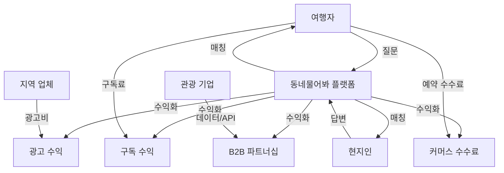

# "동네물어봐" 수익화 전략 & 마케팅 계획서

## 📋 목차
1. [비즈니스 모델 개요](#-비즈니스-모델-개요)
2. [3단계 수익화 전략](#-3단계-수익화-전략)
3. [구체적 수익 모델](#-구체적-수익-모델)
4. [초기 사용자 확보 전략](#-초기-사용자-확보-전략)
5. [마케팅 실행 계획](#-마케팅-실행-계획)
6. [성장 지표 및 목표](#-성장-지표-및-목표)
7. [경쟁 우위 및 차별화](#-경쟁-우위-및-차별화)
8. [투자 유치 계획](#-투자-유치-계획)
9. [확장 및 Exit 전략](#-확장-및-exit-전략)
10. [리스크 관리](#-리스크-관리)

---

## 💼 비즈니스 모델 개요

### 핵심 가치 제안
"제주 여행 중 궁금한 것이 생기면, 현지 주민이 10분 내로 실시간 답변해드립니다"

#### 비즈니스 모델 구조


### 타겟 시장 분석

#### 1차 타겟: 제주 여행객
- **시장 규모**: 연간 1,500만명 (2023년 기준)
- **핵심 니즈**: 실시간 현지 정보, 신뢰할 수 있는 추천
- **페인 포인트**: 정보 부족, 관광 함정, 언어 장벽

#### 2차 타겟: 제주 거주민
- **시장 규모**: 약 67만명 (제주특별자치도 인구)
- **핵심 니즈**: 부수입 창출, 지역 자긍심, 사회적 기여
- **페인 포인트**: 단조로운 일상, 추가 수입원 부족

#### 3차 타겟: 지역 사업자
- **시장 규모**: 제주 관광 관련 업체 약 15,000개
- **핵심 니즈**: 효과적인 마케팅, 직접적인 고객 접점
- **페인 포인트**: 마케팅 비용 부담, ROI 측정 어려움

---

## 📈 3단계 수익화 전략

### Phase 1: 기반 구축 단계 (0-6개월)
**목표**: 사용자 기반 확보 및 신뢰도 구축

```
수익: $0/월 (완전 무료 서비스)
사용자: 0 → 1,000명
질문: 월 0 → 300개
답변: 월 0 → 800개 (답변률 270%)
핵심 지표: 첫 답변까지 평균 시간 10분 미만
```

**전략 포커스**:
- 🎯 **품질 우선**: 수익보다 서비스 품질에 집중
- 🏠 **현지인 확보**: 신뢰할 수 있는 답변자 풀 구축
- 📊 **데이터 수집**: 사용자 행동 패턴 및 선호도 분석
- 🔧 **제품 개선**: 사용자 피드백 기반 기능 개발

**주요 활동**:
- 제주대학교, 지역 커뮤니티와 파트너십
- 현지인 인증 시스템 고도화
- 질문-답변 품질 관리 시스템 구축
- 모바일 앱 출시 및 안정화

### Phase 2: 초기 수익화 단계 (6-18개월)
**목표**: 지속 가능한 수익 모델 확립

```
수익: 월 $500-2,000
사용자: 1,000 → 8,000명
월활성사용자(MAU): 60-70%
수익 구성:
├── Google AdSense: $300-800/월 (40%)
├── 지역 광고 파트너십: $200-600/월 (30%)
├── 프리미엄 구독: $100-400/월 (20%)
└── 관광업체 제휴: $50-200/월 (10%)
```

**수익화 방식**:

1. **디스플레이 광고**
   - Google AdSense 도입 (RPM $1-3)
   - 네이버 애드포스트 연동
   - 제주 관련 키워드 특화 광고

2. **로컬 비즈니스 광고**
   - 렌터카 업체 배너 광고 ($50-100/월/업체)
   - 맛집/카페 프로모션 포스트 ($20-50/건)
   - 펜션/호텔 예약 링크 (수수료 3-5%)

3. **프리미엄 구독** "제주 플러스" ($2.99/월)
   - 질문 우선 노출 (상위 3위 내)
   - 광고 제거
   - 무제한 북마크
   - 답변 알림 우선 발송

### Phase 3: 본격 수익화 단계 (18-36개월)
**목표**: 플랫폼 경제 생태계 구축

```
수익: 월 $5,000-15,000
사용자: 8,000 → 30,000명
월활성사용자(MAU): 75-80%
수익 구성:
├── 커머스 플랫폼 수수료: $2,000-6,000/월 (40%)
├── 구독 서비스: $1,500-4,000/월 (30%)
├── 기업 파트너십: $1,000-3,000/월 (20%)
└── AI 서비스: $500-2,000/월 (10%)
```

**고도화된 수익 모델**:

1. **통합 커머스 플랫폼**
   - 맛집 예약 시스템 (수수료 5-10%)
   - 액티비티 예약 (수수료 10-15%)
   - 렌터카 통합 예약 (수수료 8-12%)
   - 숙박 예약 연동 (수수료 3-8%)

2. **프리미엄 구독** "제주 VIP" ($9.99/월)
   - 현지인과 1:1 직접 채팅
   - 맞춤형 여행 플래닝 서비스
   - 긴급 상황 우선 지원 (24시간)
   - 독점 현지인 팁 및 할인 혜택

3. **B2B 데이터 서비스**
   - 제주관광공사 데이터 라이선싱
   - 여행사 맞춤 리포트 제공
   - 기업 연수 프로그램 컨설팅
   - 관광 트렌드 분석 서비스

---

## 💰 구체적 수익 모델

### 1. 광고 기반 수익 모델

#### A. 디스플레이 광고
```
Google AdSense
├── 예상 RPM: $1-3
├── 월 페이지뷰: 100K-500K
├── 예상 수익: $100-1,500/월
└── 성장 잠재력: 사용자 증가에 비례

네이버 애드포스트
├── CPC: $0.1-0.5
├── 월 클릭: 1K-5K
├── 예상 수익: $100-2,500/월
└── 한국 사용자 특화 장점
```

#### B. 로컬 비즈니스 광고
```
렌터카 업체 ($80/월/업체)
├── 타겟 업체: 20개
├── 예상 참여: 8-12개
└── 월 수익: $640-960

맛집/카페 프로모션 ($30/건)
├── 월 프로모션: 20-40건
├── 계절성 고려 (성수기 2배)
└── 월 수익: $600-2,400

숙박업소 제휴 (예약 수수료 5%)
├── 월 예약: 50-200건
├── 평균 예약금액: $80
└── 월 수익: $200-800
```

### 2. 구독 기반 수익 모델

#### A. 기본 프리미엄 "제주 플러스" ($2.99/월)
```
목표 구독자: 500-2,000명
전환율: 5-8%
월 수익: $1,495-5,980

제공 기능:
├── 질문 우선 노출 (상위 3위 보장)
├── 광고 제거 (깔끔한 UI 경험)
├── 무제한 북마크 (무료: 10개 제한)
├── 빠른 알림 (답변 시 즉시 푸시)
└── 월 통계 리포트 (내 활동 분석)
```

#### B. 프리미엄 "제주 VIP" ($9.99/월)
```
목표 구독자: 200-800명
전환율: 2-3%
월 수익: $1,998-7,992

제공 기능:
├── 현지인 1:1 직접 채팅 (월 5회)
├── 맞춤형 여행 플래닝 (AI + 인간)
├── 긴급 지원 (24시간 응답 보장)
├── 독점 할인 (제휴업체 10-20% 할인)
├── VIP 전용 커뮤니티 접근
└── 오프라인 이벤트 초대
```

### 3. 커머스 플랫폼 수익 모델

#### A. 예약 수수료 시스템
```
맛집 예약 (수수료 5-8%)
├── 월 예약: 200-800건
├── 평균 금액: $40/건
├── 수수료율: 6%
└── 월 수익: $480-1,920

액티비티 예약 (수수료 10-15%)
├── 월 예약: 100-400건
├── 평균 금액: $60/건
├── 수수료율: 12%
└── 월 수익: $720-2,880

렌터카 예약 (수수료 8-12%)
├── 월 예약: 150-600건
├── 평균 금액: $50/건
├── 수수료율: 10%
└── 월 수익: $750-3,000
```

#### B. 제휴 상품 판매
```
제주 특산품 (마진 15-25%)
├── 월 주문: 50-200건
├── 평균 주문금액: $30
├── 마진율: 20%
└── 월 수익: $300-1,200

여행 용품 (마진 10-20%)
├── 월 주문: 30-120건
├── 평균 주문금액: $25
├── 마진율: 15%
└── 월 수익: $112-450
```

### 4. B2B 서비스 수익 모델

#### A. 데이터 라이선싱
```
제주관광공사 협업
├── 관광 트렌드 분석 데이터
├── 계약 금액: $2,000-5,000/월
└── 갱신 주기: 연간

여행사 맞춤 데이터
├── 실시간 관광 선호도 리포트
├── 계약 금액: $500-1,500/월/사
├── 타겟 고객: 10-20개 여행사
└── 월 수익: $5,000-30,000
```

#### B. 기업 서비스
```
기업 연수 프로그램
├── 제주 팀빌딩 컨설팅
├── 프로젝트 단가: $3,000-10,000
├── 월 프로젝트: 1-3개
└── 월 수익: $3,000-30,000

관광업체 마케팅 컨설팅
├── 디지털 마케팅 전략 수립
├── 프로젝트 단가: $1,000-5,000
├── 월 프로젝트: 2-5개
└── 월 수익: $2,000-25,000
```

---

## 🎯 초기 사용자 확보 전략

### 1단계: 시드 사용자 확보 (0-100명)

#### 현지인 우선 확보 전략
**핵심 아이디어**: 질 높은 답변자를 먼저 확보하여 서비스 신뢰도 구축

```
현지인 100명 확보 → 높은 답변 품질 → 관광객 자연 유입
```

**구체적 실행 방안**:

1. **제주 커뮤니티 침투 작전**
   ```
   제주대학교 학생회/동아리
   ├── 컴퓨터공학과, 관광학과 협력
   ├── 대학생 서포터즈 10명 모집
   ├── 캠퍼스 내 부스 설치 (주 2회)
   └── 학생 대상 소셜 이벤트 개최

   지역 공무원 및 직장인
   ├── 제주시청/서귀포시청 SNS 홍보
   ├── 관광공사 직원 협력 요청
   ├── 지역 기업 점심시간 홍보
   └── 공무원 카톡방 홍보 허가 요청

   지역 맘카페/커뮤니티
   ├── 제주맘카페 (10만+ 회원) 홍보
   ├── 지역 육아 커뮤니티 협력
   ├── 동네 카페 사장님들 모임 참석
   └── 농수산물 직거래 카페 홍보
   ```

2. **현지인 인센티브 프로그램**
   ```
   초기 답변자 특별 혜택
   ├── "창립멤버" 영구 배지 제공
   ├── 첫 10개 답변시 스타벅스 쿠폰
   ├── 월 최우수 답변자 제주 맛집 상품권 10만원
   └── 연말 창립멤버 제주도 1박2일 여행 제공

   친구 초대 보상
   ├── 초대자/피초대자 양쪽 5,000포인트
   ├── 포인트로 제주 특산품 교환 가능
   ├── 10명 초대시 "친구왕" 배지
   └── 추천인 순위 월별 발표 및 시상
   ```

#### 관광객 대상 초기 홍보
```
제주공항 타겟팅
├── 무료 WiFi 연결시 앱 설치 유도 팝업
├── 공항 내 QR코드 스티커 부착 (화장실, 카페)
├── 렌터카 업체와 제휴하여 차량 내 홍보물
└── 공항 픽업 기사들에게 홍보 자료 제공

숙박업소 제휴
├── 게스트하우스 체크인시 서비스 소개
├── 호텔 객실 내 QR코드 안내 카드
├── 민박 사장님들과 직접 제휴 협약
└── 숙박 플랫폼(에어비앤비) 호스트 협력

관광지 현장 마케팅
├── 성산일출봉, 한라산 등 주요 관광지 QR코드
├── 관광 안내소와 협력하여 홍보물 비치
├── 올레길 스탬프 투어와 연계 이벤트
└── 제주 버스 정류장 광고 게시
```

### 2단계: 확산 단계 (100-1,000명)

#### 바이럴 마케팅 전략

1. **"제주도 현지인이 직접 답변" 컨셉 마케팅**
   ```
   인스타그램 스토리 캠페인
   ├── #제주현지인추천 해시태그 이벤트
   ├── 인플루언서와 제주도민 매칭 콘텐츠
   ├── "제주 여행 질문 vs 현지인 답변" 포맷
   └── 매일 베스트 Q&A 스토리 공유

   틱톡 숏폼 콘텐츠
   ├── "제주도민이 알려주는 진짜 맛집" 시리즈
   ├── "관광객 vs 현지인 관점" 비교 영상
   ├── "제주 여행 꿀팁 10초 완성" 포맷
   └── 현지인 크리에이터 협업 프로그램

   유튜브 롱폼 콘텐츠
   ├── "제주 여행 질문에 현지인이 실시간 답변"
   ├── "제주도민 추천 vs 인터넷 추천" 검증 영상
   ├── "외지인이 몰랐던 제주의 진실" 시리즈
   └── 구독자 질문 받아서 제주 현지 취재
   ```

2. **인플루언서 협업 프로그램**
   ```
   마이크로 인플루언서 (팔로워 1K-10K)
   ├── 제주 거주 인플루언서 20명 선정
   ├── 월 1회 플랫폼 소개 콘텐츠 의무
   ├── 자유로운 사용 후기 및 추천
   └── 성과에 따른 인센티브 제공

   매크로 인플루언서 (팔로워 100K+)
   ├── 여행 유튜버와 제주 여행 콜라보
   ├── "제주 여행 질문 챌린지" 기획
   ├── 실시간 라이브로 질문-답변 시연
   └── 1회성 이벤트보다 지속적 관계 구축

   현지인 인플루언서 특별 프로그램
   ├── 제주 현지인 인플루언서 전용 혜택
   ├── 플랫폼 홍보대사 위촉 및 활동비 지급
   ├── 오프라인 이벤트 공동 기획 및 진행
   └── 브랜드 앰버서더 계약 체결
   ```

3. **언론 홍보 및 PR 전략**
   ```
   지역 언론 공략
   ├── 제주일보, 한라일보 기사 기고
   ├── "제주 관광의 새로운 패러다임" 보도자료
   ├── 지역 방송 (KBS제주, MBC제주) 출연
   └── 제주관광공사와 협력 홍보

   전국 언론 확산
   ├── "지역 특화 O2O 플랫폼" 각도로 접근
   ├── 스타트업 전문 매체 (더브이씨, 플래텀) 인터뷰
   ├── 관광 산업 전문지 기고
   └── 포스트 코로나 관광 트렌드 연계
   ```

### 3단계: 성장 가속화 (1,000-10,000명)

#### 성장 해킹 (Growth Hacking) 전략

1. **추천 시스템 최적화**
   ```
   친구 초대 인센티브 강화
   ├── 양방향 포인트 지급 (초대자/피초대자)
   ├── 그룹 초대시 추가 보너스 제공
   ├── 소셜 플랫폼별 맞춤 공유 기능
   └── 초대 성과 리더보드 운영

   바이럴 루프 설계
   ├── 좋은 답변 받으면 "친구에게 공유" 유도
   ├── 카카오톡 공유시 미리보기 최적화
   ├── 공유한 질문이 답변받으면 공유자에게도 알림
   └── "내 질문이 도움됐다면 평가해주세요" CTA
   ```

2. **SEO/ASO 최적화**
   ```
   검색 엔진 최적화 (SEO)
   ├── "제주 여행 질문", "제주 맛집 추천" 상위 노출
   ├── 질문-답변 페이지 검색 친화적 구조
   ├── 제주 관련 롱테일 키워드 공략
   └── 구글 featured snippet 획득 전략

   앱스토어 최적화 (ASO)
   ├── "제주", "여행", "현지인" 키워드 최적화
   ├── 앱 설명과 스크린샷 A/B 테스트
   ├── 사용자 리뷰 관리 및 별점 유지
   └── 계절별 키워드 트렌드 반영
   ```

3. **파트너십 확대 전략**
   ```
   여행 플랫폼 연동
   ├── 야놀자, 여기어때 API 연동
   ├── 트리플, 캐치테이블 제휴
   ├── 클룩, 위고 액티비티 연결
   └── 스카이스캐너, 익스피디아 협력

   교통/숙박 파트너십
   ├── 항공사 기내 WiFi 랜딩 페이지
   ├── 렌터카 업체 차량 내 QR코드 확대
   ├── 제주 버스/택시 광고 진행
   └── 크루즈 터미널 홍보 부스 설치

   제주도 공식 파트너십
   ├── 제주관광공사 공식 협력 MOU
   ├── 제주특별자치도 스마트시티 연계
   ├── 관광지 안내소 QR코드 설치 확대
   └── 올레길 스탬프 투어 연계 이벤트
   ```

---

## 📊 성장 지표 및 목표

### 단계별 상세 목표

#### 6개월 목표 (2024년 말)
```
📊 사용자 지표
├── 총 가입자: 1,000명
│   ├── 현지인: 200명 (20%)
│   ├── 관광객: 700명 (70%)
│   └── 기타: 100명 (10%)
├── 월활성사용자(MAU): 600명 (60%)
├── 일활성사용자(DAU): 150명 (15%)
└── 사용자 리텐션: 30% (7일), 15% (30일)

💬 활동 지표
├── 월 질문 수: 300개
├── 월 답변 수: 800개 (답변률 270%)
├── 평균 첫 답변 시간: 8분
├── 질문 해결률: 85%
└── 답변 만족도: 4.2/5.0

💰 비즈니스 지표
├── 월 수익: $0 (무료 서비스)
├── 월 운영비용: $200
│   ├── 서버 비용: $50
│   ├── 마케팅 비용: $100
│   └── 기타 운영비: $50
└── 순손실: -$200/월
```

#### 12개월 목표 (2025년 상반기)
```
📊 사용자 지표
├── 총 가입자: 5,000명
│   ├── 현지인: 800명 (16%)
│   ├── 관광객: 3,800명 (76%)
│   └── 기타: 400명 (8%)
├── 월활성사용자(MAU): 3,500명 (70%)
├── 일활성사용자(DAU): 1,000명 (20%)
└── 사용자 리텐션: 45% (7일), 25% (30일)

💬 활동 지표
├── 월 질문 수: 1,500개
├── 월 답변 수: 4,000개 (답변률 270%)
├── 평균 첫 답변 시간: 6분
├── 질문 해결률: 88%
└── 답변 만족도: 4.4/5.0

💰 비즈니스 지표
├── 월 수익: $800
│   ├── 광고 수익: $500 (62.5%)
│   ├── 프리미엄 구독: $200 (25%)
│   └── 파트너십: $100 (12.5%)
├── 월 운영비용: $400
│   ├── 서버 비용: $100
│   ├── 인건비: $200
│   └── 마케팅 비용: $100
└── 순이익: $400/월
```

#### 24개월 목표 (2025년 말)
```
📊 사용자 지표
├── 총 가입자: 20,000명
│   ├── 현지인: 2,000명 (10%)
│   ├── 관광객: 16,000명 (80%)
│   └── 기타: 2,000명 (10%)
├── 월활성사용자(MAU): 15,000명 (75%)
├── 일활성사용자(DAU): 4,000명 (20%)
└── 사용자 리텐션: 60% (7일), 35% (30일)

💬 활동 지표
├── 월 질문 수: 8,000개
├── 월 답변 수: 20,000개 (답변률 250%)
├── 평균 첫 답변 시간: 5분
├── 질문 해결률: 92%
└── 답변 만족도: 4.6/5.0

💰 비즈니스 지표
├── 월 수익: $5,000
│   ├── 커머스 수수료: $2,000 (40%)
│   ├── 구독 서비스: $1,500 (30%)
│   ├── 광고 수익: $1,000 (20%)
│   └── B2B 서비스: $500 (10%)
├── 월 운영비용: $2,000
│   ├── 인건비: $1,200
│   ├── 서버 비용: $300
│   ├── 마케팅 비용: $400
│   └── 기타 운영비: $100
└── 순이익: $3,000/월
```

### 핵심 성과 지표 (KPI) 모니터링

#### 사용자 성장 지표
```
신규 사용자 획득 (User Acquisition)
├── 일/주/월 신규 가입자 수
├── 획득 채널별 사용자 분포
├── 고객 획득 비용 (CAC)
└── 채널별 전환율

사용자 활성도 (User Engagement)
├── 월활성사용자 (MAU)
├── 일활성사용자 (DAU)
├── 평균 세션 시간
├── 페이지뷰 per 세션
└── 기능별 사용률

사용자 유지 (User Retention)
├── 1일/7일/30일 리텐션
├── 코호트 분석
├── 이탈률 및 이탈 이유
└── 재방문 주기
```

#### 서비스 품질 지표
```
응답 품질
├── 평균 첫 답변 시간
├── 질문 해결률 (해결됨 표시 비율)
├── 답변 만족도 평점
├── 답변자 응답률
└── 반복 질문 비율

플랫폼 건전성
├── 부적절한 콘텐츠 비율
├── 신고 접수 및 처리 시간
├── 가짜 정보 탐지율
├── 사용자 간 갈등 발생 빈도
└── 커뮤니티 가이드라인 준수율
```

#### 비즈니스 성과 지표
```
수익 지표
├── 월간 반복 수익 (MRR)
├── 연간 반복 수익 (ARR)
├── 평균 사용자당 수익 (ARPU)
├── 고객 생애 가치 (LTV)
└── 수익 채널별 기여도

비용 지표
├── 고객 획득 비용 (CAC)
├── 월간 소각률 (Burn Rate)
├── 단위 경제학 (Unit Economics)
├── LTV/CAC 비율
└── 손익분기점까지 기간
```

---

## 🏆 경쟁 우위 및 차별화

### 기존 서비스 대비 차별화 포인트

#### 1. 실시간성 vs 정적 정보
```
기존 서비스 (블로그, 리뷰 사이트)
├── 정적인 과거 정보
├── 업데이트 주기 불규칙
├── 시점별 변화 반영 어려움
└── 일방향 정보 전달

동네물어봐
├── 실시간 질문-답변 매칭
├── 현재 상황 즉시 반영
├── 10분 내 응답 목표
└── 양방향 소통 및 추가 질문 가능
```

#### 2. 현지성 vs 일반적 정보
```
기존 서비스 (여행 가이드, 포털 정보)
├── 전국구 일반적 정보
├── 관광객 시점의 표면적 정보
├── 상업적 목적의 필터링된 정보
└── 현지 문맥 부족

동네물어봐
├── 제주 특화 전문성
├── 현지인 시점의 깊이 있는 정보
├── 상업적 이해관계 없는 순수 추천
└── 지역 문화와 맥락 포함
```

#### 3. 신뢰성 vs 익명성
```
기존 서비스 (온라인 커뮤니티)
├── 익명 사용자의 정보
├── 정보 출처 불분명
├── 광고/홍보성 게시물 혼재
└── 신뢰도 검증 시스템 부재

동네물어봐
├── 현지인 인증 시스템
├── 답변자 신뢰도 점수 공개
├── 포인트/배지 기반 품질 관리
└── 커뮤니티 자정 기능
```

### 방어 가능한 경쟁 우위 (Moat)

#### 1. 네트워크 효과 (Network Effect)
```
현지인 네트워크 효과
├── 현지인이 많을수록 답변 품질 향상
├── 다양한 분야 전문가 확보
├── 빠른 응답 시간 달성
└── 신규 현지인 유입 가속화

관광객 네트워크 효과
├── 질문이 많을수록 현지인 참여 증가
├── 다양한 질문으로 데이터베이스 풍부해짐
├── 검색 엔진 최적화 효과
└── 브랜드 인지도 상승
```

#### 2. 데이터 축적 (Data Accumulation)
```
제주 관련 Q&A 데이터베이스
├── 계절별/시기별 관광 패턴
├── 연령/성별/지역별 선호도 분석
├── 실시간 관광 트렌드 파악
└── AI 서비스 개발 기반 데이터

사용자 행동 데이터
├── 질문-답변 매칭 알고리즘 개선
├── 개인화 추천 시스템 고도화
├── 예측 모델링 정확도 향상
└── 새로운 서비스 개발 인사이트
```

#### 3. 브랜드 및 신뢰도 (Brand & Trust)
```
지역 브랜드 파워
├── "제주 여행 = 동네물어봐" 연상 구조
├── 현지인들의 플랫폼 충성도
├── 관광객들의 브랜드 인지도
└── 지역 사회 내 입지 확보

신뢰도 기반 차별화
├── 현지인 인증 시스템의 신뢰성
├── 답변 품질 관리 시스템
├── 사용자 간 평가 시스템
└── 투명한 운영 정책
```

#### 4. 운영 노하우 (Operational Excellence)
```
커뮤니티 관리 역량
├── 효과적인 조정(Moderation) 시스템
├── 갈등 해결 및 중재 노하우
├── 사용자 동기 부여 방법론
└── 지속적인 참여 유도 전략

기술적 우위
├── 실시간 매칭 알고리즘
├── 모바일 최적화 UI/UX
├── 확장 가능한 인프라 구조
└── AI 기반 자동화 시스템
```

### 잠재적 경쟁자 분석

#### 직접 경쟁자
```
지역 특화 Q&A 플랫폼
├── 위협도: 높음
├── 대응 전략: 선점 효과 극대화
├── 차별화: 현지인 인증 시스템 강화
└── 방어: 브랜드 파워 및 네트워크 효과

대형 여행 플랫폼의 Q&A 기능
├── 위협도: 중간
├── 대응 전략: 제주 특화 전문성 강조
├── 차별화: 실시간성 및 현지성
└── 방어: 깊이 있는 지역 지식
```

#### 간접 경쟁자
```
여행 블로그/유튜버
├── 위협도: 낮음
├── 대응 전략: 실시간성으로 차별화
├── 협력 기회: 콘텐츠 크리에이터 파트너십
└── 상호 보완적 관계 형성

소셜미디어 그룹/카페
├── 위협도: 중간
├── 대응 전략: 구조화된 정보 제공
├── 차별화: 전문성 및 신뢰성
└── 마이그레이션 전략 수립
```

---

## 💼 투자 유치 계획

### 펀딩 라운드별 계획

#### Pre-Seed (현재)
```
목표 금액: $50K-100K
투자 용도:
├── MVP 개발 완료: $30K
├── 초기 마케팅: $20K
├── 팀 운영비 (6개월): $30K
└── 법무/회계: $10K

투자자 타입:
├── 개인투자자 (엔젤)
├── 액셀러레이터 (프라이머, 스파크랩)
├── 정부 지원 (K-스타트업)
└── 크라우드펀딩 (와디즈)

핵심 지표:
├── MVP 출시
├── 초기 사용자 100명 확보
├── 제품-시장 적합성 검증
└── 초기 트랙션 확보
```

#### Seed Round (6-12개월 후)
```
목표 금액: $300K-500K
투자 용도:
├── 제품 고도화: $150K
├── 팀 확장 (개발 2명, 마케팅 1명): $200K
├── 마케팅 확대: $100K
└── 운영비 (12개월): $50K

투자자 타입:
├── 시드 VC (블루포인트, 퓨처플레이)
├── 전략적 투자자 (여행사, 렌터카)
├── 개인투자자 풀 확대
└── 정부 펀드 (모태펀드)

핵심 지표:
├── 월활성사용자 1,000명
├── 월 수익 $500 달성
├── 제주도 내 브랜드 인지도 확보
└── 현지인 네트워크 500명 구축
```

#### Series A (18-24개월 후)
```
목표 금액: $1M-2M
투자 용도:
├── 전국 확장 (부산, 강릉): $800K
├── AI 기능 개발: $400K
├── 팀 확장 (총 15명): $600K
└── B2B 사업 개발: $200K

투자자 타입:
├── 성장 단계 VC (DSC인베스트먼트, 인터밸리)
├── 대기업 CVC (네이버, 카카오)
├── 해외 투자자 (일본, 동남아)
└── 관광 산업 전문 펀드

핵심 지표:
├── 월활성사용자 10,000명
├── 월 수익 $5,000 달성
├── 다지역 확장 성공 검증
└── B2B 수익 모델 확립
```

### 투자 유치 전략

#### 투자자별 맞춤 피칭
```
VC 투자자
├── 시장 규모 및 성장 잠재력 강조
├── 확장 가능한 비즈니스 모델
├── 경쟁 우위 및 방어 가능성
└── 명확한 Exit 시나리오

전략적 투자자 (여행 관련 기업)
├── 시너지 효과 및 상호 협력 방안
├── 기존 사업과의 연계성
├── 데이터 및 사용자 베이스 활용
└── 공동 서비스 개발 가능성

정부/공공 투자
├── 지역 경제 활성화 기여도
├── 관광 산업 디지털 전환 역할
├── 사회적 가치 창출
└── 일자리 창출 효과
```

#### 밸류에이션 전략
```
현재 단계 (Pre-Seed)
├── 예상 밸류에이션: $300K-500K
├── 근거: 아이디어 + 팀 + 초기 트랙션
├── 비교 대상: 유사 단계 로컬 플랫폼
└── 성장 스토리에 기반한 미래 가치

Seed 단계 예상
├── 예상 밸류에이션: $2M-3M
├── 근거: 검증된 비즈니스 모델 + 실제 수익
├── 비교 대상: 동남아 로컬 플랫폼 사례
└── 멀티플 방식 (매출 대비 5-10배)

Series A 단계 예상
├── 예상 밸류에이션: $10M-15M
├── 근거: 확장 가능성 + 시장 지배력
├── 비교 대상: 글로벌 여행 Q&A 플랫폼
└── 사용자 가치 기반 산정 ($50-100/MAU)
```

---

## 🌏 확장 및 Exit 전략

### 지역 확장 로드맵

#### 2차 확장 지역 (2년차)
```
부산 (해양도시 + 관광도시)
├── 시장 특성: 제주와 유사한 관광 중심지
├── 예상 TAM: 연 800만명 관광객
├── 현지 파트너: 부산대학교, 부산관광공사
├── 차별화 포인트: 해양 액티비티, 야경 명소
└── 예상 투자: $200K (마케팅 + 현지 팀)

강릉 (계절성 관광지)
├── 시장 특성: 사계절 관광지 (커피, 해변, 스키)
├── 예상 TAM: 연 400만명 관광객
├── 현지 파트너: 강릉원주대, 강릉시청
├── 차별화 포인트: 계절별 액티비티, 커피 문화
└── 예상 투자: $150K (마케팅 + 현지 팀)
```

#### 3차 확장 지역 (3-4년차)
```
전국 주요 관광지
├── 경주 (역사 문화 관광)
├── 여수 (해양 관광)
├── 춘천 (자연 + 레저 관광)
├── 안동 (전통 문화 관광)
└── 가평/양평 (수도권 근교 관광)

해외 확장 후보
├── 일본 오키나와 (제주와 유사한 도서 관광지)
├── 태국 푸켓 (동남아 대표 관광지)
├── 베트남 다낭 (한국인 선호 해외 관광지)
└── 대만 타이베이 (도시 + 자연 관광 결합)
```

### 확장 전략 방법론

#### 1. 프랜차이즈 모델
```
지역별 파트너십 구조
├── 현지 파트너 모집 (대학생, 지역 사업자)
├── 브랜드 라이선싱 + 운영 노하우 전수
├── 플랫폼 및 기술 인프라 공유
├── 수익 배분: 본사 60%, 파트너 40%
└── 품질 관리 및 브랜드 일관성 유지

현지화 전략
├── 지역별 언어/방언 대응
├── 현지 문화 및 관습 반영
├── 지역 특화 카테고리 추가
├── 현지 파트너사와 제휴 확대
└── 지역별 마케팅 전략 차별화
```

#### 2. 인수합병 (M&A) 전략
```
유사 플랫폼 인수
├── 타겟: 지역별 소규모 커뮤니티 플랫폼
├── 목적: 사용자 베이스 + 현지 네트워크 확보
├── 전략: 기술 통합 + 브랜드 통일
└── 예산: $100K-500K per 지역

보완 서비스 인수
├── 타겟: 여행 관련 앱/서비스
├── 목적: 기능 확장 + 시너지 창출
├── 후보: 숙박 예약, 맛집 리뷰, 액티비티 예약
└── 통합 효과: 원스톱 여행 플랫폼 구축
```

### Exit 전략 시나리오

#### 시나리오 1: 전략적 인수 (Strategic Acquisition)
```
잠재 인수자
├── 여행 플랫폼 (야놀자, 여기어때, 트리플)
├── 포털 사이트 (네이버, 카카오)
├── 글로벌 여행 기업 (에어비앤비, 부킹닷컴)
└── 통신사 (SKT, KT, LG U+)

인수 논리
├── 사용자 베이스 확보
├── 지역 특화 데이터 확보
├── 신규 비즈니스 모델 추가
├── 경쟁우위 확보
└── 시장 선점 효과

예상 밸류에이션
├── 3-5년차: $20M-50M
├── 근거: 매출 배수 (10-20x) + 사용자 가치
├── 업계 벤치마크: 유사 플랫폼 M&A 사례
└── 협상 여지: 시너지 효과에 따른 프리미엄
```

#### 시나리오 2: IPO (기업공개)
```
상장 조건
├── 연 매출: $5M-10M 이상
├── 지속적 성장률: 50%+ YoY
├── 시장 지배력: 해당 분야 1-2위
├── 확장 가능성: 글로벌 시장 진출
└── 수익성: 연 순이익 $1M 이상

상장 시기
├── 목표: 5-7년 후
├── 시장 환경: 여행 산업 회복 + 기술주 상승
├── 규모: 코스닥 또는 나스닥
└── 예상 밸류에이션: $100M-300M

IPO 준비 사항
├── 거버넌스 체계 구축
├── 재무 투명성 확보
├── 컴플라이언스 시스템 구축
├── IR 역량 강화
└── 글로벌 비즈니스 확장
```

#### 시나리오 3: 매니지먼트 바이아웃 (MBO)
```
MBO 조건
├── 안정적 수익 구조 확립
├── 경영진 지분 확보 (30% 이상)
├── 자금 조달 능력 확보
└── 지속 성장 전략 수립

장점
├── 경영 자율성 확보
├── 장기적 관점의 사업 운영
├── 창업자 지분 유지
└── 기업 문화 보존

단점
├── 자금 조달 부담
├── 성장 자금 확보 어려움
├── 위험 부담 증가
└── Exit 기회 제한
```

---

## ⚠️ 리스크 관리

### 비즈니스 리스크

#### 1. 시장 리스크
```
관광 산업 변동성
├── 리스크: 팬데믹, 경제 위기 등으로 관광객 급감
├── 영향도: 높음 (수익 50% 이상 감소 가능)
├── 대응책:
│   ├── 현지인 대상 서비스 확대 (생활 정보, 구인구직)
│   ├── B2B 수익 모델 강화 (정부, 기업 대상)
│   ├── 다지역 확장으로 위험 분산
│   └── 비관광 분야로 서비스 영역 확장
└── 모니터링: 월별 관광객 통계, 예약 취소율 추적

계절성 영향
├── 리스크: 제주 관광의 계절별 편차 (여름 집중)
├── 영향도: 중간 (겨울철 30-40% 활동 감소)
├── 대응책:
│   ├── 겨울철 특화 콘텐츠 개발 (온천, 실내 활동)
│   ├── 현지인 대상 서비스 강화 (일상 질문 확대)
│   ├── 기업 연수, 워크샵 유치
│   └── 한라산 등반, 겨울 축제 등 계절 이벤트 연계
└── 모니터링: 월별 활성도, 질문 카테고리 분석
```

#### 2. 경쟁 리스크
```
대형 플랫폼 진입
├── 리스크: 네이버, 카카오 등 대기업의 유사 서비스 출시
├── 영향도: 높음 (사용자 이탈 및 성장 둔화)
├── 대응책:
│   ├── 현지인 네트워크 강화로 높은 전환 비용 구축
│   ├── 제주 특화 전문성으로 차별화
│   ├── 브랜드 충성도 및 커뮤니티 결속력 강화
│   ├── 선점 효과 극대화 (타 지역 빠른 확장)
│   └── 대기업과의 파트너십 모색
└── 대응 시나리오: 3개월 내 대응 전략 수립 완료

유사 서비스 등장
├── 리스크: 동일 컨셉의 경쟁 서비스 출현
├── 영향도: 중간 (시장 분할 및 마케팅 비용 증가)
├── 대응책:
│   ├── 지적재산권 보호 (상표, 디자인)
│   ├── 기술적 우위 지속적 개발
│   ├── 사용자 경험 지속적 개선
│   ├── 파트너십 독점 계약 확보
│   └── 빠른 기능 개발 및 업데이트
└── 모니터링: 경쟁사 동향 주간 리포트
```

#### 3. 운영 리스크
```
커뮤니티 관리 실패
├── 리스크: 부적절한 콘텐츠, 사용자 간 갈등
├── 영향도: 높음 (브랜드 이미지 손상, 사용자 이탈)
├── 대응책:
│   ├── 명확한 커뮤니티 가이드라인 수립
│   ├── AI + 인간 조합의 콘텐츠 모니터링
│   ├── 신속한 신고 처리 시스템 구축
│   ├── 우수 답변자 인센티브 프로그램
│   └── 정기적인 사용자 교육 및 캠페인
└── KPI: 신고 접수 대비 처리율 95% 이상

핵심 인력 이탈
├── 리스크: 창업자, 핵심 개발자, 마케팅 담당자 퇴사
├── 영향도: 높음 (개발 지연, 노하우 손실)
├── 대응책:
│   ├── 스톡옵션 및 성과급 제도 도입
│   ├── 업무 표준화 및 문서화
│   ├── 교차 훈련 및 백업 인력 양성
│   ├── 좋은 기업 문화 및 근무 환경 조성
│   └── 정기적인 팀 빌딩 및 소통
└── 모니터링: 직원 만족도 조사 (분기별)
```

### 기술적 리스크

#### 1. 보안 리스크
```
개인정보 유출
├── 리스크: 해킹, 내부자 정보 유출
├── 영향도: 매우 높음 (법적 제재, 서비스 중단)
├── 대응책:
│   ├── 개인정보보호법 완전 준수
│   ├── 암호화 저장 및 전송
│   ├── 접근 권한 최소화 원칙
│   ├── 정기적인 보안 감사
│   ├── 침입 탐지 시스템 구축
│   └── 직원 보안 교육 강화
└── 인증: ISO 27001, 개인정보보호 인증 취득

서비스 장애
├── 리스크: 서버 다운, DDoS 공격, 인프라 장애
├── 영향도: 높음 (사용자 이탈, 매출 손실)
├── 대응책:
│   ├── 클라우드 기반 고가용성 아키텍처
│   ├── 자동 스케일링 및 로드 밸런싱
│   ├── 실시간 모니터링 및 알림 시스템
│   ├── 재해복구 계획 수립 및 정기 훈련
│   └── CDN 활용으로 성능 최적화
└── 목표: 99.9% 가용성 유지
```

#### 2. 기술 의존성 리스크
```
제3자 서비스 의존
├── 리스크: AWS, 소셜 로그인 API 장애/정책 변경
├── 영향도: 중간 (서비스 일부 기능 제한)
├── 대응책:
│   ├── 멀티 클라우드 전략 (AWS + GCP 등)
│   ├── 자체 인증 시스템 백업 구축
│   ├── API 의존성 최소화
│   ├── 벤더 다각화 전략
│   └── 계약 조건 정기 검토
└── 모니터링: 제3자 서비스 SLA 추적

기술 부채
├── 리스크: 초기 빠른 개발로 인한 코드 품질 저하
├── 영향도: 중간 (개발 속도 저하, 버그 증가)
├── 대응책:
│   ├── 정기적인 코드 리뷰 및 리팩토링
│   ├── 자동화된 테스트 코드 작성
│   ├── CI/CD 파이프라인 구축
│   ├── 기술 부채 관리 로드맵 수립
│   └── 개발 품질 지표 모니터링
└── 목표: 코드 커버리지 80% 이상 유지
```

### 법적/규제 리스크

#### 1. 개인정보보호 규제
```
개인정보보호법 강화
├── 리스크: 새로운 규제 도입, 기존 규제 강화
├── 영향도: 높음 (법적 제재, 운영 제약)
├── 대응책:
│   ├── 개인정보보호 전담 조직 구성
│   ├── 개인정보 처리방침 정기 업데이트
│   ├── 사용자 동의 절차 투명화
│   ├── 데이터 최소 수집 원칙 준수
│   ├── 개인정보 삭제 요청 시스템 구축
│   └── 법무팀 또는 전문 로펌과 자문 계약
└── 준수: GDPR, CCPA 등 글로벌 기준 적용
```

#### 2. 플랫폼 규제
```
온라인 플랫폼 규제
├── 리스크: 플랫폼 책임 강화, 수수료 규제
├── 영향도: 중간 (운영 방식 변경, 수익 구조 조정)
├── 대응책:
│   ├── 규제 동향 지속적 모니터링
│   ├── 업계 단체 참여 및 의견 개진
│   ├── 규제 준수 자동화 시스템 구축
│   ├── 대안적 수익 모델 개발
│   └── 규제 전문가 자문단 구성
└── 대응: 규제 변화 3개월 전 대응 계획 수립

관광 관련 규제
├── 리스크: 관광 가이드 자격, 여행업 등록 요구
├── 영향도: 중간 (서비스 제공 방식 변경)
├── 대응책:
│   ├── 정보 제공 플랫폼 역할 명확화
│   ├── 직접 서비스 제공 vs 중개 역할 구분
│   ├── 필요시 관련 자격 취득
│   ├── 업계 협회 가입 및 자율 규제 참여
│   └── 제주도청, 관광공사와 협력 체계 구축
└── 전략: 규제 순응보다는 파트너십 통한 해결
```

### 리스크 관리 체계

#### 1. 리스크 모니터링 시스템
```
일일 모니터링
├── 서비스 가용성 및 성능 지표
├── 사용자 활동 이상 패턴 감지
├── 보안 위협 탐지 알림
└── 재무 지표 일일 트래킹

주간 리포트
├── 주요 KPI 변화 추이
├── 경쟁사 동향 분석
├── 사용자 피드백 요약
├── 기술적 이슈 현황
└── 리스크 지표 업데이트

월간 리스크 리뷰
├── 전체 리스크 매트릭스 업데이트
├── 신규 리스크 요인 식별
├── 기존 대응책 효과성 평가
├── 리스크 대응 우선순위 재조정
└── 이사회 또는 투자자 보고
```

#### 2. 위기 대응 매뉴얼
```
비상 연락체계
├── 24시간 대응 가능한 연락망 구축
├── 역할별 책임자 지정 및 대체 인력 확보
├── 외부 전문가 비상 연락처 관리
└── 신속한 의사결정 체계 구축

커뮤니케이션 계획
├── 내부 직원 대상 소통 방안
├── 사용자 대상 공지 및 사과문 템플릿
├── 언론 대응 가이드라인
├── 투자자 및 파트너 보고 절차
└── 소셜미디어 대응 전략

복구 계획
├── 서비스 복구 우선순위 및 절차
├── 데이터 백업 및 복구 방안
├── 비즈니스 연속성 계획
├── 재무적 영향 최소화 방안
└── 사후 재발 방지 대책 수립
```

---

이 수익화 전략 및 마케팅 계획서를 통해 "동네물어봐"가 지속 가능하고 확장 가능한 비즈니스로 성장할 수 있는 구체적인 로드맵을 제시했습니다. 각 단계별 목표와 실행 방안을 따라 진행하면서, 지속적인 모니터링과 조정을 통해 성공적인 사업화를 달성할 수 있을 것입니다.